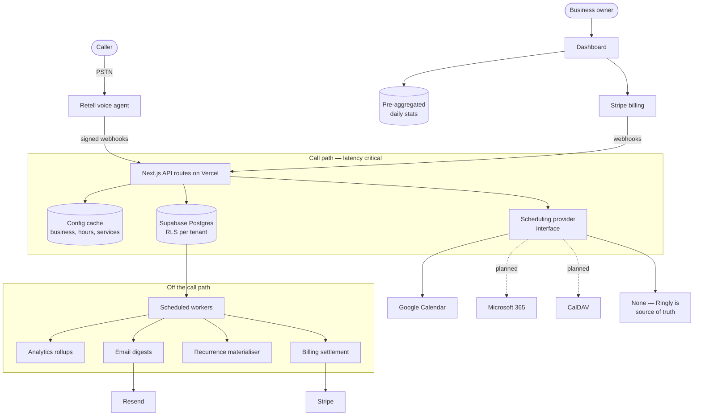

# Ringly — PRD + EDD (v3.0)

_Supersedes `Ringly_PRD_EDD_v2.md` (2026-07-01). Revised 2026-07-30 for
multi-tenant scale, scheduling-provider independence, recurring appointments,
the business analytics dashboard, Stripe billing, and email notifications._

> **Status.** Part 1 (PRD) and Part 2 (EDD) are agreed design. Part 3 is the
> delivery plan; nothing in §2.3 onward is built yet. What ships today is the v2
> product plus the calendar conflict check (PR #2).

---

# Part 1 — Product Requirements (PRD)

## 1.1 Vision

Ringly gives a small business a dedicated AI receptionist that answers calls
around the clock, discusses services and pricing, and books, reschedules and
cancels appointments against the business's own calendar.

v2 made a single business live in under three minutes. **v3 turns that into a
business**: thousands of tenants, each with thousands of customers, each on their
own calendar system and timezone, billed for what they use, and able to see and
manage their own operation without talking to us.

## 1.2 What changed from v2

| Area         | v2                                   | v3                                                                |
| ------------ | ------------------------------------ | ----------------------------------------------------------------- |
| Tenancy      | Implicitly single-tenant assumptions | Explicit multi-tenant model, isolation and scale targets          |
| Scheduling   | Google Calendar only                 | Provider abstraction; Google is one implementation of several     |
| Appointments | One-off only                         | One-off **and** recurring series                                  |
| Reminders    | Deferred (`pg_cron` TODO)            | Still deferred — moved to v2 of the product with its channels     |
| Services     | Set at onboarding                    | Editable any time; changes reach the agent for the next caller    |
| Analytics    | None                                 | Per-business dashboard, plus an operator cost/revenue dashboard   |
| Money        | None                                 | $100/30 days in advance, usage in arrears, $500 cap, card on file |
| Email        | None                                 | Billing and stats emails to the business                          |
| Latency      | Not a stated requirement             | Explicit per-turn budget on the call path                         |
| Cost         | Not a stated requirement             | Explicit per-tenant serving-cost target                           |

## 1.3 Personas

- **Business owner (primary).** Non-technical. Salon, tax office, trades, and
  similar appointment-driven businesses. Wants a receptionist, not a
  configuration project. Checks a dashboard occasionally and
  an email monthly. Cares about missed calls and money.
- **Calling customer (secondary).** Wants an appointment at a time that suits
  them, in one call, without being told to hold. Never sees Ringly's UI.
- **Ringly operator (us).** Needs per-tenant cost visibility, safe degradation,
  and no manual work per new tenant.

## 1.4 Scope

**In scope for v3:** everything in §1.5 and §1.6.

**Explicit non-goals for v3:**

- **Healthcare businesses of any kind, including clinics.** Callers to a clinic
  disclose health information, which makes the call PHI. Retell can carry PHI
  only under a signed Business Associate Agreement, which Ringly does not hold,
  and holding one imposes obligations across the whole stack. Clinics are
  therefore **out of scope until a BAA is in place** — a commercial decision, not
  a technical limitation. **`business_type` must not offer `clinic` or any
  healthcare option**, and the existing enum value must be removed.
- Multi-location businesses (one location per business row).
- Multi-staff / resource-level scheduling (one implicit calendar per business).
- Non-US phone numbers and non-English calls.
- Self-serve plan changes, coupons, refunds, dunning UI beyond Stripe's own.
- Customer-facing web booking. The phone is the only booking channel.

---

## 1.5 Functional requirements

### F1 — Onboarding and identity

_(Carried from v2; renumbered. v2 FR1–FR10 map to F1.1–F1.10.)_

- **F1.1** Intake accepts free-form text; no structured fields required.
- **F1.2** Voice output speaks the prompt; input is typed. (Speech-to-text input is deferred.)
- **F1.3** Enrichment resolves name, address, phone, hours, IANA timezone, and
  website from Google Places.
- **F1.4** Services auto-extracted from the website (≤5 items), with upload and
  manual entry as first-class fallbacks.
- **F1.5** All enriched fields are inline-editable before commit.
- **F1.6** Enrichment resolves in a single request.
- **F1.7** A single Google OAuth grants the Ringly session and offline calendar
  access; the account is keyed to the Google identity.
- **F1.7a** **Calendar scope may be declined independently of sign-in.** Google
  offers granular consent, so a user can grant sign-in and refuse calendar in the
  same dialog. Ringly checks the scopes actually granted rather than assuming.
- **F1.7b** **Declining calendar access blocks activation, not the account.**
  Sign-in completes and the enriched draft is kept, so declining costs a click
  rather than the work already done. Onboarding stops at a screen that
  **explains, in plain language, why calendar access is required** — Ringly
  refuses to book a time it cannot verify (F2.7), so without it there is no
  product — and offers a re-consent button.
- **F1.7c** The reason for every scope Ringly requests is stated on the consent
  screen **before** the user is sent to Google, not only after they decline.
- **F1.8** The user is told their Google login is now their Ringly login.
- **F1.9** Number purchase and agent provisioning run in the background.
- **F1.10** No WhatsApp UI in onboarding.
- **F1.11 (new)** Onboarding collects and verifies a **business contact email**,
  defaulted from the Google identity and editable. It is required before
  activation and is the destination for all billing and stats email (F8).
- **F1.12 (new)** Onboarding ends with a **test call** step. The business calls
  its own new number and then **confirms on the dashboard that the call worked**.
  Success is the owner's judgement, not something Ringly infers — only they know
  whether the agent actually sounded right. Confirmation is what fully activates
  the number and starts billing (F7.1).
- **F1.13 (new)** A business may place at most **10 test calls** before
  confirming (F10.1). **If it exhausts them without confirming**, onboarding
  stops and:
  - the business is **emailed** to say the number has not been activated and
    Ringly is investigating and will come back to them;
  - the failure is raised on the **operator dashboard** and **emailed to the
    operator**.

  A business in this state is never charged, and cannot activate itself out of
  it — recovery is operator-led.

### F2 — Call handling and booking

- **F2.1** The agent answers on the business's dedicated number, identifies the
  business, and can describe services, prices, and durations.
- **F2.1a** **Every call opens with a recording disclosure**, immediately after
  the greeting and before the caller says anything of substance:

  > "Hello, this is _[business name]_. Just to let you know, this call is
  > recorded for quality assurance. How can I help you today?"

  Around a dozen US states require all-party consent to record. **The disclosure
  is appended by Ringly and is not part of the business's editable greeting
  script** — a business can change how it introduces itself, but cannot remove or
  alter the disclosure. If a business supplies no greeting of its own, the text
  above is used verbatim.

- **F2.2** The agent books, reschedules, and cancels appointments.
- **F2.3** A requested time is checked against the business's own bookings **and**
  its connected calendar before anything is written; a taken slot is refused and
  the nearest open times either side are offered. _(Shipped in PR #2.)_
- **F2.3a** If the slot is taken **between** offering it and writing it — a race
  with another caller — the agent says so and re-offers:

  > "Unfortunately, that slot has just been taken. Let's find another time for
  > your appointment. Here are some available slots…"

- **F2.4** A caller identifies an existing appointment by **name plus the
  appointment's details** — date, time, and service. Ringly searches for an
  appointment matching all of them.
  - A reschedule or cancellation proceeds **only on a full match**. A partial
    match is refused and the caller is told what did not match.
  - Voice recognition errors are expected, so a caller may correct any detail and
    the search runs again against the corrected values.
  - Caller ID is **not** the identifying factor for _this lookup_: a customer
    may ring from a different phone or withhold their number, and the search runs
    over appointments rather than over customer records.
  - **A customer's identity is nonetheless their phone number**, not their name —
    names are not unique and two customers of one business may share one. A
    customer who books from two different phones therefore becomes two customer
    records, and Ringly cannot tell they are the same person. **Accepted:** it
    inflates unique-caller counts and splits history, and there is no sound way
    to merge on name alone.
  - **A relative day means the next one.** "Tuesday at 2" resolves to the
    **nearest future Tuesday** from the moment of the call. The agent then
    **states the full date back to the caller** and waits for confirmation before
    acting, so an ambiguous phrase is never resolved silently.
  - **For an appointment that belongs to a recurring series, the agent asks
    explicitly whether the caller means this occurrence alone or the whole
    series**, and repeats the choice back before cancelling or moving anything.
    This question is not asked for one-off appointments.
- **F2.5** All times spoken to a caller are in the **business's** local timezone,
  never UTC and never the caller's.
- **F2.6** While the agent is waiting on any backend operation, the caller hears
  natural filler speech rather than silence. No caller-perceptible gap may exceed
  the budget in N3.
- **F2.7** **If the business's calendar cannot be reached for any reason, no
  appointment is booked.** A booking Ringly cannot verify is worse than no
  booking — it double-books the business and the customer arrives to a clash.
  _(This replaces the earlier fail-open position; see R1.)_
  - **To the caller: a quiet apology, not an explanation.** The agent apologises,
    says it cannot confirm a time right now, and asks them to call back shortly.
    No technical detail, no blame.
  - **To everyone else: as loud as possible.** The same failure raises a
    prominent warning on the **business dashboard**, a warning on the **operator
    dashboard**, and an **immediate email to the business** telling them customer
    bookings are failing because their calendar cannot be reached.
  - **Alerting is per incident, not per call.** A calendar outage fails every
    call that arrives during it; the business gets **one** email per incident,
    not one per lost customer. The warning clears automatically on the first
    successful calendar read.
- **F2.7a** This applies however the calendar became unreachable — provider
  outage, timeout, revoked consent, or expired credentials. **There is no case in
  which Ringly books against a calendar it could not read.** A business that
  is a mandatory part of the product (F4.1), so there is no configuration in
  which booking proceeds unverified.
- **F2.8** The agent answers **24 hours a day**, but appointments may only be
  **booked inside the business's opening hours** (F3, business_hours).
- **F2.9** A one-off appointment may not be booked **more than 70 days ahead**.
  The limit is **configuration, not a constant**: a platform default that the
  **business can change from its own dashboard** (F6.13), bounded to **7–180
  days** so no business can set a value that makes availability computation
  unreasonable.
- **F2.9a** The 70-day limit constrains **what a caller may request**. It does
  not constrain recurrence: a standing series is open-ended by nature, and its
  occurrences are materialised ahead by the system (F5.2), not requested by a
  caller.

### F3 — Service catalogue management

- **F3.1** A business can add, edit, deactivate, and reorder services, each with
  a name, description, price, and duration.
- **F3.2** A change takes effect for the **next** caller. Target propagation ≤ 60s
  from save; the caller mid-conversation keeps the catalogue they started with.
- **F3.3** Deactivating a service never alters appointments already booked
  against it.
- **F3.4** Price and duration are versioned, and resolve at **different moments**:
  - **Price is the price in force at the time of the appointment**, not at
    booking — these businesses charge their customer after the appointment
    happens, so the price they will actually collect is the current one.
  - **Duration is locked** when the appointment is booked (or, for a recurring
    occurrence, when it is materialised) and never changes afterwards. A
    duration that floated would silently overlap appointments booked around it.
  - Deactivating or repricing a service therefore never breaks an existing
    booking's slot, but does change what it is worth.
  - If the service has since been **deleted**, the appointment is valued at the
    **last known price** of that service. An appointment never becomes unpriceable
    because the catalogue moved on.

### F4 — Scheduling integrations

- **F4.1** **A connected calendar is mandatory.** A business cannot activate, and
  cannot take bookings, without one. Ringly refuses to book a time it has not
  verified (F2.7), so a business with no calendar has no product.
- **F4.2** **Google Calendar is the only supported provider at v3 launch**, and
  is the default. Businesses on other systems are not served yet.
- **F4.3** The system is built so a further provider can be added **without
  changes to booking logic** — provider-specific code lives behind one interface
  (EDD §2.4).
- **F4.4** Providers targeted after launch, in priority order: Microsoft 365 /
  Outlook, CalDAV (Apple/Fastmail), then vertical booking systems (Square
  Appointments, Acuity, Calendly).
- **F4.5** **Losing or revoking provider access stops booking.** There is no
  degraded mode that books without verification — the failure is handled by F2.7
  and F2.7a. Calls are still answered and enquiries still work; only booking
  stops, loudly.

### F5 — Recurring appointments

> **Reminders are out of scope for v3.** There is no reminder channel, no
> dispatcher, and no reminder billing. The whole of reminders — including
> notifying a customer when their appointment changes (F5.2c) — is deferred to
> v2 of the product (§1.9). Recurring appointments themselves remain in v3.

- **F5.1** A caller can set up a **recurring** appointment in one call (e.g.
  "every fourth Tuesday at 2"), described by a standard recurrence rule.
- **F5.2** Occurrences are generated ahead of time so each can be individually
  moved, cancelled, or skipped without affecting the rest of the series. The
  horizon is **90 days by default and is configuration, not a constant**: a
  platform default the **business can change from its own dashboard** (F6.13),
  bounded to **30–365 days**.
- **F5.2a** If a generated occurrence lands on a slot that is already taken, it
  is **shifted to the nearest free slot on the same day, within ±2 hours** of its
  usual time. If nothing fits that window the occurrence is **skipped, not
  moved**, so a customer is never silently relocated to another day.
- **F5.2b** Either outcome — shifted or skipped — **emails the business owner**
  with the customer's name and number, the original date and time, what happened,
  and the new time if there is one. The business owner is the only party that can
  be reached in v3.
- **F5.2c** The **customer** is not notified of a shift, because no channel to
  reach them exists. Customer notification ships with the reminder channel in v2.
- **F5.3** Cancelling a series cancels its future occurrences and leaves past
  ones intact.

### F6 — Business dashboard

The business-facing dashboard contains **exactly two things**. Anything not on
this list is deliberately absent, not merely unbuilt.

**(1) Aggregate analysis of calls to Ringly**

- **F6.1** Each business sees only its own data, always.
- **F6.2** Reported for **both** groupings, side by side:
  - each **calendar month** (June, July, August) — how a business thinks; and
  - each **30-day billing period** — how they are charged.
- **F6.3** The figures are:
  - calls received, and unique callers;
  - call time-of-day distribution;
  - average and median call duration;
  - outcome breakdown as counts and percentages: **booked / rescheduled /
    cancelled / enquiry-only / dropped**;
  - appointments booked, and revenue booked. Revenue for **future**
    appointments is an **estimate**, labelled as such: price resolves at
    occurrence time (F3.4), so it can still change before the appointment
    happens.
- **F6.4** **"Dropped"** covers both a caller who hung up without a resolved
  outcome **and** a call the agent could not help with. If the caller did not get
  what they rang for, it is dropped. A completed enquiry — the caller asked
  something and got a useful answer — is reported separately.
- **F6.5** **Every outcome definition is shown on the dashboard itself**, in
  plain language, next to the figures it governs. A business must never have to
  guess what "dropped" counts.
- **F6.6** **If a definition changes, the dashboard says so prominently** — a
  notice the owner may or may not read, with no acknowledgement required and no
  state to track. It states that figures before and after the change are not
  directly comparable. Historical calls are **not** reclassified — transcripts
  are not retained (F10.6), so outcomes cannot be re-derived. This is a permanent
  property of the design, explained on the dashboard rather than hidden.

**(2) Billing history**

- **F6.7** The business sees what it has paid Ringly, **per billing period**:
  the fixed fee, the usage charged, the total, the date charged, and its status
  (paid, failed, refunded).
- **F6.8** The current period shows usage accrued so far, the cap, and the next
  charge date.

**Everything else**

- **F6.9** The dashboard is **aggregate-only for calls**. A business cannot read
  individual transcripts, listen to recordings, or search call content — Ringly
  stores none of it (F10.6). Ringly's own developer inspects individual calls in
  the Retell dashboard.
- **F6.10** Figures cover **only appointments booked through Ringly**. Anything
  the owner enters directly in their own calendar is respected for conflict
  checking (F2.3) but never appears in Ringly's figures.
- **F6.11** All figures are rendered in the business's own timezone, including
  day, week and month boundaries for grouping.
- **F6.12** Dashboard queries return in ≤ 500ms p95 regardless of tenant size,
  and their cost must not grow with total call volume across all tenants.
- **F6.13** From the dashboard a business can: confirm its test call succeeded
  (F1.12), and set its own booking and recurrence horizons (F2.9, F5.2).

> **No-shows are out of scope.** Ringly does not track, record, or report them.
> A no-show is something the business observes in its own calendar and handles
> itself; Ringly has no way to know it happened and no lever to pull. Blacklisting
> repeat no-shows, or reminding them harder, are ideas for later — both depend on
> a customer channel that does not exist.

### F7 — Billing and payments

**Billing period.** A business's period is a **rolling 30 days from activation**,
not a calendar month. Period 1 begins the moment the business activates (F1.12);
period _n+1_ begins 30 days after period _n_.

- **F7.1** A **$100 fixed fee** is charged **in advance** at the start of every
  30-day period, irrespective of usage. The first such charge is the activation
  payment — there is no separate one-off activation fee.
- **F7.2** At activation the business's **card is stored for future off-session
  use**, so later charges need no customer presence.
- **F7.3** Ringly never stores, transmits, or logs raw card details. Card data is
  handled entirely by the payment provider; Ringly stores only provider
  identifiers. _(Hard requirement, not a preference.)_
- **F7.4** **Usage** accrues through the period and is charged **in arrears** at
  period end, once the total is known.
- **F7.5** **One billable usage unit in v3: connected minutes on productive
  calls** (F7.6), whole call duration (F7.7). Reminder metering is designed for
  (F7.15) but inert, because reminders do not exist in v3.
- **F7.6** A call is **productive** — and therefore billable — if it resulted in
  any of: a new booking; a reschedule that produced a booked appointment; or a
  cancellation of a real existing appointment. **Not billable:** general enquiry
  calls, wrong numbers, dropped calls, pre-activation test calls, and any call
  that changed nothing for the business. **Who is calling is irrelevant** — the
  owner, a customer, or Ringly's own developer are billed identically. The
  outcome is the only test.
- **F7.7** The **whole call** is billable, not only the minutes up to the
  booking. Once a business is activated, **no caller is exempt** — Ringly does
  not try to decide whether a call came from a genuine customer, the owner, or
  the developer. The only filter is the outcome test in F7.6.
- **F7.7a** Connected seconds are summed across the **whole billing period** and
  **rounded up to a whole minute once**, at period close — not per call. A
  business making many short calls is not charged a full minute for each.
- **F7.8** Rates are **configuration, not constants in code**. The
  per-connected-minute rate is **TBD** and must be settable without a deploy. A
  per-reminder rate (working assumption **$0.05**) is carried in the same policy
  record for when reminders arrive.
- **F7.9** A **$500 cap per period, inclusive of the $100 fixed fee.** Usage
  **keeps accruing past the cap** — it is recorded in full, because Ringly needs
  the real number for cost and margin (F9). The cap is applied **at settlement**,
  not during the period: whatever was accrued, the business is charged at most
  $500 for the period.
- **F7.9a** **Settlement happens at exactly three moments**, and the clamp is
  applied at each:
  1. **Normal period end** — the usual case.
  2. **A cancellation completing** (F7.12), 30 days after it was requested.
  3. **Final deletion for non-payment** (F10.3), where the clamped figure is what
     the business is recorded as owing (F10.9) even though it is never collected.
- **F7.9b** On first crossing the cap Ringly **continues to serve the business
  and absorbs the excess**, **alerts the operator** (F9.6), and **emails the
  business** to say it has used enough to reach $500 and that everything for the
  rest of the period is on Ringly. Hitting the cap is good news for the business
  and should read that way.
- **F7.10** Billing repeats every 30 days with no action from the business —
  **unless the business has asked to cancel**. A business marked cancelled is
  **never charged again**, and resumes billing only if it explicitly withdraws
  the cancellation.
- **F7.10a** Because cancellation arrives by email (F10.2), **the operator sets
  and clears a business's cancelled status from the operator dashboard** (F9.10).
  It is the single control that stops future charges.
- **F7.10b** **Reactivating a suspended business resumes the current period; it
  does not start a new one.** Any fixed fee that failed at the period's start
  remains owed and is collected **at that period's settlement**, together with the
  full usage accrued across the period — including usage from the days the
  account was suspended, which were served.
- **F7.11** A failed charge starts a **7-day grace period**. Through it Ringly
  **keeps answering calls and keeps accruing usage**, and emails the business
  about the failure. If payment has not cleared by day 7, the account is
  **suspended** (F10.3).
- **F7.12** **Cancellation opens a 30-day reconsideration window; nothing is
  settled until it closes.** On the request:
  - **Service continues unchanged.** Calls are answered, bookings are taken, and
    the phone number is not touched. A business that changes its mind must find
    everything as it was.
  - **Usage stops accruing.** From the request onward the business is billed for
    nothing further, and Ringly absorbs the cost of serving them.
  - **No refund is issued yet**, and no further fixed fee is charged (F7.10).
- **F7.12a** **If the business resumes within the window**, the current billing
  period continues **as though the cancellation never happened**: accrued usage
  and any pending charges stand, and usage begins accruing again.
- **F7.12b** **If the window closes**, the account is settled and deleted:
  refund the unused portion of the $100 fixed fee, prorated at 1/30 per day with
  the day of cancellation counted as used, rounded **down** to the cent; charge
  the usage accrued **up to the cancellation request**; clamp the period total to
  $500 (F7.9a). The refund is executed through Stripe; the **calculation is
  Ringly's**, because Stripe's own proration cannot enforce the cap.
- **F7.12c** The **48-hour final email** (F10.3a) for a cancelling business is
  also its closing statement, and states: how many appointments Ringly booked in
  the final billing period, the total finally charged for it, the refund amount,
  and the date everything is deleted.
- **F7.12d** The total charged for a period **never exceeds $500**, including
  after a cancellation. Worked example: cancel on day 12 having accrued $470 of
  usage → `$100 − $60 refund + $470 = $510` → clamped to **$500**, so $460 of
  usage is charged and $10 is absorbed.
- **F7.13** The business dashboard shows current-period usage, amount accrued,
  the cap, and the next charge date.
- **F7.14** Every charge, refund, and failure is recorded immutably against the
  business for reconciliation.
- **F7.15** **The commercial terms are expected to change** once real usage is
  observed. The fixed fee, the cap, the per-unit rates, and **the definition of a
  billable call** must all be changeable without a schema migration or a
  redesign. What does **not** change: 30-day billing periods, the rule that data
  lives as long as the relationship and is purged 30 days after it ends (F10.8),
  and the two-phase 7-day-then-30-day suspension and revocation timeline
  (F10.3).
- **F7.16** A change to commercial terms **never rewrites history**. Each billing
  period is settled under the terms in force when it ran, so past invoices remain
  reproducible.

> **Architectural consequence.** Pricing is **policy data, not code**: rates, the
> cap, the fixed fee, and the set of outcomes that count as billable all live in
> a versioned `pricing_policy` record with an effective date, and each
> `billing_periods` row records which version it was settled under (EDD §2.9).
> Widening billing to all connected minutes — the expected next model — becomes a
> new policy row, not a deploy.

- **F7.17** A **chargeback is treated exactly as non-payment** (F10.3): the
  7-day grace and suspension, then full revocation at day 30, with reminder
  emails throughout so the business can resolve it and recover.
- **F7.18** **Sales tax is collected through Stripe Tax**, configured per US
  state. Tax is Stripe's calculation, not Ringly's; Ringly stores the resulting
  amounts for reconciliation only.
- **F7.19** **Deleting a business tears down its payment provider state, in
  order**: cancel the subscription → void any open invoices → detach the payment
  method → delete the customer. Only then are Ringly's own rows removed.
  Deleting Ringly's rows first destroys the identifier every one of those steps
  needs, leaving a saved card on file belonging to nobody.
- **F7.20** **The division of responsibility with the payment provider is
  explicit, and nothing is done twice.** Where both could act, exactly one does:

  | Function                                                                   | Owner                                     |
  | -------------------------------------------------------------------------- | ----------------------------------------- |
  | Tax calculation                                                            | **Stripe** — Ringly stores the amounts    |
  | Invoices, receipts, payment-succeeded email                                | **Stripe**, carrying Ringly branding      |
  | Retrying failed payments                                                   | **Stripe** — Ringly builds no retry loop  |
  | Every failure-path email (failed, reminders, suspension, deletion warning) | **Ringly**                                |
  | Proration and the $500 cap                                                 | **Ringly** computes, Stripe executes      |
  | Refunds                                                                    | **Ringly** computes, Stripe executes      |
  | End-of-dunning behaviour and teardown                                      | **Ringly** (F7.19)                        |
  | Billing thresholds                                                         | **Neither** — deliberately not configured |
  | Self-service cancellation portal                                           | **Disabled** (§1.9)                       |

- **F7.21** **The failure path is Ringly's because only Ringly knows the
  consequence.** Stripe's dunning email can say a card was declined; it cannot
  say service continues for seven days, that nothing has been deleted yet, or
  what exactly is destroyed in 48 hours — those are Ringly's timelines and
  Ringly's data. Stripe's own dunning and receipt-on-failure emails are therefore
  **switched off**, or a business receives two differently-worded messages from
  what appears to be one company.

### F8 — Email

- **F8.1** Business email goes to the contact address collected at onboarding
  (F1.11). Operator email goes to Ringly's own alert address.
- **F8.2** **Every email Ringly can send is declared in one place** —
  `src/emails/registry.ts`. If a message is not in that table it is not sent.
  The table fixes, per email: audience, sending identity, subject line,
  transactional status, and how its idempotency key is built.
- **F8.3** **Templates are React Email components versioned in this repository**
  (`src/emails/`). They are reviewed in pull requests like any other code, so a
  change to what a customer reads goes through the same scrutiny as a change to
  what the code does. No hosted template editor, no copy living in a vendor UI.
- **F8.3a** **Ringly does not send the success path.** Receipts, invoices and
  payment-succeeded notices are **Stripe's**, carrying Ringly branding (F7.20).
  Ringly sends no email that Stripe already sends well — the split is by who
  knows the consequence, not by who could technically send it (F7.21).
- **F8.4** **Transactional email cannot be unsubscribed from.** A business
  cannot opt out of being told its payment failed or its data is about to be
  deleted. **Only the periodic stats digest is optional.**
- **F8.5** Sending is **idempotent**: the key is written before the send, so a
  retried worker can never send twice. Three key shapes, chosen per email:
  - **per period** — at most once per business per billing period (receipts,
    digests, cap notice);
  - **per incident** — at most once per continuous failure, however many calls
    it affects (calendar outage). An outage must never produce one email per
    lost customer;
  - **per event** — once per discrete occurrence (a shifted appointment, a
    deletion warning).

**Format defaults — every email**

- **F8.6** Plain and utilitarian. No images, no web fonts, no columns, no
  marketing voice. These are messages about money and service interruptions;
  they should read like a utility bill and survive Gmail clipping and Outlook.
- **F8.7** Structure is fixed: wordmark, one heading stating the situation, body
  copy in plain language, a facts table for any figures, **at most one call to
  action**, then the footer.
- **F8.8** Every email states **what has happened, what it means for the reader,
  and what happens next if they do nothing**. An email that leaves the reader
  unsure whether they must act has failed.
- **F8.9** Amounts always carry currency; dates are always absolute ("14 August"),
  never relative ("in 3 days"), because delivery may be delayed.
- **F8.10** Subject lines are under ~60 characters, state the situation rather
  than tease it, and never use urgency the body does not justify.
- **F8.11** **Separate sending identities per stream** — billing, service,
  reports, operator alerts — so a digest nobody opens can never harm the
  reputation of the address that tells someone their payment failed.

**Business-facing email — the full set**

| Email                   | When                                  | Tone default                                                     |
| ----------------------- | ------------------------------------- | ---------------------------------------------------------------- |
| Activation receipt      | First fixed fee charged (F7.1)        | Welcoming; confirms what was charged and what is free            |
| Upcoming charge         | Before each period's fixed fee        | Neutral; no action needed                                        |
| Payment succeeded       | Invoice settled                       | Neutral; itemised                                                |
| Payment failed          | First decline (F7.11)                 | Calm, **leads with "your service is still running"**             |
| Payment reminder        | Through the grace period              | Firmer, counts down to the date service stops                    |
| Suspension notice       | Day 7 (F10.3)                         | Direct, **leads with "nothing has been deleted"**                |
| Deletion warning        | 48 hours before deletion (F10.3a)     | Unambiguous; itemises exactly what is destroyed                  |
| Cap reached             | $500 reached (F7.9b)                  | **Good news** — they earned it, the rest is on Ringly            |
| Cancellation confirmed  | Operator marks cancelled (F7.10a)     | Matter-of-fact; states refund, final charge, deletion date       |
| Calendar access failing | Bookings being refused (F2.7)         | Urgent, explains _why_ refusing beats double-booking             |
| Recurring change        | Occurrence shifted or skipped (F5.2b) | Informational; **states plainly that the customer was not told** |
| Test calls exhausted    | Activation stuck (F1.13)              | Reassuring; not their fault, not charged, Ringly is on it        |
| Stats digest            | Each billing period (F8.3)            | Light; the only unsubscribable email                             |

**Operator-facing email**

- **F8.12** Operator alerts are a different product from business email: read on
  a phone, at an inconvenient moment. Each **leads with the business name and
  the money at stake**, and says what happens if it is ignored. No reassurance,
  no marketing voice.
- **F8.13** The set: business hit its cap (with cost-to-serve and margin, so an
  unprofitable tenant is visible immediately), payment failed, calendar
  unreachable, activation stuck, business deleted.
- **F8.14** These move to Slack later (F9.6). The format carries the same
  information either way, so the move is a transport change rather than a
  rewrite.

### F9 — Operator dashboard (Ringly-internal)

- **F9.1** Visible **only to the operator**. No business owner may reach it by
  any route, with any credential. This is the single screen that reads across all
  tenants and is therefore treated as a walled garden (EDD §2.9a, N1.1).
- **F9.2** Per business, per period: **net revenue** (charges received, less
  payment-processor fees), **cost incurred**, and the margin between them.
- **F9.3** Payment reliability per business — paid on time, late, failed,
  currently past due — so irregular payers are visible at a glance.
- **F9.4** Platform totals: revenue, cost, and margin across all businesses.
- **F9.5** **Cost model (v1): Retell only.** Retell is the sole recurring cost
  attributed per business, covering the telephony number rental and all per-call
  charges including LLM. Deliberately excluded: Supabase and Vercel (fixed
  platform overhead, immaterial per tenant) and Google Places (one-off at
  onboarding, considered covered by the first $100). **WhatsApp messaging cost is
  added to this model when WhatsApp ships.**
- **F9.6** **Operator alerts**: a business reaching its cap (F7.9b), and payment
  failures. Delivered by **email** initially. _TBD: move operator alerting to
  Slack; pending implementation._
- **F9.7** Refreshed **daily**, and available at all times. The current period is
  computed live; history is served from pre-aggregated data.
- **F9.8** Figures are reported **by calendar month** (June, July, August), not by
  each business's 30-day period. No two businesses share a period, so per-period
  reporting cannot be summed into anything meaningful for accounting. Only
  **money actually received into Stripe** counts as revenue, and only **real
  incurred cost** counts as cost — neither is accrued or projected.
- **F9.10** The operator **sets and clears a business's cancelled status** here
  (F7.10a), since cancellation arrives by email. It is the control that stops
  future charges, and the only place it exists.
- **F9.11** Shows the same **outcome definitions** the business sees (F6.5), so
  both sides of a conversation about the numbers are reading the same
  definitions.
- **F9.12** Surfaces businesses needing attention: calendar access failing
  (F2.7), test calls exhausted without confirmation (F1.13), payment failing, at
  cap, and approaching final deletion.
- **F9.9** Shows **rented phone numbers that are not earning**: numbers held for
  businesses that never activated, are suspended, or are otherwise not paying the
  $100 minimum. Every such number is a standing cost with no revenue against it.

### F10 — Account lifecycle, suspension and data retention

- **F10.1** A business that **never activates** is removed entirely after **10
  days** — its rented number is released and all information about it is deleted.
  It may place at most **10 test calls** before activating. Both limits exist
  because an unactivated business is pure cost: a rented number and live call
  minutes against no revenue, with no relationship to protect.
- **F10.1a** **A consumer has no direct route to Ringly.** A caller wanting
  their data removed asks the business, which asks Ringly (F10.2). Ringly has no
  relationship with the caller and offers them no interface. Not a priority, and
  no mechanism exists in v3 for a business to delete a single customer.
- **F10.2** **Cancellation is not self-serve in v3.** All business-initiated
  account actions — cancellation, deletion, reactivation — go through Ringly's
  **official contact email address**, which is the single supported channel.
  _(Self-serve cancellation is a v3.1 requirement — §1.9.)_
- **F10.3** Suspension and deletion run over **30 days**, so a business always
  has time to respond before anything irreversible happens. The two paths differ
  sharply — non-payment withdraws service, cancellation does not:

  | Day  | On payment failure                                                                                                        | On cancellation request                                                                                             |
  | ---- | ------------------------------------------------------------------------------------------------------------------------- | ------------------------------------------------------------------------------------------------------------------- |
  | 0    | Payment fails. Service continues, usage keeps accruing, business emailed.                                                 | Operator marks it cancelled (F7.10a). **Service continues unchanged. Usage stops accruing. No refund yet** (F7.12). |
  | 0–7  | **Grace period.** Calls answered as normal. Reminder emails sent.                                                         | Service continues, free of charge. Reconsideration window open.                                                     |
  | 7    | **Suspended.** Calls stop being answered; the number is retained. Recoverable by paying.                                  | Nothing changes — a cancelling business is never suspended.                                                         |
  | 7–30 | Suspended, and payment **continues to be retried** (Stripe, F7.20). Any success restores service and the period (F7.10b). | Service continues. Resuming at any point restores billing as though nothing happened (F7.12a).                      |
  | ~28  | **48-hour final warning by email**, stating exactly what will be deleted and when.                                        | Same, and doubles as the closing statement (F7.12c).                                                                |
  | 30   | **Full stop.** Number released, all Ringly-held data deleted, amount owed recorded (F10.9). Irreversible.                 | Settled (F7.12b), refund issued, then the same full stop.                                                           |

- **F10.3a** **Nothing is ever deleted without a 48-hour warning email first.**
  This applies to both paths and is not conditional on the business having read
  earlier emails.
- **F10.3b** A business that has asked to cancel is **not** retried for payment
  (F7.10); the retry loop applies only to the non-payment path.
- **F10.4** **An activated business's telephone number is never released before
  day 30**, whatever the reason — non-payment, chargeback, or its own
  cancellation. It is the business's public identity, printed on signage and
  listings, and losing it is not recoverable. This protection applies only once a
  business has activated; one that never did is removed at day 10 (F10.1).
- **F10.5** **Ringly issues no deletion call to the telephony provider.**
  Transcripts and recordings expire on their own **30-day TTL** (F10.6), which is
  never longer than the window before a business is deleted, so provider-held
  content is gone by then without Ringly doing anything. Deletion at day 30 covers
  Ringly's own database only.
- **F10.6** **Ringly stores neither transcripts nor recordings.** Both remain
  with the telephony provider and are fetched on demand when needed. Retention is
  configured **on every provisioned agent**, never inherited from a default:
  - **Recordings: 30 days.** Deliberately generous for now so early calls can be
    reviewed while the product is being proven; to be reduced once recordings are
    shown to behave.
  - **Transcripts: at least 30 days**, and never shorter than recordings.
- **F10.7** Because transcript and recording retention live with the provider,
  **call content older than 30 days is not retrievable** — by the business or by
  Ringly. Any requirement that depends on older call content must be read against
  this limit.
- **F10.8** **Retention of Ringly's own data: everything lives as long as the
  business does.** Ringly does not age out any table while a business is active.
  Call records, customers, appointments, usage, costs and money records are all
  needed by the business dashboard, the operator dashboard, and invoice
  reconciliation — all of which look back over months, not days.
  - The **only** thing on a 30-day clock is what Ringly does **not** store:
    transcripts and recordings, held by the telephony provider (F10.6).
  - Everything Ringly holds is destroyed **30 days after the relationship ends**
    (F10.3), **however it ended** — non-payment or a clean cancellation alike.
  - There is no partial or rolling deletion, and no field-level expiry.
- **F10.9** **A departed business leaves a permanent financial record.** When a
  business is deleted, Ringly retains, indefinitely and outside the purge:
  - the business's **id and name**;
  - the **date it joined and the date it left**, and how it ended;
  - the **amount it still owed** at departure;
  - the **lifetime net revenue** Ringly earned from it, **after payment-processor
    fees**.

  This record contains **business identity and money only — never consumer data**.
  No caller names, no phone numbers, no appointments. It exists so Ringly can
  answer "what did this customer earn us, and what did they leave owing" years
  later, and must not become a way for customer records to survive deletion.

- **F10.10** **The financial record is captured before teardown begins.** Net
  revenue is derived from payment-processor records that the teardown deletes, so
  the order is fixed: **capture the totals → tear down the payment provider
  (F7.19) → delete Ringly's rows → write the record.** Reversing any of these
  loses the number permanently.

---

## 1.6 Non-functional requirements

### N1 — Multi-tenancy and isolation

- **N1.1** Every row of business data belongs to exactly one business, and no
  query path can return another business's rows. Isolation is enforced by the
  database, not only by application code.
- **N1.2** Server-side code paths that bypass row-level security (webhook
  handlers using a service role) must scope every query by business explicitly,
  and that scoping must be covered by tests.
- **N1.3** A tenant's data is **deleted** completely when the relationship ends
  (F10.8). **Ringly offers no export**, deliberately: every appointment already
  lives in the business's own calendar, which they keep; transcripts and
  recordings were never Ringly's to give; and everything else is Ringly's
  operational record of a relationship that has ended. There is nothing a
  business would receive that it does not already hold.

### N2 — Scale

- **N2.1** Target: **10,000 businesses**, each with up to **10,000 customers** and
  a comparable number of historical appointments and calls — order 10⁸ rows in
  the largest tables.
- **N2.2** No feature may degrade as a function of _total_ platform size; only of
  the requesting tenant's own size.
- **N2.3** Scheduled background work — recurrence materialisation, analytics
  rollups, billing settlement — must sustain the resulting steady-state volume
  with bounded lag.

### N3 — Latency on the call path

Caller-perceived silence is the metric that matters. Budget per agent turn that
involves a backend call:

| Segment                                    | Target p95 |
| ------------------------------------------ | ---------- |
| Ringly webhook handler, end to end         | ≤ 400 ms   |
| — of which our own datastore               | ≤ 80 ms    |
| — of which external scheduling provider    | ≤ 250 ms   |
| Hard ceiling before we abandon and degrade | 1500 ms    |
| Caller-perceived silence (filler covers)   | ≈ 0        |

- **N3.1** Any backend operation on the call path has a hard timeout and a
  defined outcome on expiry. **Slow is treated as failed** — and for the
  scheduling provider, failed means the booking is refused (F2.7), not that it
  proceeds unverified. The earlier "abandon and degrade" wording is superseded:
  there is nothing to degrade to when the answer would be a booking we cannot
  stand behind.
- **N3.2** Work not needed to answer the caller is done after responding, never
  before.

### N4 — Serving cost

- **N4.1** Per-business fixed monthly infrastructure cost (excluding telephony
  and LLM minutes, which are usage-driven) is the metric to minimise; it must not
  grow faster than linearly with tenants.
- **N4.2** Repeated reads of slow-changing configuration on the call path must
  not hit paid third-party APIs or the primary database every time.
- **N4.3** Dashboard analytics must be served from pre-aggregated data, not from
  scanning raw call history per request.
- **N4.4** Paid third-party calls (Places, LLM, telephony) are attributable per
  business so unit economics are measurable.

### N5 — Timezone correctness

- **N5.1** Every instant is stored in UTC and rendered in the business's IANA
  timezone.
- **N5.2** All day, week, and month boundaries — for availability, analytics
  grouping, and billing periods — are computed in the business's timezone, not
  the server's and not UTC.
- **N5.3** Behaviour is correct across DST transitions, including the duplicated
  and skipped local hours.

### N6 — Security and compliance

- **N6.1** Provider refresh tokens are encrypted at rest.
- **N6.2** Card data never touches Ringly infrastructure (F7.3), keeping us out
  of PCI-DSS scope beyond SAQ-A.
- **N6.3** All inbound webhooks verify provider signatures before acting.
- **N6.4** Customer PII (name, phone) is per-tenant and deletable (N1.3).

### N7 — Third-party dependencies and degradation

Ringly is assembled from services it does not control. Pretending otherwise
produced the wrong behaviour once already (R1), so the dependencies and their
failure modes are stated explicitly.

| Dependency                                         | Used for                    | If it is down                                                                                   |
| -------------------------------------------------- | --------------------------- | ----------------------------------------------------------------------------------------------- |
| **Retell**                                         | Telephony, STT, LLM, TTS    | **Total outage.** No call is answered. Nothing Ringly can do; not survivable by design.         |
| **Supabase**                                       | All tenant data             | **Total outage.** The agent cannot resolve the business or its catalogue. Not survivable.       |
| **Vercel**                                         | The application itself      | **Total outage.**                                                                               |
| **Google Calendar** (or other scheduling provider) | Verifying a slot is free    | **Booking fails audibly** (F2.7). The caller is told; nothing is written. Enquiries still work. |
| **Stripe**                                         | Charging, refunds, tax      | Calls continue. Charges queue and settle later; usage accrues locally regardless (§2.9).        |
| **Resend**                                         | Business and operator email | Calls continue. Email retries; nothing is lost, delivery is delayed.                            |
| **Google Places**                                  | Onboarding enrichment       | New onboarding degrades to manual entry. Existing businesses unaffected.                        |

- **N7.1** A failure in a **non-critical** dependency (Stripe, Resend, Places)
  must never prevent an existing business from answering calls. Retell, Supabase
  and Vercel are **critical** — their loss is a Ringly outage, and no design
  mitigates it.
- **N7.2** **Scheduling-provider failure is fail-closed, not fail-open.** Ringly
  will not book a time it could not verify. The caller hears an error and no row
  is written.
- **N7.3** Every degraded path is logged, surfaced to the business, and alerted
  to the operator. **Silent degradation is a defect** — see R1, which is exactly
  this bug in the shipped code.

## 1.7 Success metrics

| Metric                                | Target                 |
| ------------------------------------- | ---------------------- |
| Time-to-live (land → Go Live)         | p50 < 3 min            |
| Activation rate (live → paid)         | > 60%                  |
| Caller-perceived silence per turn     | p95 ≈ 0, no gap > 1.5s |
| Booking conflicts reaching a customer | 0                      |
| Recurrence materialisation lag        | p99 ≤ 1 h              |
| Dashboard load                        | p95 ≤ 500 ms           |
| Monthly infra cost per business       | tracked, trending down |

## 1.8 Decisions and open questions

**Settled 2026-07-30:** pricing shape (F7), cap behaviour (F7.9a/F7.12d), minute rounding (F7.7a), grace and suspension timeline (F10.3), email
provider Resend, 90-day recurrence horizon, occurrence-clash handling (F5.2a),
price at occurrence time and duration locked (F3.4), Ringly storing neither
transcripts nor recordings (F10.6), retention for the life of the relationship
(F10.8), the departure record (F10.9), the Stripe division of responsibility
(F7.20–F7.21), operator cost model and calendar-month reporting (F9.5, F9.8),
dropped-call definition (F6.3), calendar-provider switching out of scope (R9).

**Still open:**

- **Q1 — The per-connected-minute rate (Phase 5).** TBD; held as configuration
  (F7.8), so Phase 5 can be built and tested with a placeholder but cannot be
  switched on for real customers until set. The per-reminder rate is assumed
  $0.05.
- **Q2 — Resolved.** Any caller, but only productive outcomes. F7.6 and F7.7
  now state this directly: who is calling is irrelevant, the outcome is the only
  test.
- **Q3 — Ringly's cancellation email address** (F10.2). Needed for the dashboard
  and the transactional emails.
- **Q4 — Resolved.** Reminders leave v3 entirely (§1.9).
- **Q5 — Resolved.** Every email is declared and templated (F8.2, F8.3), and the
  division with Stripe settles which of them Ringly sends at all (F7.20, F8.3a).

---

## 1.9 Deferred

Two buckets, distinguished by intent rather than by a version number. "v1", "v2"
and "v3" refer only to **documents**; product scope is either _in v3_ or in one of
the buckets below.

### Soon after v3

- **Self-serve cancellation.** Replaces the email-based flow in F10.2. Recorded
  now because it raises questions that should be answered before it is built:
  - Does cancelling take effect immediately, or at period end?
  - Is the refund automatic, or does it require review?
  - What stops a business cycling — cancel, re-activate, and reset the $500 cap
    (F7.9) — which is only safe today because a human sees every cancellation?
  - Does the business get an export of their data before day-30 deletion?
  - Can a suspended business self-serve reactivate, or does that stay manual?
- **Operator alerting via Slack**, replacing email (F9.6).
- **Stripe's own customer portal as the cancellation route.** It would give
  businesses self-service cancellation and payment-method updates without Ringly
  building either. Deliberately **disabled in v3** because it would bypass the
  email-only flow (F10.2) and let a business cancel without the operator seeing
  it — which is currently the only thing preventing cap-cycling (F7.9).

### Later — no near-term plan

- **Reminders, and the channels that deliver them.** Not scheduled. **All
  existing reminder code, tables and policies are to be deleted**, not left
  dormant — dead scaffolding rots and misleads. When reminders return they return
  as a fresh design. Deferred with them:
  - customer notification when a recurring occurrence is shifted or skipped
    (F5.2c);
  - reminder metering, whose unit is already carried in the pricing policy (F7.8)
    so its return needs no migration;
  - the delivery guarantees the earlier draft specified (at-most-once,
    restart-safe, cancelled when an appointment moves).

# Part 2 — Engineering Design (EDD)

## 2.1 Architecture overview



The governing split: **the call path touches cache, one database, and at most one
external scheduler, each with a hard timeout.** Everything else — rollups,
digests, recurrence expansion, billing settlement — runs on scheduled workers and
may be slow.

**One deliberate exception to "degrade rather than fail":** the scheduling
provider. If its busy intervals cannot be read, the booking is refused out loud
(F2.7, N7.2). Every other dependency degrades quietly; this one does not.

## 2.2 Multi-tenancy model

**Decision: shared schema, shared database, row-level tenant isolation.**

Rejected alternatives: database-per-tenant (10k databases is unmanageable and
multiplies fixed cost, violating N4.1) and schema-per-tenant (migration cost
scales with tenants). Shared-schema with RLS is the only option that keeps fixed
cost flat per tenant (N4.1) while satisfying N1.1.

Implementation:

- `business_id` is present on every tenant-scoped table and is the **leading
  column of every composite index**, so each tenant's working set is contiguous
  and query cost scales with the tenant, not the platform (N2.2).
- RLS policies stay as today (`owner_user_id = auth.uid()` directly on
  `businesses`, membership subquery elsewhere) but the subquery moves into a
  `security definer` function marked `stable` so the planner caches it per
  statement instead of re-running per row.
- **The service-role path is the real isolation risk** (N1.2). Retell webhooks
  resolve the tenant from the dialled number and then use a service-role client
  that bypasses RLS entirely. Mitigation: a single `tenantScoped(db, businessId)`
  helper that every webhook query goes through, plus tests asserting cross-tenant
  reads return nothing. This is the pattern already used ad hoc in the functions
  route; v3 makes it structural.
- High-volume tables (`calls`, `appointments`) are **range
  partitioned by month** once volume justifies it, so old partitions can be
  detached and archived cheaply. Partitioning is deferred until measured, but the
  primary keys are chosen now so it stays possible without a rewrite.

## 2.3 Data model changes

Migrations `005`–`010`, in dependency order.

**005 — tenancy and integrity hardening**

- Composite indexes leading with `business_id` on `appointments`, `calls`,
  `customers`.
- Replace the ad-hoc `(business_id, starts_at)` unique index with a
  `tstzrange` **exclusion constraint** so overlapping active appointments are
  impossible at the database level, closing the check-then-write race noted in
  PR #2. Requires `btree_gist`.
- `security definer stable` helper for RLS membership.

**006 — service versioning (F3.4)**

- `service_versions(id, service_id, business_id, name, price_cents, duration_minutes, effective_from, effective_to)`.
- `appointments.service_version_id` records the version in force at booking.
- `services` keeps current values for display; edits insert a new version.

**007 — scheduling providers (F4)**

- `businesses.scheduling_provider text not null default 'google'`
  (`google | microsoft | caldav | none`).
- `scheduling_credentials(business_id, provider, encrypted_payload, status, last_error_at)` —
  replaces the single `google_refresh_token` column; provider-shaped payload.
- `businesses.external_calendar_id` generalises `google_calendar_id`.
- `appointments.external_event_id` generalises `google_calendar_event_id`.

**008 — recurring appointments (F5.1–F5.3)**

- `appointment_series(id, business_id, customer_id, service_id, rrule text, timezone, starts_at_local time, dtstart, until, status)`.
- `appointments.series_id`, `appointments.occurrence_date`, unique per
  `(series_id, occurrence_date)` so materialisation is idempotent.
- Occurrence rows are ordinary appointments — every existing conflict and
  calendar path works on them unchanged.

**009 — analytics (F6)**

- `calls` gains `started_at`, `ended_at`, `duration_seconds`, `transcript`
  (mirrored per §2.8a), `end_reason`, `is_billable`, and widens `outcome` to
  include `dropped`. No `recording_url` column — signed URLs expire and must be
  fetched on demand.
- `daily_business_stats(business_id, local_date, calls, unique_callers, avg_duration_seconds, booked, rescheduled, cancelled, enquiry_only, dropped, revenue_booked_cents)` —
  primary key `(business_id, local_date)`, `local_date` computed in the
  business's timezone (N5.2).

**010 — billing and email (F7, F8)**

- `businesses.contact_email`, `stripe_customer_id`, `stripe_subscription_id`,
  `billing_status` (`unbilled | active | grace | suspended | capped | cancelled`),
  `activated_at`, `suspended_at`, `purge_after`, `cap_cents` (default 50000).
- `billing_periods(id, business_id, seq, starts_at, ends_at, timezone, pricing_policy_id, cap_cents, fixed_fee_cents, fixed_fee_charged_at, usage_settled_at, status)` —
  `pricing_policy_id` pins the terms the period was settled under (F7.16), so a
  later change to the fee or cap cannot retroactively alter a closed invoice.
  **authoritative** period boundaries (§2.9). Explicit rows, not arithmetic over
  `activated_at`, because cancellation, reactivation and payment failure all
  break that arithmetic and periods must be immutable for reconciliation.
- `pricing_policy(id, version, effective_from, fixed_fee_cents, cap_cents, per_minute_cents, per_reminder_cents, billable_outcomes text[])` —
  the complete commercial terms as one versioned row (F7.8, F7.15). Superseding
  terms insert a new version; existing rows are never edited.
  `billable_outcomes` holds the F7.6 predicate as data, so widening billing to
  every connected minute becomes a new row rather than a deploy.
- `billing_events(id, business_id, stripe_event_id unique, kind, amount_cents, fee_cents, occurred_at, payload)` —
  immutable ledger (F7.14); `stripe_event_id` unique for webhook idempotency;
  `fee_cents` from the Stripe balance transaction so revenue is net (F9.2).
- `usage_records(id, business_id, billing_period_id, occurred_at, kind, quantity_seconds, quantity, unit_cents, amount_cents, call_id)` —
  connected time is stored in **seconds**; the round-up to whole minutes happens
  once at period close (F7.7a), never per row. Records reference a period id
  rather than being bucketed by date arithmetic.
  `kind` is `connected_minutes` in v3; the column exists so reminder units can be
  added in v2 without a migration. Per-tenant attribution (N4.4) and the input to
  the cap check (F7.9).
- `email_log(id, business_id, kind, idempotency_key unique, sent_at, status)` — F8.5.

**011 — operator dashboard (F9)**

- `cost_records(id, business_id, occurred_at, source, kind, amount_cents, call_id)` —
  `source` = `retell` in v1 (`whatsapp` when it ships). `kind` in
  (`call`, `number_rental`). Populated from the post-call webhook and a monthly
  rental job (F9.5).
- `daily_business_economics(business_id, local_date, revenue_net_cents, cost_cents, calls, billable_calls)` —
  primary key `(business_id, local_date)`; the daily refresh behind F9.7.
- No RLS policy is added for these tables. They are reachable **only** through
  the ops data module under a service role (§2.9a); tenant-facing code has no
  path to them.

## 2.4 Scheduling provider abstraction (F4.2)

One interface, implemented per provider. Booking logic depends only on this:

```ts
type BusyInterval = { starts_at: string; ends_at: string };

interface SchedulingProvider {
  readonly id: "google" | "microsoft" | "caldav" | "none";
  getBusyIntervals(
    ctx: TenantContext,
    window: { from: string; to: string },
    opts: { excludeExternalEventId?: string; signal: AbortSignal },
  ): Promise<BusyInterval[]>;
  createEvent(
    ctx: TenantContext,
    appt: AppointmentView,
  ): Promise<string | null>;
  updateEvent(
    ctx: TenantContext,
    externalEventId: string,
    appt: AppointmentView,
  ): Promise<void>;
  deleteEvent(ctx: TenantContext, externalEventId: string): Promise<void>;
}
```

- The **Google implementation already exists** in all but name — PR #2's
  `getCalendarBusyIntervals` has exactly this shape, including the
  `excludeExternalEventId` and `AbortSignal` parameters. Extracting it is a
  refactor, not a rewrite.
- **There is no `none` provider.** A calendar is mandatory (F4.1), so every
  business has exactly one real provider — Google at launch.
- `getBusyIntervals` must
  distinguish _"nothing is busy"_ from _"I could not find out"_, and the booking
  path must refuse on the latter (F2.7, F4.5). Returning `[]` for both — which is
  what the shipped code does — is precisely the R1 defect. The interface
  therefore returns a result type, not a bare array.
- Every implementation must honour the `AbortSignal` and the N3 timeout. A
  provider that cannot answer within budget is treated as absent.
- **Provider capability differences are declared, not discovered**: whether a
  provider can exclude an event by id, expand recurrences, or report
  free/busy without event detail. Booking logic branches on declared capability.

## 2.5 Call path and latency budget (N3, F2.6)

Current measured shape of one `book_appointment` turn: 3–4 Supabase round trips
plus 2 Google round trips (token exchange + API call), all sequential.

Target shape:

1. **Resolve tenant config from cache** by dialled number — business, timezone,
   hours, active services, provider. One cache read replaces three database
   queries. Cache is authoritative for ≤60s (F3.2).
2. **Conflict check**: one database read (own appointments) issued in parallel
   with one provider read, both under the N3 ceiling. Already the shape built in
   PR #2 — `Promise.all` over the two sources, single day-wide window.
3. **Respond**, then do calendar writes and analytics after the response.
   Already partly true (`syncAfterBooking` is fire-and-forget). This applies only
   to the _write_: the conflict _read_ must complete before we answer, because a
   booking we could not verify is refused (F2.7).

**Filler speech (F2.6).** Retell's `speak_during_execution` is already set on
every booking tool, so the agent talks while we work; v3 adds per-tool filler
phrasing appropriate to the operation ("let me check the diary for you") and
enables backchannelling. Retell's own end-to-end budget is ~600ms, so our 400ms
handler target keeps a turn inside roughly one second.

## 2.6 Caching and config propagation (N4.2, F3.2)

A read-through cache keyed by dialled number, holding the tenant's slow-changing
configuration. TTL 60s, and **explicitly invalidated on write** by the services,
hours, and business settings endpoints — so an edit reaches the next caller
immediately in the normal case, and within 60s even if invalidation is missed.
This single mechanism serves three requirements at once: F3.2 propagation, N3
latency, and N4.2 cost.

The cache never holds appointment or calendar data — only configuration. Busy
intervals are always read live, because a stale conflict check books someone over
a real appointment.

> Note: caching Google **access tokens** was considered and is **deliberately out
> of scope** by owner decision. The per-lookup token exchange is an accepted cost.

## 2.7 Recurrence (F5)

- **Materialiser** (scheduled, hourly): for every active series, ensure
  occurrences exist for a rolling 90-day horizon. Idempotent via the
  `(series_id, occurrence_date)` unique key.
- **Clash handling** (F5.2a): an occurrence whose slot is taken is shifted to the
  nearest free slot **on the same day within ±2 hours**, and otherwise skipped.
  The 005 exclusion constraint makes the clash a hard failure rather than a
  silent double-book, so the materialiser must handle the rejection explicitly
  rather than assume the insert succeeds.
- **Owner notification** (F5.2b) goes out per affected occurrence. Because a
  business that closes a weekday could generate one email per skipped occurrence,
  notifications are **batched per materialiser run**, not sent per row.
- Occurrence rows are ordinary appointments, so conflict checking, calendar sync
  and analytics work on them unchanged.
- **Horizon vs booking limit.** The materialiser looks 90 days ahead while a
  caller may only book 70 (F2.9). This is deliberate: the 70-day limit constrains
  what a _caller_ may request, and the wider horizon keeps a standing series
  populated ahead of it.

## 2.8 Analytics (F6)

Raw `calls` rows are never scanned per dashboard request (N4.3, F6.5). A nightly
per-tenant rollup writes `daily_business_stats` keyed by the business's **local**
date (N5.2, F6.6); the dashboard reads a bounded number of pre-aggregated rows.
Today-so-far is computed live from that tenant's own rows only, which is bounded
by tenant size, not platform size (N2.2).

`dropped` (F6.3) is derived at call end: a call that reached no terminal outcome
and was ended by the caller. This requires the post-call webhook to record
`ended_at` and an end reason, which it does not do today.

## 2.8a Transcripts, recordings and deletion (F10.5-F10.7)

**Ringly stores neither.** `calls` keeps `retell_call_id`; transcripts and
recordings are fetched from Retell on demand, which is what
`calls/[callId]/transcript/route.ts` already does. Consequences to build around:

- **Never persist a recording URL.** Retell's URLs are signed and expire; a
  stored column would rot silently. Request it at view time, every time.
- **Retention is set explicitly at agent provisioning** - 30 days for recordings,
  at least 30 days for transcripts - and never left to a default (R10).
- **Outcome derivation does not depend on storage.** The post-call webhook
  carries the transcript in its payload, so `outcome`, `end_reason` and
  `is_billable` are derived and persisted at that moment. Only the transcript
  _text_ is transient.
- **Deletion at day 30 is two-sided** (F10.5): purge our rows _and_ delete the
  Retell-side call data. Retell's own 30-day retention aligns by construction,
  but the delete must still be issued, not assumed.
- **What this costs:** transcript _search_ (F6.4) is impossible over data we do
  not hold, and no call history older than 30 days is available to anyone.

## 2.8b Data inventory — everything Ringly stores

Retention cannot be reasoned about without knowing what exists. This is the
complete v3 picture: today's tables with their v3 changes, plus the tables v3
adds. **Retention per table is not yet agreed** — the "Holds PII?" column is what
that decision should turn on.

**Tenant configuration** — created at onboarding, changes rarely.

| Table                    | Fields                                                                                                                                                                                                                                                                                                                                                                                                                                                                                                                              | PII                                     |
| ------------------------ | ----------------------------------------------------------------------------------------------------------------------------------------------------------------------------------------------------------------------------------------------------------------------------------------------------------------------------------------------------------------------------------------------------------------------------------------------------------------------------------------------------------------------------------- | --------------------------------------- |
| `businesses`             | `id`, `owner_user_id`, `name`, `business_type`, `address`, `formatted_address`, `timezone`, `latitude`, `longitude`, `google_place_id`, `website_url`, `public_phone`, `retell_phone_number`, `retell_agent_id`, `retell_llm_id`, `external_calendar_id`, `greeting_script`, `onboarding_status`, `contact_email`, `stripe_customer_id`, `stripe_subscription_id`, `billing_status`, `activated_at`, `suspended_at`, `purge_after`, `cap_cents`, `booking_horizon_days`, `materialisation_horizon_days`, `created_at`, `updated_at` | Business contact details (not consumer) |
| `business_hours`         | `id`, `business_id`, `day_of_week`, `is_closed`, `hours_ranges`, `updated_at`                                                                                                                                                                                                                                                                                                                                                                                                                                                       | No                                      |
| `services`               | `id`, `business_id`, `name`, `description`, `price_cents`, `duration_minutes`, `source`, `active`, `created_at`                                                                                                                                                                                                                                                                                                                                                                                                                     | No                                      |
| `service_versions`       | `id`, `service_id`, `business_id`, `name`, `price_cents`, `duration_minutes`, `effective_from`, `effective_to`                                                                                                                                                                                                                                                                                                                                                                                                                      | No                                      |
| `scheduling_credentials` | `business_id`, `provider`, `encrypted_payload`, `status`, `last_error_at`                                                                                                                                                                                                                                                                                                                                                                                                                                                           | Secrets (encrypted)                     |

**Operational records** — the working data of the product.

| Table                | Fields                                                                                                                                                                                                      | PII                            |
| -------------------- | ----------------------------------------------------------------------------------------------------------------------------------------------------------------------------------------------------------- | ------------------------------ |
| `customers`          | `id`, `business_id`, `phone_number`, `name`, `email`, `created_at`                                                                                                                                          | **Yes — consumer**             |
| `appointments`       | `id`, `business_id`, `customer_id`, `service_id`, `service_version_id`, `series_id`, `occurrence_date`, `starts_at`, `ends_at`, `status`, `external_event_id`, `source_call_id`, `created_at`, `updated_at` | Indirect (links to a customer) |
| `appointment_series` | `id`, `business_id`, `customer_id`, `service_id`, `rrule`, `timezone`, `dtstart`, `until`, `status`                                                                                                         | Indirect                       |
| `calls`              | `id`, `business_id`, `retell_call_id`, `from_number`, `outcome`, `end_reason`, `is_test_call`, `is_billable`, `started_at`, `ended_at`, `duration_seconds`, `created_at`                                    | **Yes — caller number**        |

**Money** — must survive for reconciliation.

| Table             | Fields                                                                                                                                                                    | PII                             |
| ----------------- | ------------------------------------------------------------------------------------------------------------------------------------------------------------------------- | ------------------------------- |
| `pricing_policy`  | `id`, `version`, `effective_from`, `fixed_fee_cents`, `cap_cents`, `per_minute_cents`, `per_reminder_cents`, `billable_outcomes`                                          | No                              |
| `billing_periods` | `id`, `business_id`, `seq`, `starts_at`, `ends_at`, `timezone`, `pricing_policy_id`, `cap_cents`, `fixed_fee_cents`, `fixed_fee_charged_at`, `usage_settled_at`, `status` | No                              |
| `usage_records`   | `id`, `business_id`, `billing_period_id`, `occurred_at`, `kind`, `quantity_seconds`, `quantity`, `unit_cents`, `amount_cents`, `call_id`                                  | No                              |
| `billing_events`  | `id`, `business_id`, `stripe_event_id`, `kind`, `amount_cents`, `fee_cents`, `occurred_at`, `payload`                                                                     | Payment metadata (no card data) |
| `cost_records`    | `id`, `business_id`, `occurred_at`, `source`, `kind`, `amount_cents`, `call_id`                                                                                           | No                              |

**Derived and operational** — rebuildable or transient.

| Table                      | Fields                                                                                                                                                                  | PII                 |
| -------------------------- | ----------------------------------------------------------------------------------------------------------------------------------------------------------------------- | ------------------- |
| `daily_business_stats`     | `business_id`, `local_date`, `calls`, `unique_callers`, `avg_duration_seconds`, `booked`, `rescheduled`, `cancelled`, `enquiry_only`, `dropped`, `revenue_booked_cents` | No — aggregate      |
| `daily_business_economics` | `business_id`, `local_date`, `revenue_net_cents`, `cost_cents`, `calls`, `billable_calls`                                                                               | No — aggregate      |
| `email_log`                | `id`, `business_id`, `kind`, `idempotency_key`, `sent_at`, `status`                                                                                                     | Business email only |

**Deleted in v3** — `reminders` entirely; `customers.whatsapp_consent_status`,
`whatsapp_consent_at`, `whatsapp_consent_call_id`; `businesses.whatsapp_number`,
`whatsapp_sender_status`, `onboarding_step`, `google_refresh_token` (moves to
`scheduling_credentials`); `no_show` from the appointment status enum; `clinic`
from `business_type`.

**Not stored anywhere:** card details (Stripe only), call recordings and
transcripts (Retell only, 30-day retention), call audio of any kind.

**Retention, decided (F10.8):** nothing is aged out while a business is active.
Every table above lives for the life of the relationship and is destroyed 30 days
after it ends, however it ended. The only 30-day clock is on what Ringly does
_not_ store — transcripts and recordings, held by Retell.

**Two additions to the list:**

- `departed_businesses(business_id, name, joined_at, left_at, ended_by, owed_at_departure_cents, lifetime_net_revenue_cents)` —
  survives the purge (F10.9). Business identity and money only; **no consumer
  data**, and the schema must keep it that way.
- `usage_records.call_id` and `cost_records.call_id` can stay non-nullable, since
  calls now outlive every period they are billed in. The earlier concern about
  orphaning billing evidence disappears with the TTL that caused it.

**Scale consequence.** Keeping everything means the largest tables grow without
bound for a long-lived tenant: at the §1.7 target, `calls` accrues on the order
of 24M rows a year across the platform. This does not threaten correctness, but
it is why §2.2 keeps monthly range partitioning available and why the dashboard
reads rollups (§2.8) rather than raw rows — retention is no longer what protects
dashboard latency, so the rollups now carry that load alone.

## 2.9 Billing (F7)

**Stripe, using Customers + Setup Intents + a 30-day recurring price + usage
meters.** Verified capabilities in §2.15.

| Requirement                         | Mechanism                                                                                                                                                      |
| ----------------------------------- | -------------------------------------------------------------------------------------------------------------------------------------------------------------- |
| F7.1 $100 in advance, every 30 days | Subscription with `interval: day, interval_count: 30`, billed at period start. **Not** `interval: month` — see the drift note below.                           |
| F7.2 card stored                    | `SetupIntent` with `usage: off_session`, attached to the Customer                                                                                              |
| F7.3 no card liability              | Card entered into Stripe Elements; never reaches our servers. We store `stripe_customer_id` and `payment_method_id` only. Keeps us at SAQ-A.                   |
| F7.4 usage in arrears               | Metered price on the same subscription, invoiced at period end                                                                                                 |
| F7.5 one usage unit                 | A single Stripe **meter**: `connected_minutes`. A `reminders_sent` meter is added in v2.                                                                       |
| F7.6 productive calls only          | Our own predicate over call outcome, evaluated post-call; only productive calls emit a usage record                                                            |
| F7.8, F7.15 terms configurable      | A versioned `pricing_policy` row holds the fixed fee, cap, per-unit rates **and the set of billable outcomes**. Changing terms inserts a new version.          |
| F7.16 history reproducible          | `billing_periods.pricing_policy_id` pins each period to the terms it was settled under                                                                         |
| F7.9 cap                            | Enforced **by us** before emitting usage, not by Stripe. On reaching: stop accruing, keep serving, alert operator                                              |
| F7.11 failed charge                 | `invoice.payment_failed` webhook → notify (F8.2) → **Stripe Smart Retries**, configured per the three settings below                                           |
| F7.12 cancellation                  | **Ringly computes** the refund and the final usage total, clamps to the cap, then executes both through Stripe. Stripe's own proration is deliberately unused. |
| F7.14 immutable record              | `billing_events`, keyed by `stripe_event_id` for idempotency                                                                                                   |

Usage is written locally to `usage_records` first — the source of truth for our
own reporting and unit economics (N4.4) — and pushed to Stripe's meters
asynchronously, so a Stripe outage never blocks a call.

**Stripe configuration, exhaustively (F7.20).** Every setting below exists to
stop both systems acting on the same thing:

| Setting                        | Value                        | Why                                                              |
| ------------------------------ | ---------------------------- | ---------------------------------------------------------------- |
| Smart Retries schedule         | Spans the full 30 days       | Default gives up well before the deletion boundary               |
| End-of-dunning behaviour       | Leave the subscription alone | Otherwise Stripe ends the relationship on its schedule, not ours |
| Dunning emails                 | **Off**                      | Ringly owns the whole failure path (F7.21)                       |
| Receipts and payment-succeeded | **On**, Ringly-branded       | Stripe knows everything these need; Ringly sends none            |
| `proration_behavior`           | `none`                       | Stripe prorates by the second and cannot enforce the cap         |
| Billing thresholds             | **Not configured**           | Would invoice early, alongside our own cap logic                 |
| Customer portal                | **Disabled**                 | Would let a business self-cancel, bypassing F10.2                |
| Branding                       | Logo, colours, business name | So Stripe-sent mail reads as Ringly                              |

The **48-hour final warning (F10.3a) is always ours** — Stripe has no concept of
the deletion that follows, so it cannot be delegated. Nor can the suspension
notice, the grace-period reminders, or the first failure notice: each states a
Ringly-specific consequence on a Ringly-specific timeline (F7.21).

**Why we do not use Stripe's proration.** Stripe prorates by the second, credits
the customer balance rather than the card unless told otherwise, and — decisively
— has no way to express "the total for this period may never exceed $500"
(F7.12d). Since the clamp has to be ours regardless, the whole calculation stays
ours and Stripe is used only to _execute_ the resulting refund and invoice.

**Billing period boundaries.** A period starts at **midnight local time** in the
business's timezone on the activation day and runs **30 local days** (DST-aware,
so a period may be 719 or 721 hours). The Stripe subscription is anchored at
**09:00 local on day 1**, not midnight — Stripe advances by a fixed 720 hours, so
a DST transition would otherwise drift the charge onto the previous calendar
date. Decoupling the charge moment from the period boundary makes that
impossible.

**`billing_periods` rows are authoritative**, not arithmetic over an activation
date. Cancellation, reactivation and payment failures all break
`activation + n × 30 days`, and periods must be immutable for reconciliation
(F7.14). Stripe is the payment executor; our table is the record.

**Three further consequences worth stating plainly:**

1. **The billing date drifts backwards through the calendar.** 30-day periods
   give 12.17 periods a year, not 12, so a business signing up on 1 January is
   billed 31 January, 2 March, 1 April… and pays **$1,216.67** a year rather than
   $1,200. This is what was asked for and Stripe supports it directly; it is
   recorded because it surprises customers, not because it is wrong. Switching to
   `interval: month` anchored on the signup day would give calendar-stable dates
   and exactly 12 charges.
2. **The cap is enforced by Ringly, not Stripe.** Stripe's billing thresholds can
   invoice early at a monetary threshold, but "stop charging and keep serving at
   a loss" is a Ringly-side policy. We check the accrued total before writing
   each usage record and stop at $400 of usage ($500 including the fixed fee).
3. **Timezone position — resolves the N5.2 conflict.** Usage is metered and
   displayed in the **business's** timezone; the invoice period is **Stripe's**.
   The dashboard labels which it is showing. Any other combination produces
   invoices that disagree with the dashboard.

## 2.9a Operator dashboard (F9)

A separate application surface, not a privileged view of the business dashboard:

- **Route namespace `/ops/*`**, excluded from every tenant-facing layout.
- **Its own data access module.** Tenant-facing code never imports it; it never
  imports tenant-scoped helpers. The one place a cross-tenant query is legitimate
  is the one place it is allowed to exist.
- **Authorisation by operator allowlist** (env-configured user ids), checked in
  the proxy _and_ in every `/ops` handler. Not a role column on a tenant table —
  nothing a compromised business account could set.
- **Tests assert** an authenticated business owner gets 404 from every `/ops`
  route, and that no tenant-facing route can reach the ops data module.
- **Cost attribution (F9.5):** per-call Retell cost captured at the post-call
  webhook — preferring a cost field on the call object where Retell supplies one,
  otherwise `duration × configured_rate`. Number rental is a monthly per-business
  line. Both land in `cost_records`.
- **Net revenue (F9.2)** from Stripe balance transactions, which carry the
  processing fee, so margin is net rather than gross.
- **Daily refresh (F9.7)** via the §2.8 rollup worker, writing
  `daily_business_economics`.
- **Reported by calendar month (F9.8).** The daily rows are keyed by UTC date and
  summed into calendar months, deliberately _not_ into business billing periods —
  no two businesses share a period, so per-period figures cannot be aggregated
  into anything an accountant recognises. Revenue counts money **settled in
  Stripe**, not accrued; cost counts spend **incurred**, not projected.
- **Idle-number view (F9.9).** Retell numbers are reconciled against businesses
  with an active paid period; anything held without one is listed with its age
  and monthly rental. This reuses `listPhoneNumbers` and the orphan-detection
  logic already in `src/lib/retell.ts`.

## 2.10 Email (F8)

**Provider: Resend** (decided 2026-07-30). Chosen for React Email — templates
live in this repo and are reviewed like any other code — a small API surface that
keeps the abstraction thin, and price parity with the alternatives at this
volume. Postmark was the runner-up on transactional deliverability; SES was
rejected as 10–20× cheaper but materially more operational work (warmup, bounce
and complaint handling) at a scale where the saving is noise.

Operator alerting (F9.6) uses the same path initially. _TBD: move operator alerts
to Slack; pending implementation._

Design: one `sendEmail(kind, businessId, payload)` entry point writing an
`email_log` row **before** sending, so a retried worker cannot double-send
(F8.5). The idempotency key takes one of **three shapes** depending on the email
— per billing period, per incident, or per discrete event — because "once"
means something different for a receipt, a calendar outage, and a single shifted
appointment. The per-incident shape is what stops an outage generating one email
per lost customer.

Ringly sends only what Stripe does not (F8.3a): the whole failure path plus
operational and reporting mail. Receipts and payment-succeeded are Stripe's.
Transactional mail is always sent; the stats digest honours an unsubscribe flag
(F8.4).

## 2.11 Cost model (N4)

| Lever                       | Mechanism                                                               |
| --------------------------- | ----------------------------------------------------------------------- |
| Fixed cost per tenant       | Shared schema, shared database, no per-tenant infrastructure            |
| Call-path third-party spend | Config cache (§2.6); one provider call per turn (already done in PR #2) |
| Dashboard cost              | Pre-aggregated rollups (§2.8)                                           |
| Background work cost        | Batched scheduled workers, `SKIP LOCKED`, no external queue             |
| Enrichment spend            | Cache Places lookups by `place_id`; single call on submit               |
| Attribution                 | `usage_records` per business (N4.4)                                     |

## 2.12 Security (N6)

Unchanged foundations: signature verification on every webhook (Retell today,
Stripe added), encrypted provider tokens, RLS. New: the `tenantScoped` helper
(§2.2) as the single service-role query path, and Stripe webhook signature
verification using the Stripe SDK's own verifier — per project rule, the vendor's
implementation, never hand-rolled.

## 2.13 Risks

- **R1 — Shipped code fails open; the product now requires fail-closed.** PR #2
  deliberately treats a calendar error, timeout, or expired token as an empty
  calendar and books anyway. F2.7 and N7.2 now require the opposite: refuse the
  booking and tell the caller. **This is a specification change, not only a bug
  fix** — `getCalendarBusyIntervals` must distinguish "no busy intervals" from
  "could not determine busy intervals", and the booking path must refuse on the
  latter. Phase 1.
- **R2 — LAUNCH BLOCKER: Google OAuth verification is not done.** While the app
  is in _Testing_, Google revokes refresh tokens after **7 days**. Combined with
  a mandatory calendar (F4.1) and fail-closed booking (F2.7), that means **every
  business stops taking bookings one week after signing up**, permanently, until
  it re-consents. This is no longer a degradation — it is the product ceasing to
  work for every customer on a 7-day timer.

  Ringly **cannot launch to a single paying business** before sensitive-scope
  verification completes, and that review runs for **weeks**. Submitting it is
  independent of every engineering phase and should not wait on any of them.

  _Owner: Shipra. Target: weekend of 2026-08-01. **Status: not started.**_

- **R3 — Cross-tenant leakage via service role.** Mitigated by §2.2; must be
  test-enforced (N1.2).
- **R4 — Migration risk.** 005's exclusion constraint fails to apply if any
  overlapping appointments already exist; needs a data audit first.
- **R5 — Provider capability mismatch.** Not every provider can exclude an event
  by id or expand recurrences; §2.4 declares capabilities rather than assuming
  parity.
- **R6 — Cost of correctness.** Live busy-checks on every turn are a real
  third-party spend. Accepted: a stale conflict check is worse than its cost.
- **R7 — Resolved.** Reminders are out of v3 entirely (F5, §1.9). Recurring
  appointments remain; nothing notifies the customer.
- **R12 — Caller authentication is weaker than caller ID.** F2.4 identifies a
  caller by name plus appointment details rather than by calling number. Anyone
  who knows a customer's name and appointment time can therefore reschedule or
  cancel it. This is a deliberate trade for usability — customers ring from
  different phones and withhold numbers — but it is an authentication weakening
  and should be revisited if abuse appears.
- **R13 — Appointments edited directly in the provider's calendar drift.** If an
  owner moves a Ringly-created event inside Google, Ringly still holds the
  original time. Conflict checks stay correct (busy intervals are read live), and
  no reminder will go out with the wrong time because there are no reminders. But
  a caller ringing about that appointment is quoted the old time, and Ringly's DB
  briefly protects a slot that is now free. Judged acceptable; sync-back is not
  built.
- **R14 — A business changing its hours or timezone.** Existing appointments may
  fall outside new hours, and a timezone change shifts every stored local time.
  Judged rare and not handled.
- **R9 — A business switching calendar provider is out of scope.** Migrating
  `external_event_id` between providers is not designed and not built. Judged
  unlikely in practice; recorded because the real world may disagree, and the
  fallback (orphan the old events, re-sync forward only) should be a conscious
  decision if it happens.
- **R10 — Our retention promise depends on a provider setting.** Retell holds
  transcripts and recordings for a **per-agent, configurable 1 day to 2 years**.
  Two consequences: every agent Ringly provisions must have retention set
  explicitly rather than inherited, and F10.5's day-30 deletion is incomplete
  unless it also deletes Retell-side data. Mirroring transcripts into our own
  database (§2.8a) removes the first dependency.
- **R11 — PHI and the missing BAA.** The "clinic" persona means callers will
  disclose health information over the phone. Retell is HIPAA-capable but
  **requires a signed BAA before PHI is transmitted**, and Ringly has none. This
  is a launch blocker for healthcare tenants, not a technical risk.
- **R8 — Unbooked calls are pure cost.** Only productive calls are billable
  (F7.6) while every call costs Retell minutes. At Retell's $0.13–0.31/min
  all-in, the $100 fixed fee covers roughly 320–770 minutes of unbilled calling
  before a business is loss-making. Accepted for now; F9 exists partly to measure
  exactly this, and the stated next pricing model (all connected minutes) is the
  remedy.

## 2.14 Delivery plan

Each phase is independently shippable. **Phase 1 is a prerequisite for
everything and contains the one active defect (R1); phases 2–7 are independent of
each other after it**, except where noted.

| Phase                        | Scope                                                                                                                                                                                                                                                                             | Depends on   | Flag    |
| ---------------------------- | --------------------------------------------------------------------------------------------------------------------------------------------------------------------------------------------------------------------------------------------------------------------------------- | ------------ | ------- |
| **1 — Foundations**          | Migration 005; `tenantScoped` helper + isolation tests; **make the calendar check fail closed (R1)** and surface it per F2.7; **delete all reminder code, tables and policies**; drop `clinic` from `business_type`; capture call duration, end reason, outcome and per-call cost | —            | no      |
| **2 — Catalogue + cache**    | 006; config cache (§2.6); F3 end to end                                                                                                                                                                                                                                           | 1            | no      |
| **3 — Provider abstraction** | 007; extract `SchedulingProvider`; port Google behind it                                                                                                                                                                                                                          | 1            | no      |
| **4 — Business dashboard**   | 009; rollups; F6 UI                                                                                                                                                                                                                                                               | 1            | no      |
| **5 — Billing + email**      | 010; Stripe 30-day subscription, card on file, meters, cap; Resend; F7/F8                                                                                                                                                                                                         | 1, 4         | **yes** |
| **6 — Recurrence**           | 008; materialiser; clash shift/skip; owner notification; F5                                                                                                                                                                                                                       | 1, 5 (email) | **yes** |
| **7 — Operator dashboard**   | 011; `/ops` walled garden; economics rollup; F9                                                                                                                                                                                                                                   | 1, 4, 5      | **yes** |

### How the work is split across branches and PRs

The rule: **one PR is one reviewable idea that leaves `main` deployable.** A
phase is not a PR. Phases split by _layer_, in this order, because each layer is
independently reviewable and the earlier ones are safe to merge before the later
ones exist:

1. **Migration + types** — schema, generated types, no behaviour change. Merges
   green and inert.
2. **Backend** — services, repositories, jobs, webhooks, with unit and
   integration tests.
3. **UI** — the screens that consume it.
4. **Enablement** — flip the feature flag on, once 1–3 are proven.

Phase 1 is small enough to be a single PR. Phases 4, 5 and 7 are each three or
four PRs on that pattern. Phase 5 additionally splits _by concern_ — Stripe
subscription, usage metering and cap, then email — because "billing" as one PR
would be unreviewable.

### Feature flags

Flags exist so incomplete work can live on `main` instead of a long-lived branch:

- **Phase 5 `billing`** — the highest-stakes flag. Until it flips, no customer is
  charged; the whole path can be exercised against Stripe test mode on `main`.
- **Phase 6 `recurring_appointments`** — recurrence changes what the agent offers
  callers, so it stays dark until the materialiser and its clash handling are
  proven against real calendars.
- **Phase 7 `ops_dashboard`** — additionally gated by the operator allowlist, so
  the flag is defence in depth rather than the control.

Phases 1–4 need no flags: each is either invisible to users or a strict
improvement to an existing screen, and each is complete when merged.

## 2.15 Verified vendor capabilities (confirmed 2026-07-30)

- **Stripe** — `SetupIntent` saves a card without charging and optimises later
  off-session charges; off-session means future charges happen without the
  customer present. Usage-based billing uses the **Meters** API (real-time,
  idempotent via `identifier`); **billing thresholds** can invoice when accrued
  usage reaches a monetary threshold. Stripe now positions **Metronome** as its
  primary usage-based billing platform for new complex integrations — worth
  evaluating at Phase 5 if metering outgrows Billing Meters.
  Sources: [Setup Intents API](https://docs.stripe.com/payments/setup-intents),
  [Save a payment method without charging](https://docs.stripe.com/payments/save-and-reuse),
  [Usage-based pricing plans](https://docs.stripe.com/billing/subscriptions/usage-based/pricing-plans),
  [Billing thresholds](https://docs.stripe.com/billing/subscriptions/usage-based/thresholds).
- **Retell** — end-to-end response budget ≈600ms with streaming between STT, LLM
  and TTS; **backchannelling** is configurable (enable, frequency, words);
  `speak_during_execution` covers tool-call latency, though community reports
  note fillers sometimes landing after completion rather than during — verify
  behaviour when tuning F2.6.
  Sources: [How real-time voice AI works](https://www.retellai.com/blog/how-real-time-voice-ai-works-stt-llm-tts),
  [Backchanneling changelog](https://www.retellai.com/changelog/latest-features-call-analysis-backchanneling-and-python-custom-llm-update),
  [Building a great voice agent](https://docs.retellai.com/blog/build-voice-agent).
- **Retell data retention** — per-agent, configurable **1 day to 2 years**, for
  transcripts, recordings and logs. Recording URLs are **signed** (so they expire
  and must be fetched on demand, never stored). Retell is SOC 2 Type I/II, GDPR
  and HIPAA capable, but **a signed BAA is required before transmitting PHI**
  (R11). PII redaction is available per agent. If storage is disabled entirely,
  the webhook's recording link expires ~10 minutes after delivery.
  Sources: [Data storage settings](https://docs.retellai.com/accounts/privacy-disable),
  [Security and compliance](https://docs.retellai.com/general/compliance),
  [PII redaction](https://www.retellai.com/blog/introducing-retell-ai-pii-redaction-data-security-made-easy).
- **Google Calendar `calendar.events`** — a **sensitive** scope; production use
  requires verification, and refresh tokens are revoked after 7 days while the app
  is in _Testing_ (R2).
  Sources: [Sensitive scope verification](https://developers.google.com/identity/protocols/oauth2/production-readiness/sensitive-scope-verification),
  [Manage App Audience](https://support.google.com/cloud/answer/15549945?hl=en).
