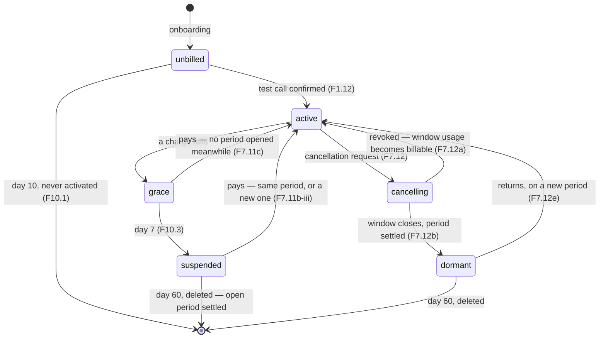

# Ringly — PRD + EDD (v3.0)

_Supersedes `Ringly_PRD_EDD_v2.md` (2026-07-01). Revised 2026-07-30 for
multi-tenant scale, scheduling-provider independence, recurring appointments,
the business analytics dashboard, Stripe billing, and email notifications.
Revised again 2026-07-31 — see below._

> **Status.** Part 1 (PRD) is locked. Part 2 (EDD) was rewritten against it on
> 2026-07-30 and supersedes the earlier design. **Almost none of it is built**:
> what ships today is the v2 product plus the calendar conflict check (PR #2) and
> the email templates (PR #4) — and §2.15 lists the places where that shipped code
> contradicts this design. The delivery plan is §2.16.

> **Revision 2026-07-31 — three scope decisions and a correctness pass.**
>
> 1. **Ringly has no channel to the calling customer, at all** (§1.4). Every
>    trace of a messaging channel and of appointment reminders is gone from this
>    document, including the dormant metering column and the deferral entries
>    that kept them alive as ideas. What survives is the instruction to **delete
>    the shipped code** (§2.4/005, §2.15) — that is cleanup, not a plan.
> 2. **Healthcare is out of scope** and always was in this document (§1.4, R11);
>    it is now also enforced in the schema and stated on the cover.
> 3. **Hosting is undecided** — Vercel or Google Cloud Run (N8, Q6, §2.2a). The
>    design no longer assumes either, and §2.2a states what must not be adopted
>    while the question is open.
>
> Five further decisions were settled the same day:
>
> 4. **A suspended business is charged nothing new** (F7.11b): no fixed fee, no
>    usage, no new period, for any part of it. **Periods are 30 calendar days and
>    are never extended** — a business suspended for ten days of its period gets
>    twenty days of service for its $100, and those lost days are the whole
>    penalty for paying late. **What does not stop is the chase** (F7.11b-i): the
>    unpaid invoice stays open, retried and followed up, because clearing it is
>    the only way back.
> 5. **Customer PII is destroyed on exactly two occasions, both automatic**
>    (F10.1a, §2.10.2): a self-serve control on the business dashboard for one
>    customer, and the lifecycle sweeper for all of them when the business itself
>    is deleted. Neither involves anyone at Ringly.
> 6. **Opening hours are the business's to change** (F3.5), written on save and
>    binding on every subsequent booking decision, including the generation of
>    future recurring occurrences (F5.2e).
> 7. **Money records get point-in-time recovery and cross-region backups** (N10).
>    A third copy outside the provider account is **deferred** (§1.9, R22) — real
>    work against a rare failure, with Stripe holding the payments meanwhile.
> 8. **Rate limiting is sized for the traffic actually expected**, which is low
>    (N9): a per-IP limit and a spend ceiling, not an abuse system.
>
> Two further decisions, and one clarification:
>
> 9. **Ringly sends every payment email, including throughout suspension; Stripe
>    retries the card silently** (Q7, F7.11b-ii). Stripe does not know what
>    suspension means here, so it cannot write a true email about it.
> 10. **The test-call allowance is five, and the sixth call is not answered**
>     (F1.13, F1.13a). At the fifth, the agent is unbound from the number — the
>     same mechanism as suspension — because a recorded refusal would still be a
>     connected call and still cost Ringly minutes. **Activating rebinds it**
>     (F1.13b), so a business that decides to pay is never held back by an
>     allowance that exists to cap free usage.
>
> And the clarification, after both were misread in review: **activation is one
> button pressed by the owner and nothing else ever triggers it** (F1.12b, F1.13d
> — no call count activates a business), and **a test call is simply any call
> arriving before that button is pressed** (F1.13c).
>
> Three more, from the second review pass:
>
> 11. **No new billing period opens while a business owes anything** (F7.11c),
>     through grace as well as suspension — so **the debt is frozen** the moment
>     service stops, and what a business owes on day 55 is what it owed on day 8.
>     Both non-payment cases are worked through in full (F7.11d). Grace service is
>     a one-time concession per failure, not a fresh week every thirty days
>     (F7.11c-i), and is **unbilled when the failed charge was a settlement**,
>     because that period closed the same day and none opens to bill it to
>     (F7.11c-ii). **The $100 is never prorated** (F7.11e). A worked life from
>     signup to either ending is at **F7b**.
> 12. **Every activation failure is reported to the business, and says whether it
>     was charged** (F1.12a-i). Binding a number is **verified by reading the
>     provider's state back**, never by placing a call (F1.12a-ii).
> 13. **The operator dashboard uses the same nightly rollup and the same live
>     median as the business one** (F9.7) — one pipeline, one freshness rule, and
>     both sides of a support call reading the same number.
>
> And three from the third pass: **the current billing period is the first row of
> the billing history, not a panel beside it** (F6.7); **the dashboard shows
> whether the number is actually live, and test calls remaining** (F6.15), so a
> business never has to ring itself to find out; and **every money figure states
> whether it is settled, accruing, or outstanding** (F6.14a), on both dashboards.
>
> **No clock is stopped by suspension** (§2.10) — not the 60-day deletion clock
> and not the billing period. Suspension stops _service_, and therefore usage and
> any new charge; it does not buy time back.
>
> **The delivery plan was then rebuilt from scratch** by deriving the order from
> Part 1's dependencies rather than patching the existing one (§2.16). It moved:
> billing from phase 6 to **phase 4**, because the dashboard reports billing and
> the dependency had been pointing the wrong way; lifecycle to **phase 5**, onto
> the critical path; recurrence later, since it needs the provider abstraction
> and hours. **Migrations are renumbered so their order matches ship order** —
> the old plan had 008 shipping after 011, which cannot happen. §2.16.1 names the
> minimum set that can charge a real customer (phases 0–5) and §2.16.2 lists every
> difference from the previous plan.
>
> **A test strategy and a scenario catalogue were added** (§2.20, §2.21): 269
> end-to-end scenarios covering every requirement in Part 1, written against a
> product-level vocabulary so the test bodies survive implementation change. Four
> decisions shape them — an injectable clock, simulated Retell payloads, Stripe in
> test mode with the other vendors faked, and assertions on projections rather
> than tables. What the suite cannot prove is listed rather than glossed
> (§2.20.3), and the vendor behaviour that needs a human is **action item A1**.
> **§2.20.3 is the honest half**: requirements no test can hold, requirements only
> a human can confirm, **scenarios that pass on something narrower than the
> requirement they hold**, premises that are not behaviours at all, and the two
> isolation rules enforced by lint rather than by tests.
> **§2.20.3 is the honest half**: requirements no test can hold, requirements only
> a human can confirm, **scenarios that pass on something narrower than the
> requirement they hold**, premises that are not behaviours at all, and the two
> isolation rules enforced by lint rather than by tests.
>
> **A final pass over the whole document** then fixed: an invariant that claimed
> a business is never charged for an unanswered day, which the fixed-period model
> contradicts (I5); an operator alert firing for every business that used its
> five test calls rather than only those that cannot activate (F1.13a); and three
> more instances of the migration-ordering bug — `calendar_incidents`,
> `email_log` and `billing_status` all owned by migrations later than the phase
> that reads them, plus **no phase owning the email dispatcher at all** (now
> its own phase) and the billing history assigned to a phase before the table it reads
> exists. Migration 007 is split into 007 and 012, since two phases each needed
> half of it.
>
> The same pass corrected the contradictions and gaps found reading Part 1
> against Part 2. The substantive ones: the 30-day/60-day retention conflict
> (F7.15), a recording TTL that outlives an unactivated business (F10.5, R18),
> no rule for a billing period ending mid-grace or mid-suspension (F7.11b),
> `contact_email` and the horizons arriving in a migration three phases after the
> phase that needs them (005), no `is_test_call` column for the counter F1.13
> depends on, no schema behind the outcome definitions F6.5–F6.6 promise, and an
> activation step that onboarding could not finish without billing (§2.16). New
> requirements: F1.13a–d (the allowance, the unbind, and what makes a call a test call), F2.10–F2.11 (no transfer,
> no voicemail), F3.5–F3.6 (hours are editable, timezone is not), F6.14 (say how
> fresh the dashboard is), N8, N9, N10.

---

# Part 1 — Product Requirements (PRD)

## 1.1 Vision

Ringly gives a small business a dedicated AI receptionist that answers calls
around the clock, discusses services and pricing, and books, reschedules and
cancels appointments against the business's own calendar.

v2 made a single business live in under three minutes. **v3 turns that into a
business**: thousands of tenants, each with thousands of customers, each in their
own timezone, billed for what they use, and able to see and manage their own
operation without talking to us. Google Calendar is the only scheduling system
served at launch, behind an interface built so others can follow.

## 1.2 What changed from v2

| Area         | v2                                   | v3                                                                |
| ------------ | ------------------------------------ | ----------------------------------------------------------------- |
| Tenancy      | Implicitly single-tenant assumptions | Explicit multi-tenant model, isolation and scale targets          |
| Scheduling   | Google Calendar only, hardwired      | Still Google only, but behind an interface others can plug into   |
| Appointments | One-off only                         | One-off **and** recurring series                                  |
| Services     | Set at onboarding                    | Editable any time; changes reach the agent for the next caller    |
| Hours        | Set at onboarding                    | Editable; timezone stays an operator action (F3.5–F3.6)           |
| Customers    | A messaging channel was planned      | **None, ever.** The call is the only contact (§1.4)               |
| Analytics    | None                                 | Per-business dashboard, plus an operator cost/revenue dashboard   |
| Money        | None                                 | $100/30 days in advance, usage in arrears, $500 cap, card on file |
| Email        | None                                 | Billing and stats emails **to the business**                      |
| Verticals    | Salons, clinics, tax offices         | **No healthcare** — no BAA, so clinics are out (§1.4)             |
| Hosting      | Assumed Vercel                       | **Undecided** — Vercel or Cloud Run; design stays portable (N8)   |
| Latency      | Not a stated requirement             | Explicit per-turn budget on the call path                         |
| Cost         | Not a stated requirement             | Explicit per-tenant serving-cost target                           |

## 1.3 Personas

- **Business owner (primary).** Non-technical. Salon, tax office, trades, and
  similar appointment-driven businesses — **explicitly not healthcare of any
  kind** (§1.4). Wants a receptionist, not a configuration project. Checks a
  dashboard occasionally and an email monthly. Cares about missed calls and
  money.
- **Calling customer (secondary).** Wants an appointment at a time that suits
  them, in one call, without being told to hold. Never sees Ringly's UI.
- **Ringly operator (us).** Needs per-tenant cost visibility, safe degradation,
  and no manual work per new tenant.

## 1.4 Scope

**In scope for v3:** everything in §1.5 and §1.6.

**Explicit non-goals for v3:**

- **Healthcare businesses of any kind, including clinics.** Callers to a clinic
  disclose health information, which makes the call PHI. Retell can carry PHI
  only under a signed Business Associate Agreement, which Ringly does not hold,
  and holding one imposes obligations across the whole stack. Clinics are
  therefore **out of scope until a BAA is in place** — a commercial decision, not
  a technical limitation. **`business_type` must not offer `clinic` or any
  healthcare option**, and the existing enum value must be removed.
- **Any outbound channel to the calling customer.** Ringly has no way to reach a
  caller after the call ends — no SMS, no messaging app, no email, no
  appointment confirmations or reminders of any kind. The **call itself is the
  only contact with a customer**, and the confirmation the caller receives is the
  agent reading the booking back to them before hanging up. Every requirement in
  this document is written on that basis: where a customer would otherwise need
  telling something (a recurring occurrence moved, F5.2c), the **business owner**
  is told and it is the owner's decision what to do. This is a product boundary,
  not a deferral with a date.
- Multi-location businesses (one location per business row).
- Multi-staff / resource-level scheduling (one implicit calendar per business).
- Multiple logins per business. **One business has exactly one owner account**,
  the Google identity that signed it up (F1.7). There are no staff logins, no
  invitations, and no roles.
- Non-US phone numbers and non-English calls.
- Self-serve plan changes, coupons, and promotional pricing of any kind.
- Customer-facing web booking. The phone is the only booking channel.
- **Transferring a call to a human, and taking a message.** The agent handles the
  call or it does not; there is no fallback to the owner's mobile and no voicemail
  (F2.10).

---

## 1.5 Functional requirements

### F1 — Onboarding and identity

_(Carried from v2; renumbered. v2 FR1–FR10 map to F1.1–F1.10.)_

- **F1.1** Intake accepts free-form text; no structured fields required.
- **F1.2** Voice output speaks the prompt; input is typed. (Speech-to-text input is deferred.)
- **F1.3** Enrichment resolves name, address, phone, hours, IANA timezone, and
  website from Google Places.
- **F1.4** Services auto-extracted from the website (≤5 items), with upload and
  manual entry as first-class fallbacks.
- **F1.5** All enriched fields are inline-editable before commit.
- **F1.6** Enrichment resolves in a single request.
- **F1.7** A single Google OAuth grants the Ringly session and offline calendar
  access; the account is keyed to the Google identity.
- **F1.7a** **Calendar scope may be declined independently of sign-in.** Google
  offers granular consent, so a user can grant sign-in and refuse calendar in the
  same dialog. Ringly checks the scopes actually granted rather than assuming.
- **F1.7b** **Declining calendar access blocks activation, not the account.**
  Sign-in completes and the enriched draft is kept, so declining costs a click
  rather than the work already done. Onboarding stops at a screen that
  **explains, in plain language, why calendar access is required** — Ringly
  refuses to book a time it cannot verify (F2.7), so without it there is no
  product — and offers a re-consent button.
- **F1.7c** The reason for every scope Ringly requests is stated on the consent
  screen **before** the user is sent to Google, not only after they decline.
- **F1.8** The user is told their Google login is now their Ringly login.
- **F1.9** Number purchase and agent provisioning run in the background.
- **F1.10 — Retired.** The number is left unused so references in earlier
  documents and commits still resolve.
- **F1.11** Onboarding collects and verifies a **business contact email**,
  defaulted from the Google identity and editable. It is the destination for all
  billing email, including the 48-hour warning before deletion (F10.3a), so an
  unverified address is a silent single point of failure.
- **F1.12** **Getting ready is a checklist of three tasks, presented
  together and completed in any order the business likes:**
  1. **verify the contact email** (F1.11);
  2. **make a test call and confirm it worked** — the owner's judgement, not
     something Ringly infers, because only they know whether the agent sounded
     right;
  3. **add a payment method.**

  Nothing is sequenced. A business that wants to hear its receptionist before
  giving anyone a card can; one that wants everything done in a minute can. The
  screen shows all three with their state, and what remains.

  **The screen also shows test calls remaining** (F1.13), because the allowance
  is small and running out of it stops the phone answering. A counter a business
  discovers only by hitting zero is a trap.

- **F1.12a** **Activation is one deliberate act by the business owner: pressing
  a button.** When all three checklist items are green an **Activate** button
  becomes available. Pressing it — and nothing else, ever — charges the $100,
  starts period 1, and flips the account from `unbilled` to `active`. The
  business is then told plainly that it is **now taking customer calls** and
  that billing has begun. There is no separate activation fee (F7.1); this charge
  is period 1's.
- **F1.12a-i** **Activation touches three systems, and the business is told the
  truth at each of them.** Taking money and connecting a phone are separate acts
  that can fail separately (EDD §2.4a.1), and the one thing a business must never
  be left with is a charge and no explanation.

  **The owner presses Activate exactly once.** Everything after that press is
  Ringly's problem to finish. **No failure is ever handed back as "press it
  again"** — the one moment a business must not be asked to press a payment
  button a second time is the moment it cannot tell whether the first press took.

  | If it fails at               | The business sees                                                                                                                                              | Charged?  |
  | ---------------------------- | -------------------------------------------------------------------------------------------------------------------------------------------------------------- | --------- |
  | **The card**                 | Inline, immediately: the card was declined, try another. Nothing else changed                                                                                  | **No**    |
  | **Recording the activation** | Nothing. **Ringly completes it itself** — the charge is the commitment, and finishing the record is a retry against Ringly's own database                      | Yes, once |
  | **Connecting the number**    | "You're activated and your first period has started. Your number is being connected — we will email you the moment it is live." **Plus that email when it is** | Yes       |
  - **Row two must never reach the screen.** A charge that succeeded and a record
    that did not is Ringly's inconsistency to resolve, not a task to hand to the
    person who just paid. The button shows progress until it resolves.
  - **Row three is the one that will be seen**, because connecting a number
    depends on a third party. The business has paid and its phone is not yet
    ringing, and silence there is indistinguishable from having been charged for
    nothing — so it is said plainly and raised to the operator (F9.6).
  - **No message ever leaves the business guessing whether it was charged.**

- **F1.12a-ii** **Every bind and every unbind is verified by reading the
  telephony provider's own record back.** A write that returns success and does
  not take effect is otherwise invisible until it matters, and it matters in both
  directions:
  - **A failed bind** — at provisioning (F1.9), at activation, or at any rebind
    (F1.13b, F7.10b) — leaves a business paying for a number that rings nowhere.
    It is discovered by a customer.
  - **A failed unbind** — at the test-call limit (F1.13a), at suspension, or at
    dormancy — leaves the number **answering calls Ringly has decided to stop
    serving and stopped metering**. It is a revenue leak and a correctness
    failure at once, and **nothing else in the system would ever notice it**,
    because every other component believes service has stopped.

  **A verification that fails is treated as a failed operation**: retried, and
  raised to the operator (F9.6). The read-back is cheap, deterministic, and tests
  the thing that actually goes wrong.

  **It is a check against provider state, never a placed call.** Ringly does not
  dial its own number: a synthetic call costs telephony minutes on every bind and
  unbind, lands in `calls` where it corrupts the test-call count (F1.13) and the
  analytics (F6.3), and still proves only that something answered. Whether the
  agent _sounds_ right is a human judgement, and checklist item 2 already exists
  for exactly that (F1.12).

- **F1.12b** **Nothing activates a business except that button.** Stated
  negatively because it is the thing most likely to be assumed otherwise:
  - **Call volume never activates anything.** Not the first call, not the fifth,
    not the one that gets refused after it. The number of calls placed has no
    bearing on billing status whatsoever.
  - **Confirming the test call does not activate.** It ticks one of three boxes
    (F1.12) and nothing more. A business can confirm its test call and sit there
    for a week without being charged a penny.
  - **Adding a card does not activate**, and the card is not charged when it is
    added — only stored (F7.2).
  - **Time never activates.** An unactivated business is deleted at day 10
    (F10.1); it is never promoted into a paying one.
  - **Ringly never activates a business on its behalf.** Not the operator, not a
    background job, not a support action.

  **Before that press: no charge is possible, ever.** After it: usage is billed
  by outcome alone (F7.6). There is no third state and no gradual transition.

- **F1.13** **An unactivated business gets five free test calls, and then the
  number stops answering.** Every pre-activation call costs Ringly real telephony
  and LLM minutes against no revenue (R8), and a business that will not activate
  is a business Ringly is subsidising indefinitely. Five is enough to hear the
  agent, try a booking, and try a reschedule; it is not enough to run a free
  receptionist.
  - **The allowance is five, and it is configuration, not a constant** — a
    platform default, changeable without a deploy, on the same principle as every
    other number in this document (F7.15).
  - **Reaching five does not activate the business, charge it, or promote it in
    any way.** It stops it, which is the opposite (F1.12b).
- **F1.13a** **At the fifth call the agent is unbound from the number, and the
  sixth call is not answered at all.** This is the same mechanism used for
  suspension and dormancy (EDD §2.10.1), applied for a different reason.
  - **Not answering is the point.** A polite refusal recorded by the agent would
    still be a connected call and would still cost Ringly minutes, which is the
    cost the limit exists to bound. The call must not reach the agent.
  - **The number stays rented and stays reserved to that business** (F10.4a). It
    is unbound, not released; nothing else can be given it while the business row
    exists.
  - **The business is always emailed**, whoever it is: its number has stopped
    answering, why, and what turns it back on.
  - **The operator is alerted only if the business _cannot_ activate** — that is,
    if it never confirmed a working test call (F9.12, "activation stuck"). A
    business with all three boxes green that simply has not pressed the button is
    **not stuck**; it is deciding, and raising it to a human every time would
    make the queue meaningless.
  - **The business is never charged.** Not for the five, not for the refused
    calls, not for being stuck.
- **F1.13b** **There are two ways out, and which one applies depends on whether
  the business ever heard a call that worked.**
  1. **It can activate itself, and that rebinds the number immediately.** If all
     three checklist items are green — including a confirmed test call — the
     Activate button still works. Pressing it charges the $100, binds the agent
     back, and the business is live (F1.12a). **Running out of test calls is not
     a bar to activating**; a business that has decided to pay should never be
     held back by an allowance that exists to limit free usage.
  2. **Otherwise it is genuinely stuck and recovery is operator-led.** A business
     that never got a call it was happy with cannot tick box 2 and therefore
     cannot activate. The operator investigates, **pauses the deletion clock**
     (F10.1b), and **resets the allowance and rebinds the agent** (F10.1c) once
     the fault is fixed.

  In both cases the **10-day clock keeps running unless the operator pauses it**
  (F10.1). An unactivated business is still deleted at day 10.

- **F1.13c** **A call is a test call if the business had not yet pressed Activate
  when it arrived. That is the whole rule; there is no detection.** Ringly bought
  the number minutes earlier and it is on no listing, no website, no sign and in
  nobody's contacts. The only person who knows it exists is the owner Ringly just
  gave it to, so before activation there is no other kind of call it could be.
  - **Who is calling is not examined**, deliberately: caller ID would add a way
    to be wrong about something the account state already settles. If a stranger
    somehow dials the number it still counts against the five and the business is
    still charged nothing, which is the right answer either way.
  - **The classification is written at the time of the call, not derived later**
    (EDD 005, `is_test_call`). Billing status changes; a call's history must not.
    Deriving it from today's status would reclassify every one of a business's
    test calls the instant it activated.
  - **After activation there are no test calls.** The owner ringing their own
    number is billed on the same terms as anyone else, by outcome alone (F7.6,
    F7.7).

- **F1.13d** **The lifecycle in full, so the boundary is unambiguous.** Three
  businesses, same five calls; the only difference is the button:

  |                            | A — activates                               | B — could, doesn't                                     | C — never got a good call                                   |
  | -------------------------- | ------------------------------------------- | ------------------------------------------------------ | ----------------------------------------------------------- |
  | Signs up, gets a number    | `unbilled`                                  | `unbilled`                                             | `unbilled`                                                  |
  | Places 5 test calls        | 5 test calls, **$0**                        | 5 test calls, **$0**                                   | 5 test calls, **$0**                                        |
  | Confirms one worked        | box 2 ticked                                | box 2 ticked                                           | **cannot** — none sounded right                             |
  | Email verified, card added | all 3 green                                 | all 3 green                                            | 2 of 3                                                      |
  | 5th call ends              | agent unbound; emailed                      | agent unbound; emailed                                 | agent unbound; emailed **and operator alerted** (F1.13a)    |
  | **Presses Activate**       | → `active`, **$100**, period 1, **rebound** | can still do this at any time → rebinds, live (F1.13b) | **button unavailable** — box 2 is not green                 |
  | Next call arrives          | answered, **production, billable**          | **not answered**                                       | **not answered**                                            |
  | Where it ends up           | Paying customer                             | Its own choice; deleted at day 10 if it never presses  | Operator-led (F10.1b, F10.1c); deleted day 10 unless paused |
  | Total charged              | $100 + usage                                | **$0**                                                 | **$0**                                                      |

  **B and C are never charged anything, whatever happens**, because neither
  pressed the button. There is no call count at which billing begins — only a
  call count at which the phone stops being answered.

### F2 — Call handling and booking

- **F2.1** The agent answers on the business's dedicated number, identifies the
  business, and can describe services, prices, and durations.
- **F2.1a** **Every call opens with a recording disclosure**, immediately after
  the greeting and before the caller says anything of substance:

  > "Hello, this is _[business name]_. Just to let you know, this call is
  > recorded for quality assurance. How can I help you today?"

  Around a dozen US states require all-party consent to record. **The disclosure
  is appended by Ringly and is not part of the business's editable greeting
  script** — a business can change how it introduces itself, but cannot remove or
  alter the disclosure. If a business supplies no greeting of its own, the text
  above is used verbatim.

- **F2.2** The agent books, reschedules, and cancels appointments.
- **F2.3** A requested time is checked against the business's own bookings **and**
  its connected calendar before anything is written; a taken slot is refused and
  the nearest open times either side are offered. _(Shipped in PR #2.)_
- **F2.3a** If the slot is taken **between** offering it and writing it — a race
  with another caller — the agent says so and re-offers:

  > "Unfortunately, that slot has just been taken. Let's find another time for
  > your appointment. Here are some available slots…"

- **F2.4** A caller identifies an existing appointment by **name plus the
  appointment's details** — date, time, and service. Ringly searches for an
  appointment matching all of them.
  - A reschedule or cancellation proceeds **only on a full match**. A partial
    match is refused and the caller is told what did not match.
  - Voice recognition errors are expected, so a caller may correct any detail and
    the search runs again against the corrected values.
  - Caller ID is **not** the identifying factor for _this lookup_: a customer
    may ring from a different phone or withhold their number, and the search runs
    over appointments rather than over customer records.
  - **A customer's identity is nonetheless their phone number**, not their name —
    names are not unique and two customers of one business may share one. A
    customer who books from two different phones therefore becomes two customer
    records, and Ringly cannot tell they are the same person. **Accepted:** it
    inflates unique-caller counts and splits history, and there is no sound way
    to merge on name alone.
  - **A relative day means the next one.** "Tuesday at 2" resolves to the
    **nearest future Tuesday** from the moment of the call. The agent then
    **states the full date back to the caller** and waits for confirmation before
    acting, so an ambiguous phrase is never resolved silently.
  - **For an appointment that belongs to a recurring series, the agent asks
    explicitly whether the caller means this occurrence alone or the whole
    series**, and repeats the choice back before cancelling or moving anything.
    This question is not asked for one-off appointments.
- **F2.5** All times spoken to a caller are in the **business's** local timezone,
  never UTC and never the caller's.
- **F2.6** While the agent is waiting on any backend operation, the caller hears
  natural filler speech rather than silence. No caller-perceptible gap may exceed
  the budget in N3.
- **F2.7** **If the business's calendar cannot be reached for any reason, no
  appointment is booked.** A booking Ringly cannot verify is worse than no
  booking — it double-books the business and the customer arrives to a clash.
  _(This replaces the earlier fail-open position; see R1.)_
  - **To the caller: a quiet apology, not an explanation.** The agent apologises,
    says it cannot confirm a time right now, and asks them to call back shortly.
    No technical detail, no blame.
  - **To everyone else: as loud as possible.** The same failure raises a
    prominent warning on the **business dashboard**, a warning on the **operator
    dashboard**, and an **immediate email to the business** telling them customer
    bookings are failing because their calendar cannot be reached.
  - **Alerting is per incident, not per call.** A calendar outage fails every
    call that arrives during it; the business gets **one** email per incident,
    not one per lost customer. The warning clears automatically on the first
    successful calendar read.
- **F2.7a** This applies however the calendar became unreachable — provider
  outage, timeout, revoked consent, or expired credentials. **There is no case in
  which Ringly books against a calendar it could not read.** A connected calendar
  is mandatory (F4.1), so there is no configuration in which booking proceeds
  unverified.
- **F2.8** The agent answers **24 hours a day**, but appointments may only be
  **booked inside the business's opening hours** (F3, business_hours).
- **F2.9** A one-off appointment may not be booked **more than 70 days ahead**.
  The limit is **configuration, not a constant**: a platform default that the
  **business can change from its own dashboard** (F6.13), bounded to **7–180
  days** so no business can set a value that makes availability computation
  unreasonable.
- **F2.9a** The 70-day limit constrains **what a caller may request**. It does
  not constrain recurrence: a standing series is open-ended by nature, and its
  occurrences are materialised ahead by the system (F5.2), not requested by a
  caller.
- **F2.10** **There is no escape hatch out of the agent.** Ringly does not
  transfer to a human, does not take a message, and has no voicemail. A caller
  the agent cannot help is told plainly that it cannot help with that and is
  given the business's own contact details — which the business already
  published. The call is recorded as `dropped` (F6.4), which is how the business
  finds out this is happening. Adding a transfer target would mean holding an
  owner's personal number, ringing it out of hours, and building a hand-off the
  agent cannot verify anyone answered.
- **F2.11** **The caller's booking confirmation is the agent reading it back**
  during the call — date, time, service, and business — and nothing else. Ringly
  cannot reach the caller after the call (§1.4), so the read-back is the whole
  confirmation and the agent must not promise a message that will never arrive.

### F3 — Service catalogue and opening hours

- **F3.1** A business can add, edit, deactivate, and reorder services, each with
  a name, description, price, and duration.
- **F3.2** A change takes effect for the **next** caller. Target propagation ≤ 60s
  from save; the caller mid-conversation keeps the catalogue they started with.
- **F3.3** Deactivating a service never alters appointments already booked
  against it.
- **F3.4** Price and duration are versioned, and resolve at **different moments**:
  - **Price is the price in force at the time of the appointment**, not at
    booking — these businesses charge their customer after the appointment
    happens, so the price they will actually collect is the current one.
  - **Duration is locked** when the appointment is booked (or, for a recurring
    occurrence, when it is materialised) and never changes afterwards. A
    duration that floated would silently overlap appointments booked around it.
  - Deactivating or repricing a service therefore never breaks an existing
    booking's slot, but does change what it is worth.
  - If the service has since been **deleted**, the appointment is valued at the
    **last known price** of that service. An appointment never becomes unpriceable
    because the catalogue moved on.
- **F3.5** **Opening hours are editable by the business on its own dashboard**,
  on the same terms as the catalogue — same screen, same ≤60s propagation
  (F3.2). A business that cannot change its own Saturday has to ring Ringly to
  do it, which is not a product.
  - **The change is written to the database on save** and is authoritative from
    that moment. There is no draft, no review, and no operator step.
  - **Every subsequent booking decision uses the new hours** — the agent's
    availability check (F2.8), the slots it offers either side of a taken one
    (F2.3), and the generation of future recurring occurrences (F5.2e). The only
    bound is the ≤60s the agent may take to see the change (F3.2), and a caller
    already mid-conversation keeps the hours they started with.
  - **Appointments already booked are never moved or cancelled.** One that now
    falls outside opening hours stays exactly where it is: a time was agreed with
    a customer Ringly has no way to contact (§1.4), so breaking it silently is
    worse than honouring it. The business can see it in its own calendar and
    handle it.
  - **Narrowing hours does not retroactively invalidate anything**, and widening
    them makes new slots bookable immediately.
- **F3.6** **Changing timezone is an operator action, not a self-serve one.**
  A timezone is resolved once at onboarding from the business's address (F1.3)
  and is almost never genuinely wrong; changing it silently re-interprets every
  stored instant a business can see (N5.1) and every billing-period boundary
  (N5.2). Rare enough to handle by hand, and consequential enough that it should
  be.

### F4 — Scheduling integrations

- **F4.1** **A connected calendar is mandatory.** A business cannot activate, and
  cannot take bookings, without one. Ringly refuses to book a time it has not
  verified (F2.7), so a business with no calendar has no product.
- **F4.2** **Google Calendar is the only supported provider at v3 launch**, and
  is the default. Businesses on other systems are not served yet.
- **F4.3** The system is built so a further provider can be added **without
  changes to booking logic** — provider-specific code lives behind one interface
  (EDD §2.4).
- **F4.4** Providers targeted after launch, in priority order: Microsoft 365 /
  Outlook, CalDAV (Apple/Fastmail), then vertical booking systems (Square
  Appointments, Acuity, Calendly).
- **F4.5** **Losing or revoking provider access stops booking.** There is no
  degraded mode that books without verification — the failure is handled by F2.7
  and F2.7a. Calls are still answered and enquiries still work; only booking
  stops, loudly.

### F5 — Recurring appointments

> **A recurring series is between the business and Ringly, not between Ringly
> and the customer.** Ringly has no channel to the caller (§1.4), so everything
> below that would ordinarily involve telling a customer something instead tells
> the **business owner**, whose job it then is.

- **F5.1** A caller can set up a **recurring** appointment in one call (e.g.
  "every fourth Tuesday at 2"), described by a standard recurrence rule.
- **F5.2** Occurrences are generated ahead of time so each can be individually
  moved, cancelled, or skipped without affecting the rest of the series. The
  horizon is **90 days by default and is configuration, not a constant**: a
  platform default the **business can change from its own dashboard** (F6.13),
  bounded to **30–365 days**.
- **F5.2a** If a generated occurrence lands on a slot that is already taken, it
  is **shifted to the nearest free slot on the same day, within ±2 hours** of its
  usual time. If nothing fits that window the occurrence is **skipped, not
  moved**, so a customer is never silently relocated to another day.
- **F5.2b** Either outcome — shifted or skipped — **emails the business owner**
  with the customer's name and number, the original date and time, what happened,
  and the new time if there is one. The business owner is the only party that can
  be reached in v3.
- **F5.2c** **The customer is not notified of a shift or a skip**, because Ringly
  has no way to reach them (§1.4). The email to the owner (F5.2b) therefore
  **states this plainly** — it carries the customer's name and number precisely so
  the owner can ring them, and says in as many words that Ringly has not.
- **F5.2d** Because a shifted occurrence is one the customer does not know about,
  **the shift window is deliberately narrow** (±2 hours, same day, F5.2a) and a
  skip is preferred to a larger move. A customer who arrives at their usual time
  to find the slot moved by two hours is an inconvenience; one who arrives on the
  wrong day is a failure.
- **F5.2e** **A generated occurrence must fall inside opening hours**, evaluated
  against the hours in force when it is generated — not when the series was set
  up (F3.5). A business that stops opening on Saturdays must stop having Saturday
  occurrences generated. One that would now land outside hours is treated exactly
  like a clash (F5.2a): shifted within ±2 hours the same day if that lands inside
  hours, otherwise **skipped**, and either way the owner is emailed (F5.2b).
  **Already-generated occurrences are not swept up and moved** — the same rule as
  F3.5, because they are appointments a customer has been promised.
- **F5.3** Cancelling a series cancels its future occurrences and leaves past
  ones intact.

### F6 — Business dashboard

The dashboard **reports exactly two things** — the aggregate shape of the calls
Ringly handled, and what the business has paid for them. Anything else it might
report is deliberately absent, not merely unbuilt.

It also carries **the state of the service itself** (F6.15), the **controls** a
business needs — the full list is F6.13 — and the warnings raised when something
is wrong (F2.7). Those are not reporting, and the two-things rule does not
constrain them.

**(1) Aggregate analysis of calls to Ringly**

- **F6.1** Each business sees only its own data, always.
- **F6.2** **Two filters, in order, governing everything on the page:**
  1. **Unit** — `calendar month` (how a business thinks) or `billing period`
     (how it is charged). One or the other, never both at once.
  2. **Range** — `current` · `past 3` · `past 6` · `past 12` of that unit. These
     four and no others; an arbitrary date picker invites ranges that cross a
     unit boundary and answer nothing.
- **F6.3** **Six metrics, aggregate only.** There is no per-customer reporting:
  a customer cannot be reliably identified — names are not unique and one person
  rings from different numbers — so any per-customer figure would be a guess
  presented as a fact.
  - **total calls**
  - **average call duration**
  - **median call duration**
  - **calls that booked** — the count of calls whose outcome was a booking,
    whether that booked one appointment or set up a recurring series. It is the
    headline number, and it is the same figure as the `booked` bar in the outcome
    breakdown, promoted to a tile because it is what an owner looks for first
  - **outcome breakdown**: booked / rescheduled / cancelled / enquiry-only /
    dropped
  - **time of day** the calls arrived

  **Everything here counts calls, not appointments.** A single call can set up a
  recurring series that becomes fifty appointments, and none of these six figures
  will say fifty. That is deliberate — this section is the shape of the calls
  Ringly handled — but it must be stated in the definitions panel (F6.5), because
  "calls that booked" and "appointments in my diary" are different numbers and an
  owner will compare them.

- **F6.3a** Plus **revenue booked** — an **estimate** wherever the range includes
  future appointments, labelled as such, because price resolves at occurrence
  time (F3.4).
- **F6.3b** **Time of day is reported in six four-hour windows**, starting at
  local midnight: 00–04, 04–08, 08–12, 12–16, 16–20, 20–24. Hourly resolution is
  noise at these volumes; four-hour windows are the grain at which a business can
  act — "we are missing calls in the evening".
- **F6.3c** **Outcome and time of day cross each other through filters, not a
  separate report.** The outcomes view filters by time window; the time-of-day
  view filters by outcome. Both questions — how do evening calls end, when do
  reschedules happen — are answered without either chart carrying two dimensions
  at once.
- **F6.3d** **Enquiry-only and dropped are counted separately**, here and on the
  operator's dashboard, even though neither is billable (F7.6). Collapsing them
  would hide the difference between an agent that answers questions well but does
  not convert, and one that is failing callers outright.
- **F6.3e** **Three separate trends across periods** — calls, appointments
  booked, and revenue booked — each one chart, one column per period. Kept apart
  rather than behind a measure toggle, so a period where calls rose and revenue
  did not is visible at a glance instead of requiring two clicks to notice.
- **F6.3f** **What the business pays Ringly is not among the call metrics.** It
  lives in the billing history (F6.7). The call analysis is about the work done;
  the billing history is about the money.
- **F6.4** **"Dropped"** covers both a caller who hung up without a resolved
  outcome **and** a call the agent could not help with. If the caller did not get
  what they rang for, it is dropped. A completed enquiry — the caller asked
  something and got a useful answer — is reported separately.
- **F6.5** **Every outcome definition is shown on the dashboard itself**, in
  plain language, next to the figures it governs. A business must never have to
  guess what "dropped" counts.
- **F6.6** **If a definition changes, the dashboard says so prominently** — a
  notice the owner may or may not read, with no acknowledgement required and no
  state to track. It states that figures before and after the change are not
  directly comparable. Historical calls are **not** reclassified — transcripts
  are not retained (F10.6), so outcomes cannot be re-derived. This is a permanent
  property of the design, explained on the dashboard rather than hidden.

**(2) Billing history**

- **F6.7** Billing history is **one table, not a chart** — one row per billing
  period: **dates · fixed fee · billable minutes · usage charge · total · % of the
  $500 cap · date charged · status**.
  - **The current period is the first row of that same table**, not a separate
    panel beside it (F6.8). It is the row a business looks at most, and lifting
    it out would mean the one number they check daily lives somewhere different
    from the eleven they check yearly, in a different shape, having to say the
    same things twice.
  - **Billable minutes** are connected minutes on productive calls (F7.6);
    enquiry-only and dropped calls consume none.
  - **Status** is what makes the current row legible next to the closed ones:
    **in progress** · paid · failed · refunded. **"Refunded" is only ever a
    goodwill gesture made by hand** — no rule in this document produces a refund,
    and none should be built.
  - **A period during which service was suspended says so in its row** (F7.11b).
    Its dates are still exactly 30 days, so nothing looks wrong; what the label
    adds is that the business was not served for some of them and was **not
    charged for those days**. Without it, a period with low usage and a full $100
    looks like a mistake.
  - Minutes and money are different units, so nothing here is charted: a single
    plot carrying both would need two axes, which is the one construction that
    reliably misleads.
- **F6.8** **The current period's row is live** and carries what a business
  actually asks: usage accrued so far, the cap and how close they are to it, and
  **the date of the next charge**. Every other row is settled and final.

**Everything else**

- **F6.9** The dashboard is **aggregate-only**. A business cannot read individual
  transcripts, listen to recordings, search what was said, or see figures broken
  down by customer — Ringly stores no call content (F10.6) and cannot reliably
  identify a customer (F6.3). Ringly's own developer inspects individual calls in
  the Retell dashboard.
- **F6.10** Figures cover **only appointments booked through Ringly**. Anything
  the owner enters directly in their own calendar is respected for conflict
  checking (F2.3) but never appears in Ringly's figures.
- **F6.11** All figures are rendered in the business's own timezone, including
  day, week and month boundaries for grouping.
- **F6.12** Dashboard queries return in ≤ 500ms p95 regardless of tenant size,
  and their cost must not grow with total call volume across all tenants.
- **F6.13** From the dashboard a business can: manage its service catalogue and
  opening hours (F3.1, F3.5), confirm its test call succeeded (F1.12), set its
  own booking and recurrence horizons (F2.9, F5.2), reconnect a calendar after a
  failure (F1.7b), **delete a customer by phone number** (F10.1a-i), and opt out
  of the stats digest (F8.4). **It cannot change its timezone** (F3.6) or cancel
  its account (F10.2); both go through Ringly.
- **F6.14** **The dashboard states how fresh it is, on the page, always.**
  - **A nightly rollup is the right grain for every call metric** (F6.3, F6.3a).
    These are questions about shape and trend — how many calls, when they
    arrive, how they end — and none of them is meaningfully different for having
    happened four hours ago. Serving them from a rollup is also what keeps F6.12
    achievable at 10,000 tenants.
  - **The consequence is that today's calls are not shown**, and the dashboard
    must **say so in plain words** next to the figures: complete to a stated
    date, today appears tomorrow. A business that has just taken a call, cannot
    find it, and is given no explanation concludes the product is broken — and it
    will do that on day one, when it is testing exactly this.
  - **Median call duration is computed live** when the dashboard loads (F6.3),
    because a median cannot be recovered from daily aggregates. It is the single
    live query against raw calls and is bounded by the selected range.
  - **Billing figures are live** (F6.8, F7.13). A business asking what it owes is
    asking about now, and the numbers are small enough to compute on demand.
  - Anything live is **labelled live**, so the two kinds of figure are never read
    as one.
- **F6.14a** **Every money figure states whether it is settled.** A charge that
  has cleared, a charge that is still accruing, and a charge that failed are
  three different kinds of number, and rendering them identically invites a
  business to plan around one that has not happened.
  - **Settled** — money that moved. Closed periods, completed charges.
  - **Accruing** — the current period's usage and running total, correct as of
    now and certain to change (F6.8).
  - **Outstanding** — invoiced and not paid, whether the business is in grace or
    suspended (F7.11b-i).

  **The same rule governs the operator dashboard** (F9.8), where it matters more:
  revenue there counts only money actually received, and a figure that quietly
  mixed in what is merely invoiced would misstate the business Ringly is in.

- **F6.15** **The dashboard states the current state of the service, at the top,
  always.** A business must be able to answer "is my phone being answered right
  now?" without ringing it. Three facts, in plain language:
  - **whether the number is live** — bound to an agent and taking calls, or not
    (F1.13a, F10.3) — and, when it is not, **why, and exactly what turns it back
    on**: activate (F1.13b), or settle what is owed (F7.10b);
  - **the number itself**, since it is the business's public identity;
  - **test calls remaining**, before activation only (F1.13).

  **This is the one thing on the dashboard that is never stale**: it is read from
  current state, not from the rollup, and it is the first thing on the page. A
  business whose number stopped answering and whose dashboard looked normal would
  have no way of finding out except from a customer who could not get through.

> **No-shows are out of scope.** Ringly does not track, record, or report them.
> A no-show is something the business observes in its own calendar and handles
> itself; Ringly has no way to know it happened and no lever to pull. Blacklisting
> repeat no-shows, or reminding them harder, are ideas for later — both depend on
> a customer channel that does not exist.

### F7 — Billing and payments

**Billing period.** A business's period is a **rolling 30 days from activation**,
not a calendar month. Period 1 begins the day the business activates (F1.12);
period _n+1_ begins the day after period _n_ ends.

**The two charges never fall on the same day.** The fixed fee is taken on the
**first** day of a period; that period's usage is settled on its **last** day.
For a business activating on day 1: $100 on day 1, period-1 usage on day 30,
$100 for period 2 on day 31. A card that has gone bad therefore fails one charge
at a time, and there is only ever **one grace clock**, started by whichever
charge failed first (F7.11).

- **F7.1** A **$100 fixed fee** is charged **in advance** at the start of every
  30-day period, irrespective of usage. The first such charge is the activation
  payment — there is no separate one-off activation fee.
- **F7.2** At activation the business's **card is stored for future off-session
  use**, so later charges need no customer presence.
- **F7.3** Ringly never stores, transmits, or logs raw card details. Card data is
  handled entirely by the payment provider; Ringly stores only provider
  identifiers. _(Hard requirement, not a preference.)_
- **F7.4** **Usage** accrues through the period and is charged **in arrears** at
  period end, once the total is known.
- **F7.5** **There is exactly one billable usage unit: connected minutes on
  productive calls** (F7.6), whole call duration (F7.7). No other unit is
  metered, and the pricing policy carries no dormant ones — a rate nothing
  produces is scaffolding that misleads whoever reads it next.
- **F7.6** A call is **productive** — and therefore billable — if it resulted in
  any of: a new booking; a reschedule that produced a booked appointment; or a
  cancellation of a real existing appointment. **Not billable:** general enquiry
  calls, wrong numbers, dropped calls, pre-activation test calls, and any call
  that changed nothing for the business. **Who is calling is irrelevant** — the
  owner, a customer, or Ringly's own developer are billed identically. The
  outcome is the only test.
- **F7.7** The **whole call** is billable, not only the minutes up to the
  booking. Once a business is activated, **no caller is exempt** — Ringly does
  not try to decide whether a call came from a genuine customer, the owner, or
  the developer. The only filter is the outcome test in F7.6.
- **F7.7a** Connected seconds are summed across the **whole billing period** and
  **rounded up to a whole minute once**, at period close — not per call. A
  business making many short calls is not charged a full minute for each.
- **F7.8** Rates are **configuration, not constants in code**. The
  per-connected-minute rate is **TBD** (Q1) and must be settable without a
  deploy. Adding a future unit of usage means adding a column to the pricing
  policy at that time, not carrying an unused one now.
- **F7.9** A **$500 cap per period, inclusive of the $100 fixed fee.** Usage
  **keeps accruing past the cap** — it is recorded in full, because Ringly needs
  the real number for cost and margin (F9). The cap is applied **at settlement**,
  not during the period: whatever was accrued, the business is charged at most
  $500 for the period.
- **F7.9a** **Settlement happens at exactly three moments**, and the clamp is
  applied at each:
  1. **Normal period end** — the usual case.
  2. **A cancellation window closing** (F7.12) — 7 days after the request or at
     period end, whichever comes first, which settles the period early.
  3. **Final deletion for non-payment** (F10.3), where the clamped figure is what
     the business is recorded as owing (F10.9) even though it is never collected.
- **F7.9b** On first crossing the cap Ringly **continues to serve the business
  and absorbs the excess**, **alerts the operator** (F9.6), and **emails the
  business** to say it has used enough to reach $500 and that everything for the
  rest of the period is on Ringly. Hitting the cap is good news for the business
  and should read that way.
- **F7.10** Billing repeats every 30 days with no action from the business —
  **unless the business has asked to cancel**. A business marked cancelled is
  **never charged again**, and resumes billing only if it explicitly withdraws
  the cancellation.
- **F7.10a** Because cancellation arrives by email (F10.2), **the operator sets
  and clears a business's cancelled status from the operator dashboard** (F9.10).
  It is the single control that stops future charges.
- **F7.10b** **Payment clearing is the trigger; restoration is the consequence.**
  Ringly does not charge a suspended business to bring it back — it is already
  being charged, continuously, by the retries that never stopped (F7.11b-i).
  **The moment nothing is outstanding, service resumes that same day**: the
  number is rebound and the business is emailed to say its phone is answering
  again.
  - **"Nothing outstanding" is the test, not "a payment arrived".** A business can
    owe a failed fixed fee and an unsettled usage bill at once; clearing one of
    two leaves it suspended, and the email says what remains.
  - **It does not matter how the payment cleared** — an automatic retry, a new
    card, or the business paying the invoice by hand. All three reach Ringly the
    same way (EDD §2.9.5).
  - **Which period they land in follows F7.11b-iii**: the original one if it is
    still running, otherwise a new one opened that day. **The original is never
    extended** — the days lost to suspension are lost (F7.11b).
  - Usage served during the 7-day grace before suspension **is billable and
    settles with its period** — service given is service billed.
- **F7.10b-i** **A business that has paid and is still not being answered is the
  worst state in the system**, so recovery must not depend on a single message
  arriving. If the notification of payment is lost, a **daily reconciliation**
  finds any suspended business that owes nothing and restores it (EDD §2.9.5).
  A lost notification may cost such a business hours; it must never cost it days,
  and it must never cost it the account.
- **F7.10c** **A new billing period opens, charged $100 that day, whenever
  service resumes and no period is running.** Two routes reach it:
  - **Returning from dormancy after cancellation** (F7.12e) — that path settled
    its period on the way out (F7.12b), so there is never one to resume.
  - **Returning from suspension after the original period already ended**
    (F7.11b-iii).

  Whether they keep their number and history depends only on whether their data
  still exists — inside the recoverable window they resume as themselves, after
  it they are a stranger.

- **F7.11** A failed charge starts a **7-day grace period**. Through it Ringly
  **keeps answering calls and keeps accruing usage**, and emails the business
  about the failure. If payment has not cleared by day 7, the account is
  **suspended** (F10.3).
- **F7.11a** **A business already behind on payment cannot cancel into free
  service.** If a cancellation arrives while a payment failure is unresolved, the
  business is treated as **non-paying**: the suspension clock keeps running
  (F10.3), no free window opens, and no usage is forgiven. Cancelling is not a
  route out of a debt.
- **F7.11b** **A billing period is 30 calendar days and is never extended.
  Suspension does not extend it, and a suspended business is charged nothing
  new.** (The one thing that can make a period _shorter_ is cancellation, which
  settles the final one early — F7.12b. Nothing ever makes one longer.) Two rules
  that sound like they conflict and do not:
  - **The period clock never stops.** `starts_at` and `ends_at` are set when the
    period opens and **never move**. A period that begins on the 3rd ends on the
    2nd of the following month whether the business was served for thirty of
    those days or seven.
  - **No new charge of any kind arises during suspension** — no fixed fee, no
    usage, no new period. Calls are not being answered (F10.3), so there is
    nothing to bill for.

  **A suspended business therefore loses service days it has already paid for,
  and that is the intended outcome.** The days were lost by not paying on time.
  Extending the period to give them back would mean a business that pays late
  ends up no worse off than one that pays on time, which is not a rule Ringly
  should be operating.

  - **Usage does not accrue during suspension**, because no calls are served.
  - **The $100 already invoiced for that period stands, whole and unprorated**
    (F7.11e). It was charged in advance for a period Ringly held open and stood
    ready to serve.
  - **A period _can_ end while suspended**, and this is the case the rule has to
    answer (F7.11d): it **settles on its original last day** for whatever usage
    accrued before suspension, clamped — and **no successor opens** while the
    business is still suspended.

- **F7.11b-i** **What pauses is the meter, not the collection of what is already
  owed.** These are two different things and conflating them breaks the recovery
  path, because the unpaid charge is the entire reason the business is suspended
  and paying it is the only way out.

  | During suspension                              | Continues? | Whose job  |
  | ---------------------------------------------- | ---------- | ---------- |
  | The **outstanding invoice** stays open and due | **Yes**    | Stripe     |
  | **Automatic retries** against the card on file | **Yes**    | Stripe     |
  | **Payment follow-up emails** to the business   | **Yes**    | **Ringly** |
  | The 48-hour deletion warning at ~day 58        | **Yes**    | **Ringly** |
  | New fixed fees                                 | **No**     | —          |
  | New usage charges                              | **No**     | —          |
  | New billing periods                            | **No**     | —          |

  A suspended business must be **chased as hard as any other debtor** — it is
  being asked to settle what it already owes, which is not a charge for the
  suspension. What it must never receive is a **new** charge for a service it is
  not getting.

- **F7.11b-ii** **Ringly writes and sends every one of those emails; Stripe
  retries the card in silence** (Q7, F7.20, F7.21). Suspension is a Ringly
  concept and Stripe knows nothing about it — not that the agent has been
  unbound, not that no new period will open, not that the number goes in 48
  hours.
  An email from Stripe during suspension could only say a card was declined,
  which is the least useful true thing available and would arrive alongside
  Ringly's saying something different. **Stripe's dunning stays off throughout**,
  including here.

  **The failure this guards against is the opposite of the one F7.11b guards
  against.** F7.11b stops Ringly billing for a phone nobody answers; F7.11b-i
  stops Ringly going quiet on a debt and letting a recoverable business drift to
  day 60 in silence. The implementation detail that makes the pair work is at
  §2.9.3 — a subscription whose collection is fully paused would stop the
  retries, which is not what is wanted.

- **F7.11b-iii** **On restore, where the business lands depends on one question:
  is the period it was suspended in still running?**
  - **Still running** → service simply resumes inside it. **Nothing new is
    charged**, and it ends on its original date with however many days are left.
  - **Already ended** → **a new period opens on the day service is restored**,
    with $100 charged that day (F7.10c). The ended period stays settled on its
    own terms; there is no reaching back into it.

  **At most one period boundary can ever be crossed while suspended**, because no
  successor opens during suspension and the whole suspension is bounded at 60
  days (F10.3). There is no case of a business returning to find three periods
  stacked up behind it.

  **The debt clears first; the new period's fee is charged after.** These are two
  separate movements on the same day and the order is not cosmetic: restoration
  is triggered by owing nothing (F7.10b), so the new period cannot exist until
  the old debt is settled. A business paying its way out of suspension on a day
  when a new period opens is therefore charged **twice that day** — what it owed,
  then $100 — and both appear separately in its billing history (F6.7).

- **F7.11b-iv** **If the new period's $100 fails, that is a fresh failure with a
  fresh clock.** The old grace clock ended the moment the debt cleared; a decline
  on the new period starts a new 7-day grace from that day (F7.11), not a
  continuation of the one just closed. A business is never carried straight from
  suspension back into suspension without the full grace it is owed — and the
  60-day deletion clock restarts with it, because the previous one expired when
  the account was restored.

- **F7.11c** **No new billing period ever opens while the business owes
  anything.** Not during grace, not during suspension. This is the single rule
  that keeps a failing account from accumulating fees, and it holds from the
  moment the first charge declines until the moment the debt clears.
  - **A business in trouble is therefore only ever dealing with one period** —
    the one that was open when the trouble started, if any — and one debt.
  - **The period that was already open runs to its own end and settles there**
    (F7.11b), because it was opened and paid for, or invoiced, before any of this
    began. Its successor simply never arrives.
  - **A second decline does not start a second clock.** There is one, started by
    whichever charge failed first (F7.11), and outstanding amounts add up.

  **Without this rule a business is billed $100 for periods it never asked for
  and mostly did not receive**, discovering the total at the exact moment it is
  deciding whether to come back. With it, the debt a business must clear is
  bounded by what it actually used before Ringly stopped serving it.

- **F7.11c-i** **Grace service is a one-time concession per failure, not a
  recurring benefit.** The seven days are given once, when a payment first
  declines. They are not re-granted at what would have been the next period
  boundary, because there is no next period while the debt stands (F7.11c) — a
  business cannot collect a fresh week of free service every thirty days by
  continuing not to pay.

- **F7.11c-ii** **Grace usage is billed only if there is an open period to bill
  it to.**
  - **Usually there is**, and it settles with that period as ordinary usage —
    service given is service billed.
  - **In one case there is not**: when the failed charge _was_ the settlement of
    a period, that period closes on the same day (F7.16), and the grace that
    follows runs with no period open. **That usage is not billed.** There is
    nothing to bill it to, no successor opens (F7.11c), and inventing a period to
    hold it would be manufacturing exactly the $100 charge this design refuses.
  - **The cost is still recorded.** `cost_records` do not belong to a period, so
    Ringly keeps its true cost of serving those days (F9.5, R8) even though it
    charges nothing for them. **What Ringly absorbs, Ringly measures.**
  - It is bounded at seven days, once (F7.11c-i).

  **This makes grace mean two slightly different things, and that is accepted.**
  Where the fee declined, grace is _service continues and you still owe for it_;
  where the settlement declined, grace is _service continues and it is free_. The
  difference is not a policy choice about which failure deserves more sympathy —
  it falls out of whether a period happened to be open. **Recorded rather than
  smoothed over**, because the two ways to remove it are both worse: opening a
  period to bill against would manufacture a $100 charge on an already-failing
  account, and withholding service during the second kind of grace would punish
  the business that failed the _smaller_ of the two charges.

- **F7.11d** **Which period suspension lands in depends on which charge failed,
  and the two cases are not symmetric.** There are only two ways to fail a payment
  (F7.11) and they sit at opposite ends of a period, so both are worked through
  here in full. In each, day numbers are days of period _N_, grace runs 7 days
  from the failure, and **no period is ever extended** (F7.11b).

  **Case (a) — the $100 fixed fee fails.** Charged on **day 1** of period _N_, so
  the failure is at the very start of a period nobody has paid for.

  |                                                   |                                                                                                                                                                            |
  | ------------------------------------------------- | -------------------------------------------------------------------------------------------------------------------------------------------------------------------------- |
  | Day 1                                             | $100 invoiced, declined. Grace starts                                                                                                                                      |
  | Days 1–8                                          | Served. Period _N_ runs normally, usage accrues to it and is billable (F7.11c-ii)                                                                                          |
  | Day 8                                             | **Suspended.** Period _N_ keeps running; the business is simply not being served                                                                                           |
  | **Pay on day 20** — owes **$100**                 | That is the only invoice raised so far; _N_'s usage is not settled until day 30. Service resumes **inside _N_**, which still ends day 30. **Nothing else is charged then** |
  | └ then day 30                                     | _N_ settles as normal, for **days 1–8 _and_ 20–30** of usage — everything served, whenever it was served                                                                   |
  | **Day 30 while still suspended**                  | _N_ **settles on time** for its 7 days of usage (days 1–8), clamped, and that invoice joins the debt. **No _N+1_ opens** (F7.11b)                                          |
  | **Pay on day 45** — owes **$100 + 7 days' usage** | Both invoices must clear. _N_ is over, so **a new period opens day 45** and **its own $100 is charged then**, after the debt clears (F7.10c)                               |
  | Never pay                                         | Deleted at day 60 from the failure. Debt = the $100 **plus** the 7 days of usage, clamped (F7.9a)                                                                          |

  **Case (b) — the usage settlement fails.** Charged on the **last day** of period
  _N_, so _N_ closes that same day and **no successor ever opens** (F7.11c). The
  whole episode belongs to _N_.

  |                                          |                                                                                                                                                           |
  | ---------------------------------------- | --------------------------------------------------------------------------------------------------------------------------------------------------------- |
  | Day 30 of _N_                            | Usage settled and invoiced; declined. Grace starts. **_N_ is closed** — `usage_settled_at` is set and it never reopens (F7.16)                            |
  | Days 30–37                               | **Served, under grace — and not billed.** There is no open period to bill it to and none opens (F7.11c-ii). Ringly absorbs it; the cost is still recorded |
  | Day 31                                   | **Nothing happens.** No period opens, no $100 is invoiced. The debt does not grow                                                                         |
  | Day 37                                   | **Suspended.** Service stops                                                                                                                              |
  | Outstanding, throughout                  | **One invoice: _N_'s usage settlement.** It never grows, however long the suspension lasts                                                                |
  | **Pay on day 45** — owes **_N_'s usage** | Nothing outstanding → restored that day. **No period is open, so a new one opens on day 45** with its own $100, charged then (F7.10c). It runs to day 74  |
  | **Pay on day 70** — owes **_N_'s usage** | **Identical.** A new period opens day 70, $100 charged then, running to day 99                                                                            |
  | Never pay                                | Deleted at day 90 (60 days from the day-30 failure). Debt = **_N_'s usage settlement and nothing else**, clamped                                          |

  **Case (b) has no second period in it at all**, and that is the whole point of
  F7.11c. Paying on day 45 and paying on day 70 are the same transaction: clear
  one invoice, start fresh at full price. The only thing later costs the business
  is the days its phone was not answered.

  **The seven grace days in case (b) are free**, and deliberately so
  (F7.11c-ii) — the period they would have belonged to closed the day the charge
  failed, and Ringly will not open a period to have something to bill them
  against. **They are given once** (F7.11c-i): a business that stays unpaid does
  not receive another week at what would have been the next boundary, because no
  boundary arrives.

  **The shape both cases share.** At most one period is ever open during a failure
  episode, and at most one debt accumulates. Paying while that period is still
  running resumes it with no new charge and no days given back; paying after it
  has ended — or when there was never one open — starts a fresh period at full
  price. **Late payment costs service days. That is the whole penalty, and it is
  enough of one.**

  **The debt never grows while a business is unpaid.** It is fixed by what was
  served before Ringly stopped serving, and a business deciding on day 55 whether
  to come back owes exactly what it owed on day 8. That is the property F7.11c
  exists to guarantee, and it is what makes the recovery path something a
  struggling business can actually take.

- **F7.11e** **The $100 is never prorated — not on suspension, not on
  cancellation, not on deletion.** A period that delivered 7 days of service still
  owes its whole fee.
  - **The fee buys the period, not the days consumed.** The same principle
    already governs cancellation, where it is not refunded for a period cut short
    (F7.12b). A business that was suspended could have had the rest of its days by
    paying; it chose the timing.
  - **Nothing is collected either way on the deletion path** (F7.12f) — this only
    fixes the figure on the departure record (F10.9). Prorating it would be
    arithmetic in service of a number nobody will ever be paid.
- **F7.11f** **A business has at most one open period at any moment, and periods
  never overlap or stack.** A settled period is finished; a suspended business
  opens none (F7.11b); a restored business either lands in the one still running
  or gets exactly one new one (F7.11b-iii). **There is no state in which two
  periods are live**, which is what keeps the billing history a simple ordered
  list a business can read down (F6.7).

- **F7.12** **Cancellation opens a short reconsideration window, then settles.**
  The window runs from the request until **whichever comes first: 7 days later,
  or the end of the current billing period**. During it:
  - **Service continues unchanged.** Calls answered, bookings taken, number
    untouched. A business that changes its mind finds everything as it was.
  - **Usage stops being billed.** Nothing accrued from the request onward is ever
    charged, though the service is still given. Ringly absorbs it.
  - **Countdown emails run through the window**, saying what happens, when, and
    what the business will and will not be charged.
- **F7.12a** **Revoking inside the window erases it, retroactively.** The period
  continues to its original end as though the request never happened — and the
  usage served during the window, which would have been free had they left,
  **becomes billable after all**. The free window is a concession for leaving,
  not a way to take a week of free service and stay.
- **F7.12b** **When the window closes, the period is settled early and service
  stops.** The business is charged the usage it accrued **up to the request**,
  clamped so the period total never exceeds $500 (F7.9a).

  **The $100 fixed fee is not refunded, in whole or in part.** It buys the
  period, and a business that leaves part-way through has still had the service
  it paid for — with free service on top for the length of the window. The
  earlier prorated-refund rule is withdrawn.

- **F7.12c** Settlement sends a **closing statement**: appointments booked in the
  final period, the usage charged, confirmation that the fixed fee is not
  refunded, and the date the account and its data will be deleted if they do not
  return.
- **F7.12d** The total charged for a period **never exceeds $500**, cancellation
  or not. Worked example: a business accrues $470 of usage in a period →
  `$100 + $470 = $570` → clamped to **$500**, so $400 of usage is charged and $70
  is absorbed by Ringly.
- **F7.12e** **The account then lies dormant for 60 days, fully recoverable.**
  Service has stopped, but **the phone number and every database record are
  retained**. A business that returns inside those 60 days resumes on **its own
  number with its own history** — customers, appointments and past figures all
  intact — on a **new billing period starting that day, with $100 charged that
  day**. Only after the 60 days is anything deleted, and a business returning
  after that is a wholly new account with a new number. Sixty days costs Ringly
  only the number rental, and far less than losing a business to a number it can
  no longer have.
- **F7.12f** **If the settlement charge fails, it is recorded and let go.** The
  amount is written to the departure record (F10.9) as owed. Ringly does not
  suspend, retry, or pursue a business whose service has already stopped —
  there is nothing left to withhold.
- **F7.13** The business dashboard shows current-period usage, amount accrued,
  the cap, and the next charge date.
- **F7.14** Every charge, refund, and failure is recorded immutably against the
  business for reconciliation.
- **F7.15** **The commercial terms are expected to change** once real usage is
  observed. The fixed fee, the cap, the per-unit rates, and **the definition of a
  billable call** must all be changeable without a schema migration or a
  redesign. What does **not** change: 30-day billing periods, the rule that data
  lives as long as the relationship and is purged **60 days** after it ends
  (F10.3, F10.8), and the two-phase shape of the lifecycle — a grace period, then
  suspension, then removal after a final warning (F10.3) — though the lengths of
  those phases may be tuned.
- **F7.16** A change to commercial terms **never rewrites history**. Each billing
  period is settled under the terms in force when it ran, so past invoices remain
  reproducible.

> **Architectural consequence.** Pricing is **policy data, not code**: rates, the
> cap, the fixed fee, and the set of outcomes that count as billable all live in
> a versioned `pricing_policy` record with an effective date, and each
> `billing_periods` row records which version it was settled under (EDD §2.9).
> Widening billing to all connected minutes — the expected next model — becomes a
> new policy row, not a deploy.

- **F7.17** A **chargeback is treated exactly as non-payment** (F10.3): the
  7-day grace and suspension, then full revocation at day 60, with follow-up
  emails throughout so the business can resolve it and recover. **No special
  handling** — Ringly does not pause the deletion clock while a dispute is open,
  does not build a dispute workflow, and contests or concedes disputes by hand in
  the Stripe dashboard. A dispute running longer than 60 days therefore resolves
  after the business is gone; accepted, because they are rare and the alternative
  is machinery for an event that may never happen.
- **F7.18** **Sales tax is collected through Stripe Tax**, configured per US
  state. Tax is Stripe's calculation, not Ringly's; Ringly stores the resulting
  amounts for reconciliation only.
- **F7.19** **Deleting a business tears down its external state before its own,
  in order**: capture the lifetime totals (F10.10) → cancel the subscription →
  void any open invoices → detach the payment method → delete the payment-provider
  customer → **release the phone number to the telephony provider** (F10.4b) →
  **email the business and the operator** (F10.3c) → delete Ringly's rows → write
  the departure record. Deleting Ringly's rows first
  destroys the identifier every one of those steps needs, leaving a saved card on
  file belonging to nobody and a rented number belonging to nobody. The full
  reasoning for each position in that order is at EDD §2.9.4.
- **F7.20** **The division of responsibility with the payment provider is
  explicit, and nothing is done twice.** Where both could act, exactly one does:

  | Function                                                                     | Owner                                                                |
  | ---------------------------------------------------------------------------- | -------------------------------------------------------------------- |
  | Tax calculation                                                              | **Stripe** — Ringly stores the amounts                               |
  | Invoices, receipts, payment-succeeded email                                  | **Stripe**, carrying Ringly branding                                 |
  | Retrying failed payments                                                     | **Stripe** — Ringly builds no retry loop                             |
  | Every failure-path email (failure, follow-ups, suspension, deletion warning) | **Ringly**                                                           |
  | The $500 cap and the clamp at settlement                                     | **Ringly** computes, Stripe executes                                 |
  | Refunds                                                                      | **Neither, automatically** — goodwill only, by hand in Stripe (F6.7) |
  | End-of-dunning behaviour and teardown                                        | **Ringly** (F7.19)                                                   |
  | Billing thresholds                                                           | **Neither** — deliberately not configured                            |
  | Self-service cancellation portal                                             | **Disabled** (§1.9)                                                  |

- **F7.21** **The failure path is Ringly's because only Ringly knows the
  consequence.** Stripe's dunning email can say a card was declined; it cannot
  say service continues for seven days, that nothing has been deleted yet, or
  what exactly is destroyed in 48 hours — those are Ringly's timelines and
  Ringly's data. Stripe's own dunning and receipt-on-failure emails are therefore
  **switched off**, or a business receives two differently-worded messages from
  what appears to be one company.

### F7a — The billing model, end to end

_Normative summary. Where this and F7/F10 differ, the numbered requirements win._

**Activation.** A business signs up, gets a number, and places up to **five** test
calls. To go live it must do three things — verify its email, confirm on its
dashboard that a test call worked, and add a card — and then **press Activate**.
That press charges the $100 and starts period 1; **nothing else does** (F1.12b).
At five test calls without activating, **the number stops answering** (F1.13a).
A business that never activates is removed entirely at day 10.

**A period.** Thirty calendar days from activation, **never extended for any
reason** (F7.11b). **$100 on the first day.** Usage
accrues across the period on **productive calls only** — a booking, a reschedule
that booked, or a cancellation of a real appointment. Enquiries, wrong numbers
and dropped calls cost the business nothing, and who is calling never matters.
**Usage is settled on the last day**, seconds summed across the whole period and
rounded up to a minute once. The next period begins the following day with its
own $100 — so the two charges never share a date, and a failing card fails one at
a time.

**The cap.** $500 per period including the fixed fee. Usage past it is still
recorded, because Ringly needs its true cost, but the charge is clamped at
settlement. The business is told it has hit the cap and that the rest of the
period is on Ringly.

**Settlement happens at exactly three moments:** a period ending normally, a
cancellation window closing, or final removal for non-payment — where the
clamped figure becomes the debt on the departure record, uncollected.

**If payment fails.** One clock, started by whichever charge failed first.

| Day  |                                                                                                                                                                                                  |
| ---- | ------------------------------------------------------------------------------------------------------------------------------------------------------------------------------------------------ |
| 0–7  | Service continues and **this usage is billable**. The period runs normally. Payment follow-up emails.                                                                                            |
| 7    | Suspended. Calls stop. **Number and all data retained.** The period keeps running — it is simply not being served                                                                                |
| 7–60 | **Nothing new is charged and nothing accrues.** Recoverable at any point; paying restores service that day, inside the same period if it is still running, otherwise on a fresh one (F7.11b-iii) |
| ~58  | 48-hour final warning.                                                                                                                                                                           |
| 60   | Number released, data deleted, the paused period settled for what was served and the debt recorded permanently.                                                                                  |

**Nothing new is billed for a suspended day, and no period is ever extended**
(F7.11b). A business suspended for ten days of its period simply gets twenty days
of service for its $100. **The lost days are the penalty for paying late**, and
they are the only penalty — Ringly adds no fee, no interest, and no charge for
the time it was not answering the phone.

**If the business cancels.** The window is **7 days or the end of the period,
whichever comes first**. Through it service continues untouched and usage stops
being billed.

- **Revoke inside the window** and the period runs to its original end — and the
  usage served during the window **becomes billable after all**. The concession
  was for leaving.
- **Let it close** and the period settles early: usage up to the request is
  charged, **the $100 is not refunded**, service stops, and a closing statement
  goes out. There is **no refund on this path at all** — the fee is never
  returned and usage is only ever charged in arrears.
- **Then 60 days dormant.** Number and every record retained. Come back inside it
  and you resume on your own number with your own history, on a new period
  charged $100 that day. After it, everything is deleted and a return is a
  stranger.

**A business already behind on payment cannot cancel into free service** — it is
treated as non-paying, and the suspension clock keeps running. **If a departing
business's settlement charge fails**, it is recorded as owed and let go; there is
nothing left to withhold.

**Chargebacks** follow the non-payment path exactly.

### F7b — One business, end to end

_Illustrative, not normative. Where this and F7 differ, F7 wins._ A single
worked life, because the rules above are individually simple and only get hard
where they meet.

**Signing up — no money moves.** A salon lands on the site, types its name and
address, and Ringly enriches it from Places and builds a service menu from its
website. It signs in with Google, grants calendar access, and a number is bought
and an agent bound behind the value screen. **The account is `unbilled`. It has
been charged nothing and could walk away costing Ringly one number rental.**

**Getting ready — still no money.** The checklist shows three tasks. The owner
rings the number, hears the agent, books a test appointment, and ticks "it
worked". They verify the email that arrived. They add a card, **which is stored,
not charged** (F7.2). Three test calls used, two remaining (F1.13).

**Activation — the only thing that starts billing.** They press **Activate**.
$100 is charged, `billing_status` becomes `active`, and **period 1 opens: day 1
to day 30** (F1.12a). The agent is already bound, so the number is live. From the
next call onward, usage accrues on productive calls (F7.6).

**Period 1 runs.** 40 productive calls, 96 connected minutes. On **day 30**,
usage settles: the seconds are summed across the period, rounded up once to 96
minutes, priced at the rate pinned to this period, and charged. **Day 31: period
2 opens and its $100 is charged.** Two charges, one day apart, never the same day
(F7).

**Period 2, and the card expires.** On **day 31** — day 1 of period 2 — the $100
declines.

| Day   |                                                                                                                                                    |                        |
| ----- | -------------------------------------------------------------------------------------------------------------------------------------------------- | ---------------------- |
| 31    | Charge fails. **Grace starts.** Email: _your service is still running_                                                                             | Owes **$100**          |
| 31–38 | **Served normally.** Usage accrues to period 2 and is billable. Follow-up emails count down                                                        | Owes $100              |
| 38    | **Suspended.** Agent unbound, verified (F1.12a-ii). The number stops answering. **Period 2 keeps running to day 60** — it is not extended (F7.11b) | Owes $100              |
| 38–60 | Nothing accrues, nothing new is charged. Stripe keeps retrying; Ringly keeps emailing (F7.11b-i, -ii)                                              | Owes $100              |
| 60    | **Period 2 ends on time and settles** for the 8 days of usage it did serve, clamped. That invoice joins the debt. **No period 3 opens** (F7.11c)   | Owes **$100 + 8 days** |
| 60–91 | Suspended, debt **frozen**. It does not grow by a cent however long this lasts                                                                     | Owes $100 + 8 days     |
| ~89   | 48-hour deletion warning                                                                                                                           |                        |

**Two endings.**

**They pay on day 75.** The retry succeeds; the webhook arrives; nothing is
outstanding (§2.9.5). Ringly rebinds the agent and verifies it, and **the number
answers again that day**. No period is open, so **period 3 opens on day 75 and
its $100 is charged then** (F7.10c) — two movements on the same day, both in the
billing history. Period 3 runs to day 104. If _that_ $100 had declined, it would
be a **fresh** failure with a fresh 7-day grace (F7.11b-iv), not a continuation.

**They never pay.** At **day 91** — 60 days from the day-31 decline — the number
is released to Retell, every Ringly row is deleted, and a departure record is
written with **$100 + 8 days of usage** as owed and never collected (F10.9). The
customer records, appointments and call history go with it (F10.1a-ii).

**What the salon paid across the whole story:** $100 for period 1, plus period
1's usage, plus — on the paying ending — the $100 and 8 days it owed for period
2, plus $100 for period 3. **It was never charged for a single day the phone was
not being answered, and the debt it had to clear on day 75 was exactly the debt
it had on day 60.**

**Who does what** is one table, in F8 — every scenario, who invoices and who
writes the words. **The teardown order** is F7.19, with the reasoning for each
position at EDD §2.9.4.

### F7c — Invariants

_Normative. Every one of these should hold for every business in every state; a
change that breaks one is a change to the commercial model, not a detail._

| #      | Invariant                                                                                                                                                                                                                                                          | Exceptions                                                                                                                                 |
| ------ | ------------------------------------------------------------------------------------------------------------------------------------------------------------------------------------------------------------------------------------------------------------------ | ------------------------------------------------------------------------------------------------------------------------------------------ |
| **I1** | **A billing period is 30 calendar days and is never extended** — not by suspension, not by grace, not by anything (F7.11b)                                                                                                                                         | **One:** cancellation settles the final period **early** (F7.12b). Periods can be cut short; none is ever lengthened                       |
| **I2** | **At most one period is open at a time, and none opens while the business owes anything** (F7.11c, F7.11f)                                                                                                                                                         | None                                                                                                                                       |
| **I3** | **A period's total is clamped to $500 inclusive of the fee (F7.9), and what is owed is that total less anything already collected.** Because only one period can ever be outstanding (I2), **$500 is the ceiling on what any business can owe** — exclusive of tax | None                                                                                                                                       |
| **I4** | **Nothing is deleted without a 48-hour warning email** (F10.3a)                                                                                                                                                                                                    | None                                                                                                                                       |
| **I5** | **No _new_ charge ever arises while a business is suspended** — no fee, no usage, no period (F7.11b, F7.11c). Its debt is frozen at what it owed when service stopped                                                                                              | **Not the same as "pays only for days served":** the fee already taken for the current period covers days it will not now receive (F7.11b) |
| **I6** | **The $100 is never prorated or refunded** (F7.11e, F7.12b)                                                                                                                                                                                                        | Goodwill refunds, by hand, which no rule produces (F6.7)                                                                                   |

**The two failure cases reach different ceilings**, because they differ on
whether the fixed fee was ever collected:

|                                        | Owed if they never pay                                                                                                              | Ceiling  |
| -------------------------------------- | ----------------------------------------------------------------------------------------------------------------------------------- | -------- |
| **Case (a)** — the fee declined        | `min($100 + usage, $500)`. The fee was invoiced and never collected, so the whole clamped total is owed                             | **$500** |
| **Case (b)** — the settlement declined | `min($100 + usage, $500) − $100` = `min(usage, $400)`. The fee was collected at period start, so only the usage half is outstanding | **$400** |

**$500 is therefore the ceiling across every scenario**, and only case (a)
reaches it. **Tax sits outside it** (F7.18): the cap clamps Ringly's own charges,
and Stripe Tax is added on top at invoice time.

**The departure record holds the figure exclusive of tax** (F10.9). Tax was never
Ringly's money and, on a debt that is never collected, was never remitted either;
including it would overstate what the business owes Ringly by an amount Ringly
would never have kept.

**Three things that are _not_ invariants**, listed because they read like they
should be:

- **"Everything is deleted at 60 days."** There are **three** deletion clocks and
  they start from different events: **10 days** for a business that never
  activated (F10.1, and the operator can pause it — F10.1b); **60 days from the
  first failed charge** for non-payment and chargebacks (F10.3); **60 days after
  service stops** for a business that cancelled, which is itself up to 7 days
  after the request (F7.12e) — so up to 67 days from that request.
- **"Free service never exceeds 7 days."** It is bounded at 7 in the two places
  that look like concessions — the grace period (F7.11) and the cancellation
  window (F7.12) — but **the $500 cap is deliberately unbounded within a period**
  (F7.9b). A business that reaches the cap on day 6 is served free for the
  remaining 24 days, and Ringly absorbs it on purpose. That is the single largest
  giveaway in the model and the one worth watching (R8).
- **"Grace always costs the business nothing."** Grace usage **is billed** when a
  period is open to bill it to, which is the ordinary case; it is free only when
  the failed charge was itself a settlement, because that period closed the same
  day (F7.11c-ii). **The asymmetry is known and accepted** — see F7.11c-ii for
  why the two ways of removing it are both worse than living with it.

### F8 — Email

- **F8.1** Business email goes to the contact address collected at onboarding
  (F1.11). Operator email goes to Ringly's own alert address.
- **F8.2** **Every email Ringly can send is declared in one place** —
  `src/emails/registry.ts`. If a message is not in that table it is not sent.
  The table fixes, per email: audience, sending identity, subject line,
  transactional status, and how its idempotency key is built.
- **F8.3** **Templates are React Email components versioned in this repository**
  (`src/emails/`). They are reviewed in pull requests like any other code, so a
  change to what a customer reads goes through the same scrutiny as a change to
  what the code does. No hosted template editor, no copy living in a vendor UI.
- **F8.3a** **Ringly does not send the success path.** Receipts, invoices and
  payment-succeeded notices are **Stripe's**, carrying Ringly branding (F7.20).
  Ringly sends no email that Stripe already sends well — the split is by who
  knows the consequence, not by who could technically send it (F7.21).
- **F8.4** **Transactional email cannot be unsubscribed from.** A business
  cannot opt out of being told its payment failed or its data is about to be
  deleted. **Only the periodic stats digest is optional.**
- **F8.5** Sending is **idempotent**: the key is written before the send, so a
  retried worker can never send twice. Three key shapes, chosen per email:
  - **per period** — at most once per business per billing period (the digest,
    the upcoming-charge notice, the cap notice);
  - **per incident** — at most once per continuous failure, however many calls
    it affects (calendar outage). An outage must never produce one email per
    lost customer;
  - **per event** — once per discrete occurrence (a shifted appointment, a
    deletion warning).

**Format defaults — every email**

- **F8.6** Plain and utilitarian. No images, no web fonts, no columns, no
  marketing voice. These are messages about money and service interruptions;
  they should read like a utility bill and survive Gmail clipping and Outlook.
- **F8.7** Structure is fixed: wordmark, one heading stating the situation, body
  copy in plain language, a facts table for any figures, **at most one call to
  action**, then the footer.
- **F8.8** Every email states **what has happened, what it means for the reader,
  and what happens next if they do nothing**. An email that leaves the reader
  unsure whether they must act has failed.
- **F8.9** Amounts always carry currency; dates are always absolute ("14 August"),
  never relative ("in 3 days"), because delivery may be delayed.
- **F8.10** Subject lines are under ~60 characters, state the situation rather
  than tease it, and never use urgency the body does not justify.
- **F8.11** **Separate sending identities per stream** — billing, service,
  reports, operator alerts — so a digest nobody opens can never harm the
  reputation of the address that tells someone their payment failed.

**Business-facing email — the full set**

**Every row below is an email Ringly sends.** Receipts, invoices and
payment-succeeded notices are **absent by design** — they are Stripe's (F8.3a),
and duplicating them is how a business ends up with two differently-worded
messages from what looks like one company (F7.21).

| Email                   | When                                          | Tone default                                                                                                                                                          |
| ----------------------- | --------------------------------------------- | --------------------------------------------------------------------------------------------------------------------------------------------------------------------- |
| Email verification      | Contact email entered (F1.11)                 | Functional; one link, nothing else                                                                                                                                    |
| Welcome / now live      | Activation completes (F1.12a)                 | Welcoming; **states the number is now taking customer calls**                                                                                                         |
| Upcoming charge         | Before each period's fixed fee                | Neutral; no action needed                                                                                                                                             |
| Payment failed          | First decline (F7.11)                         | Calm, **leads with "your service is still running"**                                                                                                                  |
| Payment follow-up       | Through the grace period                      | Firmer, counts down to the date service stops                                                                                                                         |
| Suspension notice       | Day 7 (F10.3)                                 | Direct, **leads with "nothing has been deleted"**                                                                                                                     |
| **Service restored**    | Nothing outstanding after suspension (F7.10b) | **Leads with "your number is answering again"**; states the new period end date, since the period was paused (F7.11b)                                                 |
| Deletion warning        | 48 hours before deletion (F10.3a)             | Unambiguous; itemises exactly what is destroyed                                                                                                                       |
| Cap reached             | $500 reached (F7.9b)                          | **Good news** — they earned it, the rest is on Ringly                                                                                                                 |
| Cancellation confirmed  | Operator marks cancelled (F7.10a)             | Matter-of-fact; **states the fixed fee is not refunded** (F7.12b)                                                                                                     |
| Cancellation countdown  | Through the reconsideration window (F7.12)    | Neutral; the date service stops, and how to revoke                                                                                                                    |
| Closing statement       | Cancellation window closes (F7.12c)           | Final; usage charged, fee not refunded, deletion date                                                                                                                 |
| Calendar access failing | Bookings being refused (F2.7)                 | Urgent, explains _why_ refusing beats double-booking                                                                                                                  |
| Recurring change        | Occurrence shifted or skipped (F5.2b)         | Informational; **states plainly that the customer was not told**                                                                                                      |
| **Account deleted**     | Teardown completes, on every path (F10.3c)    | Final and factual: what was deleted, that the number is gone for good, and any amount recorded as owed. **Sent before the record holding their address is destroyed** |
| Test calls exhausted    | 5th test call, not activated (F1.13a)         | States plainly that the number has stopped answering, that they are not charged, and that activating turns it back on (F1.13b)                                        |
| Stats digest            | Each billing period (F8.3)                    | Light; the only unsubscribable email                                                                                                                                  |

**Who raises the money and who writes the words — every scenario**

One rule underneath the table: **Stripe invoices, charges and retries; Ringly
decides the amounts and writes every message except the three Stripe already
sends well.** Stripe's dunning is off throughout (F7.21), including during
suspension (F7.11b-ii).

| Scenario                    | Invoice + charge                                   | Email to the business                                      |
| --------------------------- | -------------------------------------------------- | ---------------------------------------------------------- |
| Activation, period 1's $100 | **Stripe** (Ringly triggers)                       | Receipt: **Stripe** · "You're live": **Ringly**            |
| Each period's $100          | **Stripe**                                         | Upcoming charge: **Ringly** · Receipt: **Stripe**          |
| Usage settlement            | **Stripe** — Ringly computes and clamps (F7.9)     | Receipt: **Stripe**                                        |
| $500 cap reached            | — nothing charged                                  | **Ringly**                                                 |
| Payment declines            | Stripe retries, 60-day schedule                    | **Ringly**                                                 |
| Through grace               | Stripe still retrying                              | **Ringly** — follow-ups                                    |
| Suspension                  | Stripe **still retrying**; no new invoice (F7.11c) | **Ringly** — suspension notice, then follow-ups            |
| Service restored            | New period's $100, if one opens: **Stripe**        | **Ringly**                                                 |
| 48h before deletion         | —                                                  | **Ringly**                                                 |
| Deletion                    | Teardown voids open invoices (§2.9.4)              | **Ringly** — to the business **and** the operator (F10.3c) |
| Cancellation requested      | — nothing charged in the window                    | **Ringly** — confirmation, then countdown                  |
| Cancellation settles        | Final usage: **Stripe**                            | **Ringly** — closing statement                             |
| Refund (goodwill only)      | **Stripe**, by hand (F6.7)                         | none automated                                             |
| Test calls exhausted        | — never charged                                    | **Ringly**                                                 |
| Calendar unreachable        | —                                                  | **Ringly**                                                 |
| Recurring occurrence moved  | —                                                  | **Ringly**                                                 |
| Stats digest                | —                                                  | **Ringly**                                                 |

**Stripe sends exactly three things to a business: invoices, receipts, and
payment-succeeded** (F8.3a). Everything else in the table is Ringly's, because
every other message depends on something Stripe does not know — that service
continues seven days, that the agent has been unbound, that no new period will
open, or what is destroyed in forty-eight hours.

**Operator-facing email**

- **F8.12** Operator alerts are a different product from business email: read on
  a phone, at an inconvenient moment. Each **leads with the business name and
  the money at stake**, and says what happens if it is ignored. No reassurance,
  no marketing voice.
- **F8.13** The set: business hit its cap (with cost-to-serve and margin, so an
  unprofitable tenant is visible immediately), payment failed, calendar
  unreachable, activation stuck, **unactivated and about to expire** (F9.6a),
  **business deleted** — the last carrying lifetime net revenue and the amount
  left owing, since deletion is the only moment those totals are final (F10.3c).
- **F8.14** These move to Slack later (F9.6). The format carries the same
  information either way, so the move is a transport change rather than a
  rewrite.

### F9 — Operator dashboard (Ringly-internal)

- **F9.1** Visible **only to the operator**. No business owner may reach it by
  any route, with any credential. This is the single screen that reads across all
  tenants and is therefore treated as a walled garden (EDD §2.11, N1.1).
- **F9.2** **Two filters, governing everything on the page:** a **range**
  (`current calendar month` · `past 3` · `past 6` · `past 12`) and a **business
  selector** listing every business active in that range, from which the operator
  picks one, several, or all.
- **F9.2a** **The main view is money, and it is a table** — one row per business:
  **net revenue · cost · margin**, sortable on any column. With thousands of
  businesses no chart distinguishes them; a table sorted by margin puts the ones
  losing money at the top, which is the question the operator actually has.
- **F9.2b** **Two charts.**
  - **Margin over time**, one column per calendar month across the selected
    range, aggregating whichever businesses are selected. Margin can go
    **negative** (R8), so this chart has a **zero baseline** and distinguishes
    positive from negative — a losing month must not render as merely a shorter
    bar.
  - **Outcomes × time of day**, grouping by one and filtering the other, exactly
    as F6.3c does for the business.
- **F9.2c** **No per-business call volume, duration, or outcome columns in the
  table.** Those questions are about one business and are answered by opening
  that business's own dashboard (F9.2e), one click away and in the form the
  business itself sees. The main table is money, and stays money (F9.2a).

  **This does not exclude the aggregate outcomes × time-of-day chart** in F9.2b,
  which answers a different question — how calls behave across the platform, or
  across whichever businesses are selected — and cannot be got by opening one
  dashboard at a time. _(An earlier draft said "no platform-wide time-of-day
  chart", which contradicted F9.2b. The chart stays; the per-business columns do
  not.)_

- **F9.2d** **No unique-caller or per-customer figures anywhere.** Same reason as
  F6.3: a customer cannot be reliably identified, so the number would be a guess.
- **F9.2e** **The operator can open any business's own dashboard**, exactly as
  that business sees it, by picking the business from a **drop-down of business
  names**. This is how a support conversation gets resolved — looking at the same
  screen the person on the phone is describing.
  - **Read-only. Every control in F6.13 is absent**, not disabled — editing
    services and hours, setting horizons, confirming a test call, the digest
    opt-out, and above all **deleting a customer** (F10.1a-i), which is
    irreversible and belongs to the business alone.
  - **Visibly a borrowed view**, banner-marked with the business's name.
  - **Not impersonation.** No business session is created and no business
    credential is used; the page renders inside `/ops` from the operator's own
    session (EDD §2.11).
- **F9.3** Payment reliability per business — paid on time, late, failed,
  currently past due — so irregular payers are visible at a glance.
- **F9.4** Platform totals: revenue, cost, margin, and **the number of active
  businesses**, across all businesses in the selected range.
- **F9.5** **Cost model (v1): Retell only.** Retell is the sole recurring cost
  attributed per business, covering the telephony number rental and all per-call
  charges including LLM. Deliberately excluded: Supabase and the application
  host (fixed platform overhead, immaterial per tenant, and **not yet chosen** —
  N8) and Google Places (one-off at onboarding, considered covered by the first
  $100). A cost line is added to this model only when something new is billed
  per business; nothing is carried here in advance of that.
- **F9.6** **Operator alerts** are the set in F8.13 and no other: a business
  reaching its cap (F7.9b, with cost-to-serve and margin), a payment failure,
  a calendar unreachable (F2.7), an activation stuck (F1.13a), **an unactivated
  business approaching deletion** (F9.6a), and a business deleted (F10.3c).
  Delivered by **email** initially. _Moving operator alerting to Slack is
  deferred (§1.9)._
- **F9.6a** **An unactivated business is raised to the operator before its 10-day
  clock runs out**, whether or not it is stuck (F1.13a). The two conditions are
  different and both need a human:
  - **Stuck** means it _cannot_ activate — no test call ever worked — and Ringly
    is the blocker.
  - **Expiring** means it _has not_ activated, for any reason, and is about to be
    deleted with its number released. It may be a business that got busy, hit a
    problem Ringly never saw, or is one prompt away from paying.
  - **This is the last moment anything can be done.** After deletion the number
    is gone to the carrier and the account is a stranger (F10.4b) — an outcome
    worth one email to avoid, given a signup already cost Ringly enrichment,
    a number, and up to five calls.
  - **Timed to leave room to act**, not fired at the deadline. The operator can
    then reach out, pause the clock (F10.1b), or let it lapse deliberately.
- **F9.7** **The operator dashboard follows the same freshness rule as the
  business one** (F6.14): served from the nightly rollup, complete to a stated
  date, with **median duration the one live figure and labelled as such**. One
  rule, one pipeline, one explanation — and the operator and the business looking
  at the same numbers on a support call is worth more than the operator seeing
  four hours further ahead.
  - **Money is the exception, and it is a different exception.** Revenue, cost
    and margin are only counted once they are real (F9.8), so they are as fresh
    as the payment provider's own records and no fresher. They are not "live" in
    the sense the median is; they are **settled**, which is a stronger property.
  - **The operational panels are live** — needs attention, idle numbers, payment
    reliability (F9.12, F9.9, F9.3). They exist to prompt action today, and a
    business whose calendar broke this morning must not first appear tomorrow.
- **F9.8** Figures are reported **by calendar month** (June, July, August), not by
  each business's 30-day period. No two businesses share a period, so per-period
  reporting cannot be summed into anything meaningful for accounting. Only
  **money actually received into Stripe** counts as revenue, and only **real
  incurred cost** counts as cost — neither is accrued or projected.
- **F9.9** Shows **rented phone numbers that are not earning**: numbers held for
  businesses that never activated, are suspended, or are otherwise not paying the
  $100 minimum. Every such number is a standing cost with no revenue against it.
- **F9.10** The operator **sets and clears a business's cancelled status** here
  (F7.10a), since cancellation arrives by email. It is the control that stops
  future charges, and the only place it exists.
- **F9.11** Shows the same **outcome definitions** the business sees (F6.5), so
  both sides of a conversation about the numbers are reading the same
  definitions.
- **F9.12** **"Needs attention" is a table of named conditions, not a feeling.**
  Every row is a business, the condition it is in, how long it has been in it, and
  what the operator can do. Ordered by how little time is left to act.

  **Broken now — a customer is being turned away as you read this**

  | Condition            | Trigger                                                                               | Operator action                                                                                                 |
  | -------------------- | ------------------------------------------------------------------------------------- | --------------------------------------------------------------------------------------------------------------- |
  | **Bookings failing** | An open calendar incident (F2.7)                                                      | Get them to reconnect the calendar; every caller meanwhile is refused                                           |
  | **Activation stuck** | 5 test calls used, never confirmed (F1.13a) — **their number is no longer answering** | Investigate; then reset the allowance and rebind (F10.1c). They are waiting on Ringly and are not being charged |

  **About to lose the business**

  | Condition                    | Trigger                             | Operator action                                             |
  | ---------------------------- | ----------------------------------- | ----------------------------------------------------------- |
  | **Deletion imminent**        | Inside the 48-hour warning (F10.3a) | Last chance; number and data go permanently at the deadline |
  | **Suspended**                | Day 7+ of non-payment (F10.3)       | Their phone is not being answered; recoverable until day 60 |
  | **Cancellation window open** | Requested, not yet settled (F7.12)  | They can still revoke; the window is short                  |
  | **Unactivated, expiring**    | Approaching day 10 (F10.1)          | Pause the clock (F10.1b) or let it lapse                    |
  | **Payment failed**           | Inside the 7-day grace (F7.11)      | Service still running; Stripe is retrying                   |

  **Costing Ringly money**

  | Condition           | Trigger                                  | Operator action                                               |
  | ------------------- | ---------------------------------------- | ------------------------------------------------------------- |
  | **At cap**          | Reached $500 for the period (F7.9b)      | Everything further is absorbed; check the pricing fits them   |
  | **Negative margin** | Cost exceeded revenue for the range (R8) | The unbooked-call economics are not working for this business |

  **Needs a human, or nothing will happen**

  | Condition             | Trigger                                          | Operator action                                               |
  | --------------------- | ------------------------------------------------ | ------------------------------------------------------------- |
  | **Clock paused**      | An operator paused a lifecycle deadline (F10.1b) | Resolve and unpause — a paused clock never resumes itself     |
  | **Dispute open**      | A chargeback was filed (F7.17)                   | Contest or concede by hand in Stripe; may outlast the account |
  | **Debt on departure** | A settlement charge failed (F7.12f)              | Informational — recorded as owed, not pursued                 |

  A business can appear under several conditions at once and is listed once per
  condition, because they need different actions.

- **F9.13** The operator can **pause the 10-day unactivated clock** on an
  individual business (F10.1b), and see which businesses are paused and since
  when. A pause is an explicit act with a visible owner, never a side-effect.

### F10 — Account lifecycle, suspension and data retention

- **F10.1** **An unactivated business is bounded twice, because it is pure
  cost** — a rented number and live call minutes against no revenue, with no
  relationship to protect:
  - **five test calls**, after which the number stops answering (F1.13, F1.13a);
  - **ten days**, after which the business is removed entirely — number released,
    everything deleted.

  **The two limits are independent and bite in either order.** A business can
  exhaust its calls on day one and sit unbound for nine more, or never call at
  all and be deleted on day ten with its allowance untouched. Only the operator
  changes either (F10.1b, F10.1c).

- **F10.1a** **A consumer has no direct route to Ringly**, and does not need
  one. A caller wanting their data removed asks the **business**, which is who
  they have a relationship with; Ringly is the business's service provider
  (N6.5) and offers the caller no interface.

  **Customer PII is destroyed on exactly two occasions, and both are automatic.
  There is no third, and neither involves anyone at Ringly:**

  |                      | **Path 1 — one customer**                                                              | **Path 2 — the whole business**                                                |
  | -------------------- | -------------------------------------------------------------------------------------- | ------------------------------------------------------------------------------ |
  | **What triggers it** | The business owner presses delete on the dashboard, having been asked by that customer | A lifecycle deadline expires — day 10 unactivated, day 60 suspended or dormant |
  | **Who acts**         | The business owner, self-serve                                                         | Nobody. The lifecycle sweeper, on a timer                                      |
  | **Scope**            | That one customer                                                                      | Every customer the business ever had, and the business itself                  |
  | **Requirement**      | F10.1a-i                                                                               | F10.1a-ii                                                                      |

- **F10.1a-i** **Path 1 — deleting one customer, self-serve and immediate.** The
  owner enters the caller's phone number, is shown what will be erased, confirms
  once, and it is done. No email to Ringly, no operator, no ticket, no waiting —
  a deletion right that depends on somebody reading an inbox is not a deletion
  right.

  **Phone number is the only way in**, because it is the customer's identity
  (F2.4) and the only thing a caller can state unambiguously. This is a targeted
  lookup in order to delete, **not** a customer directory: it never lists
  customers and never resolves a partial match into a name, or it would become
  exactly the per-customer view F6.9 excludes.

  |                                           | Outcome                                                                                                          | Why                                                                                                                                                                                                                                                    |
  | ----------------------------------------- | ---------------------------------------------------------------------------------------------------------------- | ------------------------------------------------------------------------------------------------------------------------------------------------------------------------------------------------------------------------------------------------------ |
  | **The `customers` row** — name, phone     | **Deleted**                                                                                                      | It is the PII. This is the point of the operation                                                                                                                                                                                                      |
  | **Future appointments** for that customer | **Cancelled and deleted**, and their events removed from the connected calendar                                  | An appointment whose customer no longer exists is a slot the business holds open for a ghost                                                                                                                                                           |
  | **Past appointments**                     | **Kept, with the customer link removed** — service, duration, price and date survive; the name and number do not | They carry revenue the business already earned and the rollups already counted (F6.3a), and invoices already settled against them (F7.16). Deleting them would silently rewrite closed figures. What is left is a transaction with nobody's name on it |
  | **`calls`**                               | **Untouched — nothing to touch**                                                                                 | Calls carry no customer link (F6.3) and no transcript or recording (F10.6). There is no PII in them to erase                                                                                                                                           |
  | **Analytics rollups**                     | **Untouched**                                                                                                    | Daily aggregates only; no customer grain exists anywhere in them (§2.8)                                                                                                                                                                                |
  | **Billing and money records**             | **Untouched**                                                                                                    | They are about the business, never about its callers (F10.9)                                                                                                                                                                                           |
  | **The business's own calendar**           | Future events removed; **past events left alone**                                                                | Past events are the business's own record in a system Ringly does not own                                                                                                                                                                              |

  **It is irreversible, and says so before the confirmation.**

- **F10.1a-ii** **Path 2 — the business is deleted, and every customer goes with
  it, automatically.** When a lifecycle deadline expires (day 10 unactivated, day
  60 suspended or dormant) the sweeper deletes the tenant, and customers and
  appointments are ordinary tenant rows caught by that (F10.3, F10.8). **Nobody
  requests it and nobody performs it.**

  **Exactly one thing survives, and it contains no consumer data by
  construction**: `departed_businesses` (F10.9) — the business's id and name, when
  it joined and left, how it ended, what it owed, and what Ringly earned from it.
  **No caller name, no caller number, no appointment.** That is a property to
  preserve, not a coincidence: the departure record must never become a way for
  customer data to outlive the deletion that was supposed to remove it.

- **F10.1b** **The operator can pause the 10-day clock on any individual
  business**, from the operator dashboard (F9.13). A business whose test calls
  all failed (F1.13) is waiting on Ringly, not the other way round, and would
  otherwise be deleted while the problem is being investigated. **Silence is not
  a pause:** absent an explicit operator action the default stands and an
  unactivated business is removed at day 10.
- **F10.1c** **Resetting the allowance and rebinding the agent are one operator
  action**, taken once the fault is fixed. A business whose five calls all failed
  has an unbound number (F1.13a) **and** an exhausted allowance, so restoring one
  without the other leaves it exactly as stuck as before — a phone that rings
  nowhere, or an answering phone with no calls left to prove itself with. The
  operator normally does this alongside pausing the clock (F10.1b).
- **F10.2** **Cancellation is not self-serve in v3.** All business-initiated
  account actions — cancellation, deletion, reactivation — go through Ringly's
  **official contact email address**, which is the single supported channel.
  _(Self-serve cancellation is deferred to soon after v3 — §1.9.)_
- **F10.3** The two paths differ sharply. **Non-payment withdraws service after
  a week. Cancellation never withdraws it at all** — it runs out the period the
  business already paid for.

  **On payment failure** — the clock starts the day the _first_ charge fails,
  whether that was a fixed fee or a usage settlement:

  | Day  | What happens                                                                                                                                                                      |
  | ---- | --------------------------------------------------------------------------------------------------------------------------------------------------------------------------------- |
  | 0    | Charge fails. Service continues, usage keeps accruing, business emailed.                                                                                                          |
  | 0–7  | **Grace period.** Calls answered as normal. Payment follow-up emails sent. This usage **is billable** — service given is service billed.                                          |
  | 7    | **Suspended.** Calls stop being answered; **the number and all data are retained**. Any open period keeps running and is not extended (F7.11b); **none opens** (F7.11c).          |
  | 7–60 | Suspended and **charged nothing whatsoever** — no fee, no usage, no new period. Fully recoverable: paying what is owed restores service and resumes the period that day (F7.10b). |
  | ~58  | **48-hour final warning by email**, itemising exactly what will be deleted.                                                                                                       |
  | 60   | **Full stop.** Number released, Ringly-held data deleted, the paused period settled for what was served, amount owed recorded permanently (F10.9).                                |

  Days 7–60 cost Ringly almost nothing — service has already stopped, and only
  the number rental continues — so the window is long, because the business's
  number is worth far more to them than the rental is to Ringly. **It costs the
  business nothing at all**, which is the point: Ringly does not charge for a
  phone it is not answering.

  **On a cancellation request** — a short window, then dormancy:

  | Point               | What happens                                                                                                                                   |
  | ------------------- | ---------------------------------------------------------------------------------------------------------------------------------------------- |
  | Request             | Operator marks it cancelled (F7.10a). **Service continues. Usage stops being billed. Nothing settled** (F7.12).                                |
  | Until window closes | Reconsideration window — **7 days, or period end, whichever is sooner**. Service runs free. Countdown emails explain what is coming.           |
  | Any time inside it  | Revoking erases the request; the period continues to its original end and billing resumes (F7.12a).                                            |
  | **Window closes**   | Period settled early. Usage to the request date charged; **no refund of the fixed fee**. Service stops. **Closing statement sent** (F7.12b–c). |
  | + 0 to 60 days      | **Dormant.** Number and all data retained. Returning resumes the same number and history on a new period (F7.12e).                             |
  | + 58 days           | **48-hour final warning** before deletion.                                                                                                     |
  | + 60 days           | Number released, Ringly-held data deleted (F10.8). A later return is a wholly new account.                                                     |

- **F10.3a** **Nothing is ever deleted without a 48-hour warning email first.**
  This applies to both paths and is not conditional on the business having read
  earlier emails.
- **F10.3b** A business that has asked to cancel is **not** retried for payment
  (F7.10); the retry loop applies only to the non-payment path.
- **F10.3c** **Deletion is confirmed by email to the business and to the
  operator, on every path** — day 10 unactivated, day 60 non-payment, 60 days
  after service stops for a cancellation.
  - **To the business:** what has been deleted, that **the number is gone
    permanently and cannot be recovered** (F10.4b), and any amount recorded as
    owed (F10.9). The 48-hour warning said this was coming (F10.3a); this says it
    has happened. A business that ignored the warning and rings its own number a
    week later deserves a better answer than a dead line.
  - **To the operator:** the same event, with the money — lifetime net revenue
    and the amount left owing — because deletion is the moment a customer
    relationship ends and the only moment those totals are final (F8.13).
  - **It is sent even when the address was never verified** (F1.11). An
    unactivated business may never have confirmed its email; best effort to the
    address on file is better than deleting in silence.
- **F10.3d** **The business's deletion email must be sent before the row holding
  its address is destroyed.** `departed_businesses` deliberately keeps no contact
  details (F10.9), so once teardown removes the tenant rows there is no address
  left to write to. This fixes the position of the send inside the teardown
  order (F7.19, EDD §2.9.4) — it is not a step that can be moved to the end for
  tidiness.
- **F10.4** A business's telephone number is its public identity, printed on
  signage and listings, and losing it is not recoverable. **How long it is held
  after service ends depends on why service ended:**
  - **Never activated** — removed at **day 10** (F10.1). No relationship to
    protect.
  - **Non-payment or chargeback** — held to **day 60** (F10.3), recoverable
    throughout by paying what is owed. Holding it costs Ringly only the rental;
    releasing it early costs the business its identity.
  - **The business's own cancellation** — held a further **60 days** after
    service stops (F7.12e), fully recoverable, because a business that left in
    good standing may come back and should find itself intact.
- **F10.4a** **A number is never reassigned while any business still holds it.**
  Suspension and dormancy stop the number being answered, which makes it look
  unused; it is not. A number leaves a business **only at deletion** — day 10
  unactivated, day 60 otherwise — and never during a suspension or dormancy
  period, however idle it appears.
- **F10.4b** **At deletion the number is handed back to the telephony provider,
  not retained in a Ringly pool for the next business.** Recorded with its
  reasoning so the question is settled:
  - **There is no purchase price to save.** Retell numbers are a **$2/month
    rental with no one-time purchase fee**, so holding one costs $2/month for as
    long as it sits idle and buying a fresh one when needed costs the same $2/month
    starting only when needed. Pooling is strictly more expensive, and it
    manufactures exactly the cost F9.9 exists to surface.
  - **A departed business's customers keep calling its number** — from saved
    contacts, printed material, a vehicle, a stale listing. Reassigning it means
    those callers reach **a different business's receptionist**, which answers as
    that business and may book them an appointment at the wrong one.
  - **Carriers quarantine numbers for a reason.** US rules require **at least 45
    days** after disconnection before reassignment, and carriers commonly hold
    30–90. Handing the number back makes that quarantine the provider's
    responsibility and the provider's cost.
  - **The residual risk is customer confusion, not regulatory.** Ringly is
    inbound-only, so reassigned-number liability that attaches to outbound
    callers does not reach it. That lowers the stakes; it does not change the
    decision, because the cost argument alone already favours handing it back.
- **F10.5** **Deleting a business deletes Ringly's own database only**, plus the
  external teardown in F7.19. Transcripts and recordings expire on their own
  **30-day TTL** with the telephony provider (F10.6), and Ringly does not chase
  them — with one exception, which exists because the general rule does not hold
  everywhere:
  - **On the 60-day paths** (non-payment, cancellation) the TTL has long since
    expired by the time deletion runs. Nothing to do.
  - **On the 10-day unactivated path (F10.1) it has not.** A test call placed on
    day 1 is held by the provider until day 31, three weeks after the business
    and every record of it are gone. **Ringly therefore issues an explicit
    provider-side deletion for that path**, or the business's calls outlive the
    business — the one case where "the TTL is always shorter" is simply false.
    _(The earlier blanket claim that provider content always expires first is
    withdrawn.)_
- **F10.6** **Ringly stores neither transcripts nor recordings.** Both remain
  with the telephony provider and are fetched on demand when needed. Retention is
  configured **on every provisioned agent**, never inherited from a default:
  - **Recordings: 30 days.** Deliberately generous for now so early calls can be
    reviewed while the product is being proven; to be reduced once recordings are
    shown to behave.
  - **Transcripts: at least 30 days**, and never shorter than recordings.
- **F10.7** Because transcript and recording retention live with the provider,
  **call content older than 30 days is not retrievable** — by the business or by
  Ringly. Any requirement that depends on older call content must be read against
  this limit.
- **F10.8** **Retention of Ringly's own data: everything lives as long as the
  business does.** Ringly does not age out any table while a business is active.
  Call records, customers, appointments, usage, costs and money records are all
  needed by the business dashboard, the operator dashboard, and invoice
  reconciliation — all of which look back over months, not days.
  - The **only** thing on a 30-day clock is what Ringly does **not** store:
    transcripts and recordings, held by the telephony provider (F10.6).
  - Everything Ringly holds is destroyed when the relationship is over, on the
    clock the ending sets (F10.3, F10.4): **day 60** for non-payment, **60 days
    after service stops** for a business that cancelled, **day 10** for one that
    never activated.
  - There is no partial or rolling deletion, and no field-level expiry.
- **F10.9** **A departed business leaves a permanent financial record.** When a
  business is deleted, Ringly retains, indefinitely and outside the purge:
  - the business's **id and name**;
  - the **date it joined and the date it left**, and how it ended;
  - the **amount it still owed** at departure;
  - the **lifetime net revenue** Ringly earned from it, **after payment-processor
    fees**.

  This record contains **business identity and money only — never consumer data**.
  No caller names, no phone numbers, no appointments. It exists so Ringly can
  answer "what did this customer earn us, and what did they leave owing" years
  later, and must not become a way for customer records to survive deletion.

- **F10.10** **The financial record is captured before teardown begins.** Net
  revenue is derived from payment-processor records that the teardown deletes, so
  the order is fixed: **capture the totals → tear down the payment provider
  (F7.19) → release the number → send the deletion emails (F10.3d) → delete
  Ringly's rows → write the record.** Each step destroys something the one before
  it needed: the totals come from Stripe, the emails need an address on the
  tenant row, and the record needs the business id.

---

## 1.6 Non-functional requirements

### N1 — Multi-tenancy and isolation

- **N1.1** Every row of business data belongs to exactly one business, and no
  query path can return another business's rows. Isolation is enforced by the
  database, not only by application code.
- **N1.2** Server-side code paths that bypass row-level security (webhook
  handlers using a service role) must scope every query by business explicitly,
  and that scoping must be covered by tests.
- **N1.3** A tenant's data is **deleted** completely when the relationship ends
  (F10.8). **Ringly offers no export**, deliberately: every appointment already
  lives in the business's own calendar, which they keep; transcripts and
  recordings were never Ringly's to give; and everything else is Ringly's
  operational record of a relationship that has ended. There is nothing a
  business would receive that it does not already hold.

### N2 — Scale

- **N2.1** Target: **10,000 businesses**, each with up to **10,000 customers** and
  a comparable number of historical appointments and calls — order 10⁸ rows in
  the largest tables.
- **N2.2** No feature may degrade as a function of _total_ platform size; only of
  the requesting tenant's own size.
- **N2.3** Scheduled background work — recurrence materialisation, analytics
  rollups, billing settlement — must sustain the resulting steady-state volume
  with bounded lag.

### N3 — Latency on the call path

Caller-perceived silence is the metric that matters. Budget per agent turn that
involves a backend call:

| Segment                                            | Target p95 |
| -------------------------------------------------- | ---------- |
| Ringly webhook handler, end to end                 | ≤ 400 ms   |
| — of which our own datastore                       | ≤ 80 ms    |
| — of which external scheduling provider            | ≤ 250 ms   |
| Hard ceiling, after which the operation has failed | 1500 ms    |
| Caller-perceived silence (filler covers)           | ≈ 0        |

- **N3.1** Any backend operation on the call path has a hard timeout and a
  defined outcome on expiry. **Slow is treated as failed** — and for the
  scheduling provider, failed means the booking is refused (F2.7), not that it
  proceeds unverified. There is no "degrade" to fall back to: the only thing to
  degrade _to_ would be a booking Ringly cannot stand behind.
- **N3.2** Work not needed to answer the caller is done after responding, never
  before.

### N4 — Serving cost

- **N4.1** Per-business fixed monthly infrastructure cost (excluding telephony
  and LLM minutes, which are usage-driven) is the metric to minimise; it must not
  grow faster than linearly with tenants.
- **N4.2** Repeated reads of slow-changing configuration on the call path must
  not hit paid third-party APIs or the primary database every time.
- **N4.3** Dashboard analytics must be served from pre-aggregated data, not from
  scanning raw call history per request.
- **N4.4** Paid third-party calls (Places, LLM, telephony) are attributable per
  business so unit economics are measurable.

### N5 — Timezone correctness

- **N5.1** Every instant is stored in UTC and rendered in the business's IANA
  timezone.
- **N5.2** All day, week, and month boundaries — for availability, analytics
  grouping, and billing periods — are computed in the business's timezone, not
  the server's and not UTC.
- **N5.3** Behaviour is correct across DST transitions, including the duplicated
  and skipped local hours.

### N6 — Security and compliance

- **N6.1** Provider refresh tokens are encrypted at rest.
- **N6.2** Card data never touches Ringly infrastructure (F7.3), keeping us out
  of PCI-DSS scope beyond SAQ-A.
- **N6.3** All inbound webhooks verify provider signatures before acting.
- **N6.4** Customer PII (name, phone) is per-tenant and deletable **without a
  human in the loop** — wholesale and automatically when the tenant leaves
  (N1.3, F10.1a-ii), and individually through a self-serve control on the
  business dashboard (F10.1a-i). No deletion path depends on anyone at Ringly
  reading an email.
- **N6.5** **Ringly is a service provider to the business, not a controller of
  the caller's data.** The business owns its customer relationship and its own
  privacy obligations; Ringly processes on its behalf and offers the caller no
  interface (F10.1a). Every consumer request therefore arrives through the
  business, and Ringly's duty is to be able to action it (N6.4), not to
  adjudicate it.

### N7 — Third-party dependencies and degradation

Ringly is assembled from services it does not control. Pretending otherwise
produced the wrong behaviour once already (R1), so the dependencies and their
failure modes are stated explicitly.

| Dependency                                         | Used for                    | If it is down                                                                                   |
| -------------------------------------------------- | --------------------------- | ----------------------------------------------------------------------------------------------- |
| **Retell**                                         | Telephony, STT, LLM, TTS    | **Total outage.** No call is answered. Nothing Ringly can do; not survivable by design.         |
| **Supabase**                                       | All tenant data             | **Total outage.** The agent cannot resolve the business or its catalogue. Not survivable.       |
| **Application host** (N8, undecided)               | The application itself      | **Total outage.**                                                                               |
| **Google Calendar** (or other scheduling provider) | Verifying a slot is free    | **Booking fails audibly** (F2.7). The caller is told; nothing is written. Enquiries still work. |
| **Stripe**                                         | Charging, refunds, tax      | Calls continue. Charges queue and settle later; usage accrues locally regardless (§2.9).        |
| **Resend**                                         | Business and operator email | Calls continue. Email retries; nothing is lost, delivery is delayed.                            |
| **Google Places**                                  | Onboarding enrichment       | New onboarding degrades to manual entry. Existing businesses unaffected.                        |

- **N7.1** A failure in a **non-critical** dependency (Stripe, Resend, Places)
  must never prevent an existing business from answering calls. Retell, Supabase
  and the application host are **critical** — their loss is a Ringly outage, and
  no design mitigates it.
- **N7.2** **Scheduling-provider failure is fail-closed, not fail-open.** Ringly
  will not book a time it could not verify. The caller hears an error and no row
  is written.
- **N7.3** Every degraded path is logged, surfaced to the business, and alerted
  to the operator. **Silent degradation is a defect** — see R1, which is exactly
  this bug in the shipped code.

### N8 — Hosting: undecided, and the application must stay portable

**Where Ringly runs is an open decision (Q6).** The two candidates are **Vercel**
and **Google Cloud Run**, and nothing in this document assumes either.

- **N8.1** No requirement in this document depends on the choice. Everything the
  application needs from its host is ordinary: serve HTTP, hold environment
  secrets, and run scheduled work on a timer.
- **N8.2** **The application must not become unportable while the decision is
  open.** Host-specific primitives — a proprietary cron, a proprietary
  key-value or queue product, a runtime only one platform offers — are not to be
  adopted without recording the decision to be locked in. This is cheap to hold
  now and expensive to undo later.
- **N8.3** **Scheduled work is the only place the two hosts differ materially**,
  and it is where every background worker in this design lives (§2.2). The
  design therefore specifies workers as **idempotent HTTP endpoints invoked by
  an external timer**, which both platforms can drive and neither owns.
- **N8.4** Whichever is chosen must run in a **US region**, alongside the
  database, so the call path does not cross a continent inside a 400ms budget
  (N3).

### N9 — Cost control on the unauthenticated surface

**Sized for the traffic actually expected, which is low.** Onboarding is not a
consumer signup funnel — a realistic day is a handful of businesses, not
thousands — so this is a **cost guardrail, not an anti-abuse system**. Build the
cheap version; revisit only if the cost figures say otherwise.

- **N9.1** **Onboarding enrichment is a paid endpoint reachable without a login**
  (§2.4a step 2: Google Places, a website crawl, and a Claude call). It carries
  a **simple per-IP limit and a daily spend ceiling**, above which it degrades to
  manual entry (F1.4) rather than continuing to spend. Both are configuration.
- **N9.2** The spend is **attributable** even before a business exists (N4.4), so
  a runaway is visible in the operator's cost figures rather than appearing as
  unexplained margin loss. **Visibility is doing most of the work here** — at
  this volume, noticing is worth more than preventing.
- **N9.3** Nothing chargeable to Ringly beyond enrichment — buying a number,
  creating an agent — may happen before a Google sign-in (§2.4a step 7). This is
  the real bound: a bot that gets through the limiter costs one enrichment call,
  never a phone number.

### N10 — Durability of money records

**This is the strictest requirement in the document.** Everything else can be
rebuilt from a provider or asked for again; the record of what a business was
charged, under which terms, and what it still owes exists nowhere else in full.
Stripe holds the payments but not the periods, the policy versions, the clamped
totals, or the usage they were derived from.

- **N10.1** **The money tables are `billing_events`, `usage_records`,
  `billing_periods`, `pricing_policy` and `departed_businesses`.** They are named
  here so the protections below apply to a definite list rather than a feeling
  about which data is important.
- **N10.2** **Two copies in v3:**
  1. **Point-in-time recovery** on the primary database — covers a bad
     migration, an errant delete, corruption.
  2. **Automated backups replicated to a second region**, retained ≥ 90 days —
     covers losing a region.
- **N10.3** **RPO ≤ 1 hour for the money tables, RTO ≤ 4 hours.** An hour is
  below any billing interval in this design, so at most one hour of usage
  records — not one period's, and never a settled charge — can be at risk.
- **N10.4** **Nothing in the money tables is ever hard-deleted or updated in
  place once settled** (F7.16). Corrections are new rows. A durable copy of a
  table that gets rewritten protects nothing, and this costs nothing to hold to
  from the first migration.
- **N10.5** **Restores are exercised on a schedule and the result recorded.** A
  backup never restored is a belief.
- **N10.6** **Deleting a business is not an exception.** The departure record is
  written last and deliberately outlives everything else (F10.9, F10.10); it is a
  money record and is covered by the above.
- **N10.7** **Stripe is a second copy of the payments, though not of the
  reasoning.** Every charge, refund and dispute also exists in Stripe's own
  records, which fail independently of Ringly's infrastructure. What Stripe does
  **not** hold is which period a payment settled, under which policy version,
  against how many seconds of usage, and clamped by how much — so Stripe is a
  meaningful partial backstop for v3, and not a substitute for N10.2.

> **Deferred, deliberately (§1.9): a third copy outside the provider account.**
> Both copies above live in the same provider account and share its fate — a
> credential compromise or an account closure takes them together. The fix is an
> append-only export to storage under separate credentials, and it is **not built
> in v3**: it is real work for a failure mode that is rare, and Stripe (N10.7)
> covers the payments half of it in the meantime. Recorded so the gap is a
> decision rather than an oversight, and revisited once there is revenue worth
> the effort.

## 1.7 Success metrics

**v3 splits the v2 "time to live" metric in two**, because activation is no
longer the end of a single uninterrupted sitting: it now requires an inbox
round-trip and a card (F1.12), so a p50 measured end to end would be measuring
how fast someone checks their email.

| Metric                                      | Target                 | Measured from → to                         |
| ------------------------------------------- | ---------------------- | ------------------------------------------ |
| **Time to provisioned** — land → own number | p50 < 3 min            | First keystroke → checklist screen (F1.12) |
| **Time to activated** — land → paying       | p50 < 24 h             | First keystroke → $100 charged (F1.12a)    |
| **Activation rate** — provisioned → paying  | > 60%                  | Of businesses reaching the checklist       |
| Caller-perceived silence per turn           | p95 ≈ 0, no gap > 1.5s |                                            |
| Booking conflicts reaching a customer       | 0                      |                                            |
| Recurrence materialisation lag              | p99 ≤ 2 h              | Bounded by the hourly materialiser (§2.7)  |
| Dashboard load                              | p95 ≤ 500 ms           |                                            |
| Monthly infra cost per business             | tracked, trending down |                                            |

**Activation is the same event as the first payment** (F1.12a), so there is no
intermediate "live but unpaid" state to measure between them — the v2 metric
that assumed one is retired.

## 1.8 Decisions and open questions

**Settled 2026-07-30:** pricing shape (F7), cap behaviour (F7.9a/F7.12d), minute rounding (F7.7a), grace and suspension timeline (F10.3), email
provider Resend, 90-day recurrence horizon, occurrence-clash handling (F5.2a),
price at occurrence time and duration locked (F3.4), Ringly storing neither
transcripts nor recordings (F10.6), retention for the life of the relationship
(F10.8), the departure record (F10.9), the Stripe division of responsibility
(F7.20–F7.21), operator cost model and calendar-month reporting (F9.5, F9.8),
dropped-call definition (F6.3), calendar-provider switching out of scope (R9).

**Still open:**

- **Q1 — The per-connected-minute rate (Phase 4).** TBD; held as configuration
  (F7.8), so billing can be built and tested with a placeholder but **cannot be
  switched on for real customers until it is set**.
- **Q2 — Resolved.** Any caller, but only productive outcomes. F7.6 and F7.7
  now state this directly: who is calling is irrelevant, the outcome is the only
  test.
- **Q3 — Ringly's contact email address** (F10.2). It is the single channel for
  cancellation, deletion and reactivation, so it is needed by the dashboard, the
  transactional emails, and the footer of every message Ringly sends. **Blocks
  Phase 5.**
- **Q4 — Resolved.** Ringly has no channel to the calling customer at all, and
  this is a product boundary rather than a deferral (§1.4).
- **Q5 — Resolved.** Every email is declared and templated (F8.2, F8.3), and the
  division with Stripe settles which of them Ringly sends at all (F7.20, F8.3a).
- **Q6 — Where the application is hosted (N8).** **Vercel** or **Google Cloud
  Run**; undecided. It does not block any phase — N8.2 keeps the application
  portable while it is open — but it must be settled before the first paying
  customer, because moving a live phone system is not a thing to do casually.
  The decision turns on how scheduled work is run (N8.3) and on whether the
  Next.js-native deployment is worth more than the container control.
- **Q7 — Resolved.** **Ringly sends every payment email, including through
  suspension; Stripe retries the card and says nothing.** Suspension is Ringly's
  concept — Stripe has no idea the agent has been unbound, that the period is
  paused, or what is deleted in 48 hours — so the only sender who can write a
  true email is Ringly. F7.20, F7.21 and F7.11b-i stand as written and Stripe's
  dunning stays off.

**Action items — work that is not a question and not a phase:**

- **A1 — Manual QA against the real Google, Retell and Resend, before launch.**
  The automated suite fakes all three (EDD §2.20.1), so it proves Ringly reacts
  correctly to a simulated calendar failure, not that Google fails that way. What
  only a human can confirm is listed at **§2.20.4**: that the agent actually says
  the disclosure and sounds right, that a real granular-consent decline and a real
  token revocation behave as designed, and that mail from all four identities
  lands in an inbox rather than a spam folder. **Owner: the operator.** This is
  the untested half of the system, and no amount of green tests substitutes for
  it.
- **A2 — A load exercise against the N2.1 targets** (10,000 businesses × 10,000
  customers), which an end-to-end suite cannot express (§2.20.3).
- **A3 — A restore drill** proving N10.5, including from the cross-region copy.

---

## 1.9 Deferred

"v1", "v2" and "v3" refer only to **documents**; product scope is either _in v3_
or listed below. **Nothing here is scaffolded in advance** — no dormant table, no
unused column, no dead code path held open against a future that may not arrive
(§2.4/005, F7.5).

### Soon after v3

- **Self-serve cancellation.** Replaces the email-based flow in F10.2. Recorded
  now because it raises questions that should be answered before it is built:
  - Does cancelling take effect immediately, or at period end?
  - What stops a business cycling — cancel, re-activate, and reset the $500 cap
    (F7.9) — which is only safe today because a human sees every cancellation?
  - Can a suspended business self-serve reactivate, or does that stay manual?

  Two questions the earlier draft raised are **already answered and not open**:
  there is **no automatic refund** on any path (F7.12b), and there is **no data
  export**, deliberately and permanently (N1.3).

- **Operator alerting via Slack**, replacing email (F9.6).
- **A third copy of the money records, outside the primary provider account**
  (N10). v3 ships point-in-time recovery plus cross-region backups, which both
  live in one account and share its fate. The eventual fix is an append-only
  daily export under separate credentials with object lock (§2.14.1 records the
  shape). **Deferred because it is real work against a rare failure**, and
  because Stripe independently holds the payments half in the meantime (N10.7).
  Worth doing once there is enough revenue to miss.
- **Stripe's own customer portal as the cancellation route.** It would give
  businesses self-service cancellation and payment-method updates without Ringly
  building either. Deliberately **disabled in v3** because it would bypass the
  email-only flow (F10.2) and let a business cancel without the operator seeing
  it — which is currently the only thing preventing cap-cycling (F7.9).

### Not planned

These are **out of scope with no date**, listed so nobody re-proposes them as
oversights. Each is a boundary stated in §1.4, repeated here because that is
where people look.

- **Any channel to the calling customer**, and therefore every feature built on
  one: appointment confirmations after the call, appointment reminders, notice
  that a recurring occurrence moved (F5.2c), no-show follow-up.
- **Call transfer to a human, and voicemail** (F2.10).
- **Staff logins and roles** (§1.4).
- **Healthcare businesses**, until a BAA exists (§1.4, R11).

# Part 2 — Engineering Design (EDD)

_Rewritten 2026-07-30 against the locked Part 1, and revised 2026-07-31.
Supersedes the earlier design, which predated fail-closed booking, the removal
of every customer-facing channel (§1.4), versioned pricing policy, and the
division of responsibility with Stripe._

## 2.1 The four properties that shape everything

Most of this design falls out of four requirements. Where a decision looks
over-engineered, one of these is usually why.

1. **A booking Ringly cannot verify is never written** (F2.7, N7.2). This is the
   opposite of the usual "degrade gracefully" instinct and it propagates: the
   provider interface cannot return a bare list, the call path cannot answer
   before the check completes, and "no busy intervals" must be a different value
   from "I could not find out".
2. **One tenant's data must never reach another** (N1.1), while the code paths
   that matter most — the Retell webhooks — run under a service role that
   bypasses row-level security entirely. Isolation therefore cannot rest on RLS
   alone.
3. **The caller is on the phone** (N3). Every decision on the call path is
   bounded by a hard timeout, and anything not needed to answer them happens
   after the response.
4. **The commercial terms will change** (F7.15) without rewriting history
   (F7.16). Pricing is data with versions, not constants in code, and every
   settled period remembers which version settled it.

## 2.2 Architecture

```mermaid
flowchart TB
    Caller([Caller]) -->|PSTN| Retell[Retell agent]
    Retell -->|signed webhook| Fn[/api/webhooks/retell/functions/]
    Retell -->|signed webhook| Post[/api/webhooks/retell/post-call/]

    subgraph Hot["Call path — hard latency budget, fail-closed"]
        Fn --> Cache[(Tenant config cache)]
        Fn --> DB[(Postgres · RLS per tenant)]
        Fn --> Sched{{SchedulingProvider}}
    end

    Sched --> GCal[Google Calendar]
    Sched -.later.-> MS[Microsoft 365 · CalDAV]

    Post --> DB
    Post --> Cost[cost_records]
    Post --> Usage[usage_records]

    subgraph Cold["Workers — may be slow, must be idempotent"]
        W1[Recurrence materialiser]
        W2[Analytics rollup]
        W3[Billing settlement]
        W4[Lifecycle sweeper]
        W5[Email dispatcher]
        W6[Billing reconciliation]
    end
    DB --> Cold

    W3 --> Stripe[Stripe]
    Stripe -->|signed webhook| Hook[/api/webhooks/stripe/]
    Hook --> DB
    W5 --> Resend[Resend]

    Owner([Business owner]) --> Dash[/dashboard/]
    Op([Operator]) --> Ops[/ops/ — walled garden]
    Dash --> Roll[(daily_business_stats)]
    Ops --> Econ[(daily_business_economics)]
```

**The split that matters:** the call path touches a cache, one database, and one
external calendar, each under a hard timeout. Everything else — settlement,
rollups, recurrence, lifecycle, email — runs on scheduled workers where slowness
is survivable and idempotency is mandatory.

## 2.2a Where this runs — and why the design does not care

**The host is undecided** (N8, Q6): Vercel or Google Cloud Run. Nothing above
depends on the answer, and this section exists to keep it that way.

**Everything Ringly needs from a host is ordinary.** Serve HTTP, hold secrets,
run five jobs on a timer. Both candidates do all three; they differ only in how
the third is spelled.

| Concern             | How it is built                                                 | Why it survives either host                                              |
| ------------------- | --------------------------------------------------------------- | ------------------------------------------------------------------------ |
| Web + API           | Next.js, standard Node runtime                                  | Runs on Vercel natively and in a container on Cloud Run                  |
| **Background work** | **Each worker is an idempotent, authenticated `POST` endpoint** | A timer that can make an HTTP request can drive it — nothing else needed |
| The timer itself    | Whatever the chosen host provides                               | The only host-specific line in the system, and it is one config file     |
| Queues              | **None.** Postgres + `SKIP LOCKED` (§2.13)                      | No managed queue product to port                                         |
| Cache               | In-process, TTL 60s (§2.5.5)                                    | No managed key-value product to port                                     |
| Secrets             | Environment variables                                           | Both                                                                     |

**Workers are endpoints, not cron handlers**, and this is the whole portability
strategy. It costs nothing — the job body is identical either way — and it means
the difference between the two hosts is a scheduler configuration rather than a
rewrite. Each endpoint:

- **authenticates the caller** with a shared secret, since an HTTP-triggered job
  is reachable by anyone who guesses the path;
- **is idempotent**, because a timer that fires twice is a normal event, not an
  incident — settlement already keys on `usage_settled_at` (§2.9.2),
  materialisation on `(series_id, occurrence_date)` (§2.7), and email on the
  idempotency key (§2.12);
- **is bounded**, processing a batch and returning rather than running to
  completion, so no single invocation depends on a platform's maximum duration —
  the one platform limit that genuinely differs between the two.

**What would forfeit the choice**, and is therefore not to be adopted while Q6
is open (N8.2): a host-proprietary cron with no HTTP equivalent, a
host-proprietary key-value or queue product, a host-only runtime, or middleware
that only one platform executes.

**The decision should be made before the first paying customer**, not because
the code will resist it later, but because moving a live phone system is a thing
to do once, deliberately, with nobody's bookings riding on it.

## 2.3 Multi-tenancy

**Shared schema, shared database, row-level isolation.** Rejected:
database-per-tenant (10,000 databases makes fixed cost scale with tenants,
violating N4.1) and schema-per-tenant (migration cost scales with tenants).

### 2.3.1 Two isolation mechanisms, because one is not enough

**RLS** covers everything reached with the user's own credentials — the
dashboard, the settings pages. Policies stay as today: `owner_user_id =
auth.uid()` on `businesses`, and membership via a `security definer stable`
helper elsewhere so the planner evaluates it once per statement rather than once
per row.

**RLS does not cover the webhooks**, which is where nearly all writes happen.
Retell posts to us; we resolve the tenant from the dialled number and then use a
service-role client that bypasses RLS by design. That is the real exposure
(N1.2), and the mitigation is structural:

```ts
// The only way webhook code is allowed to reach the database.
function tenantScoped(db: ServiceClient, businessId: string): TenantDb;
```

`TenantDb` exposes the same query surface with `business_id` already bound. A
webhook handler cannot express a cross-tenant query because it never holds the
unscoped client. Lint forbids importing `createServiceClient` outside
`lib/db/tenant.ts` and `lib/ops/`.

**Tests are part of the mechanism, not a check on it** (N1.2): every webhook
function is exercised with two seeded businesses, asserting that a call arriving
for one can neither read nor write the other's rows.

### 2.3.2 Physical layout

`business_id` leads every composite index, so a tenant's working set is
contiguous and query cost tracks the tenant rather than the platform (N2.2).
`calls` and `appointments` are the tables that grow without bound — at the N2.1
target, order 24M `calls` rows a year — and their primary keys are chosen now so
monthly range partitioning stays available without a rewrite. Partitioning is
deferred until measured.

## 2.4 Data model

Migrations are forward-only and immutable. Numbering continues from `004`.

### 005 — foundations

Everything Phase 1 needs; nothing that depends on a later decision.

- **`btree_gist`**, then replace the `(business_id, starts_at)` unique index with
  a range exclusion constraint, so overlapping active appointments are impossible
  at the database rather than merely unlikely:

  ```sql
  alter table appointments add constraint appointments_no_overlap
    exclude using gist (
      business_id with =,
      tstzrange(starts_at, ends_at, '[)') with &&
    ) where (status in ('booked','rescheduled'));
  ```

  This closes the check-then-write race that the application check alone cannot
  (two callers, same slot, same instant). **It also means the materialiser and
  the booking path must handle a rejected insert as a real outcome** (F2.3a,
  F5.2a), not an unexpected error.

- **Drop the v2 schema that v3 has no product for.** These columns and tables
  back features that are now out of scope with no date (§1.4, §1.9), so they are
  **deleted rather than left dormant** — an unused table is read by the next
  engineer as a feature that exists:
  - the `reminders` table and its policy;
  - the customer-messaging consent columns on `customers` — `whatsapp_consent_status`,
    `whatsapp_consent_at`, `whatsapp_consent_call_id`;
  - the messaging-sender columns on `businesses` — `whatsapp_number`,
    `whatsapp_sender_status` — and `onboarding_step`;
  - `no_show` from the appointment status check;
  - **`clinic` from the `business_type` check** (§1.4). Any existing row carrying
    it must be reassigned before the constraint is tightened, or the migration
    fails — see R4.

- **`calls` gains** `started_at`, `ended_at`, `duration_seconds`, `end_reason`,
  `outcome` widened to include `dropped`, `is_billable boolean not null default
false`, and **`is_test_call boolean not null default false`**.

  **`is_test_call` is written once, at the post-call webhook, as
  `business.billing_status = 'unbilled'`** — the account state at the moment the
  call happened (F1.13c). There is no heuristic and no caller-ID check: before
  activation the number exists nowhere but in the owner's hand, so every call to
  it is a test call by construction.

  **It is stored rather than derived** for one reason: billing status is not
  stable. Deriving "was this a test call" from today's status would flip every one
  of a business's test calls to non-test the instant it activates, corrupting the
  F1.13 counter, every billable total (F7.6), and the analytics rollup at once.
  A fact about the past is written down at the time.

  **The same handler enforces the allowance** (§2.4a.2): if this call is the
  fifth, it unbinds the agent before returning, so the sixth is never answered.
  The count is read from `calls`, not held on `businesses`, so a reset (F10.1c)
  is an explicit allowance grant rather than a decrement anyone can lose track of.

  Calls are **not** linked to customers: there is no reliable way to identify one
  (F6.3), so no per-customer reporting exists and nothing needs the link. No
  `transcript` and no `recording_url` — Ringly stores neither (F10.6), and a
  stored recording URL would rot because Retell's are signed.

- **`businesses` gains the onboarding checklist**, because Phase 3 needs it and
  billing (006) is three phases later: `contact_email`, `contact_email_verified_at`,
  `test_call_confirmed_at`, `activated_at` (F1.11, F1.12). The **payment-method**
  leg of the checklist is read from Stripe in Phase 4, not stored here.
- **`businesses.test_call_allowance int not null default 5`** (F1.13). A column
  rather than a constant so the platform default can move without a deploy and so
  the operator's reset (F10.1c) is a write to one row rather than a special case
  in the counting logic. Calls used are counted from `calls`; this is the
  ceiling they are counted against.
- **`businesses` gains the two horizons** — `booking_horizon_days default 70`
  and `materialisation_horizon_days default 90` (F2.9, F5.2) — for the same
  reason: Phases 6, 7 and 9 read them, and none of those depends on billing.
  A check constraint enforces the bounds **and their relationship**:
  `booking_horizon_days between 7 and 180`,
  `materialisation_horizon_days between 30 and 365`, and
  `materialisation_horizon_days >= booking_horizon_days` — otherwise a business
  can set a 180-day booking window against a 30-day materialisation horizon and
  a caller books into a series that has not been generated (F2.9a).
- **Composite indexes** leading with `business_id` on `appointments`, `calls`,
  `customers`; plus `(business_id, started_at)` on `calls`, which is what the
  live median query needs (010).
- **`calendar_incidents(id, business_id, opened_at, closed_at, last_error,
notified_at)`** — Phase 1 builds fail-closed booking and the one-email-per-outage
  rule (F2.7, §2.5.4), and neither works without somewhere to record an open
  incident.
- **`email_log(id, business_id, kind, idempotency_key unique, sent_at, status)`**
  — Phase 3 sends the email-verification message (F1.11) and every phase from
  there on sends something. The idempotency key is written **before** the send (F8.5),
  so the log is not an audit trail bolted on later; it is the mechanism.
- **`businesses.billing_status`** with the states in §2.9.1, defaulting to
  `unbilled`. It looks like a billing column and belongs to billing, but **Phase 1
  already depends on it**: `is_test_call` is written from it at the post-call
  webhook (F1.13c), and the Activate button in Phase 4 is the write that moves it
  off `unbilled`. Everything Stripe-specific stays in 006.
- **`businesses.agent_bound_at timestamptz`** — null when the agent is unbound.
  F6.15 must tell a business whether its number is answering **on every dashboard
  load**, and §2.10.1 unbinds it for three different reasons; without a local
  flag the only source of truth is Retell, and the dashboard would call a third
  party to render a page. It is written by the same transaction that binds or
  unbinds, and **reconciled against the provider by the read-after-write check**
  (F1.12a-ii) rather than trusted blindly.
- **`tenant_id_of(uuid)`** — the `security definer stable` RLS helper.

**Three of the columns above sit in 005 for the same reason** — an early phase
reads them and the migration that would otherwise own them lands several phases
later. A schema can land inert ahead of its use; it cannot land after it.

### 006 — billing (F7)

```
pricing_policy(id, version unique, effective_from,
               fixed_fee_cents, cap_cents, per_minute_cents,
               billable_outcomes text[])

billing_periods(id, business_id, seq, starts_at, ends_at, timezone,
                pricing_policy_id, status, fixed_fee_charged_at,
                usage_settled_at, cancellation_requested_at,
                free_from, suspended_at, resumed_at,
                unique (business_id, seq))

usage_records(id, business_id, billing_period_id, call_id, occurred_at,
              kind, quantity_seconds, unit_cents, amount_cents)

billing_events(id, business_id, stripe_event_id unique, kind,
               amount_cents, tax_cents, fee_cents, occurred_at, payload)

cost_records(id, business_id, call_id, occurred_at, source, kind, amount_cents)

businesses.stripe_customer_id, stripe_subscription_id,
          stats_digest_opted_out_at
```

`contact_email`, `activated_at`, `billing_status`, `email_log` and the two
horizons are **not here** — they land in 005, because Phases 1–3 read them and
none of those depends on billing. **Only what Stripe touches belongs in this
migration.**

Four deliberate choices:

- **`billing_periods` rows are authoritative**, not arithmetic over
  `activated_at`. Cancellation, suspension and reactivation all break
  `activated_at + n × 30 days`, and a settled period must be immutable for
  reconciliation (F7.16).
- **`starts_at` and `ends_at` are written once and never change** (F7.11b). Every
  period is exactly 30 calendar days. There is no extension, no proration, and no
  arithmetic anywhere that adjusts a period's boundaries after it opens — which
  is what keeps `billing_periods` reconcilable and the billing history readable
  (F6.7). The **only** field of an open period that changes is `usage_settled_at`,
  and setting it closes the period for good (F7.16).
- **`suspended_at` and `resumed_at` are a record, not a mechanism.** They mark
  the days a period was not being served, so the dashboard can label the row
  (F6.7) and an operator can answer "why did this business only get eighteen
  days" without reconstructing it from `billing_events`. **Nothing computes from
  them** — no boundary moves, no charge is adjusted. At most one suspension can
  fall inside one period (F7.11f), so a pair of columns is enough and a table of
  intervals would be storing a case that cannot arise.
- **`pricing_policy_id` is pinned per period**, so changing the fee or the cap
  cannot retroactively alter a closed invoice (F7.16). `billable_outcomes` holds
  the F7.6 predicate as data, so widening billing to every connected minute is a
  new policy row rather than a deploy (F7.15).
- **`usage_records.quantity_seconds`** — seconds, not minutes. The round-up to
  whole minutes happens once at settlement (F7.7a), never per row. `unit_cents`
  and `amount_cents` on a usage row are therefore **indicative, not the charge**:
  the charge is computed from the summed seconds at settlement, and a row's own
  `amount_cents` exists only so an unsettled period can show a running estimate
  (F7.13). Nothing may sum `amount_cents` to produce an invoice.
- **`tax_cents` is stored but never computed** (F7.18). Stripe Tax calculates it;
  Ringly records the figure Stripe returned so a period can be reconciled against
  a bank statement without calling Stripe back.

### 007 — lifecycle (F10)

```
lifecycle_deadlines(business_id pk, kind, due_at, paused_at, paused_by, reason)
departed_businesses(business_id pk, name, joined_at, left_at, ended_by,
                    owed_at_departure_cents, lifetime_net_revenue_cents)
```

**`lifecycle_deadlines` exists because the operator can pause a clock** (F10.1b).
A deadline computed on the fly from `created_at + 10 days` cannot be paused; a
stored `due_at` with a nullable `paused_at` can. Every lifecycle transition in
§2.10 reads from this table.

`departed_businesses` carries **no consumer data** and no RLS policy — it is
reachable only through the ops module (§2.11).

### 008 — service versioning (F3.4)

```
service_versions(id, service_id, business_id, name, price_cents,
                 duration_minutes, effective_from, effective_to)
services.sort_order int not null default 0   -- F3.1 reordering
services.deactivated_at timestamptz          -- F3.1 deactivate ≠ delete
appointments.duration_minutes                -- locked at booking/materialisation
```

Price is **not** stored on the appointment: F3.4 resolves it at occurrence time,
so it is looked up from `service_versions` for the date in question, falling back
to the last known version if the service was deleted. Duration **is** stored,
because a duration that moved would silently overlap neighbouring bookings.

**Deactivation and deletion are different things** (F3.3): `deactivated_at`
hides a service from the agent while leaving every appointment booked against it
intact, and `service_versions` rows are never removed, which is what makes the
last-known-price fallback possible after an actual delete.

### 009 — scheduling credentials (F4)

```
businesses.scheduling_provider text not null default 'google'
businesses.external_calendar_id text
appointments.external_event_id text
scheduling_credentials(business_id pk, provider, encrypted_payload,
                       status, last_ok_at, last_error_at, last_error)
```

Generalises `google_calendar_id`, `google_calendar_event_id` and
`google_refresh_token`. There is **no `none` provider** — a calendar is mandatory
(F4.1).

### 010 — analytics (F6, F9)

```
daily_business_stats(
  business_id, local_date,
  calls, duration_seconds_total,
  booked_by_window       int[6],   -- 00-04 04-08 08-12 12-16 16-20 20-24
  rescheduled_by_window  int[6],   -- business-local windows (F6.3b)
  cancelled_by_window    int[6],
  enquiry_only_by_window int[6],
  dropped_by_window      int[6],
  appointments_booked, appointments_rescheduled, appointments_cancelled,
  revenue_booked_cents,
  outcome_ruleset_version int not null,
  primary key (business_id, local_date))

outcome_rulesets(version pk, effective_from, definitions jsonb, note text)
```

- **The outcome × window grid is the storage shape**, because both dashboards
  slice it in both directions (F6.3c, F9.2b). Everything else is derived: calls
  by window is the elementwise sum of the five arrays, calls by outcome is the
  sum within one, and `calls` is the sum of all thirty cells.
- **Five columns rather than one 30-element array.** Same data, but
  `rescheduled_by_window` reads as what it is, and a query wanting one outcome
  touches one column.
- **Windows are bucketed at rollup time from the business's local clock**
  (N5.2) — not from UTC, and not recomputed at read time.
- **`local_date` is the business's local date**, which lets the same rows serve
  calendar months _and_ 30-day billing periods (F6.2), and trends across several
  of either (F6.3e).
- **Average duration is derived** (`duration_seconds_total / calls`). Storing an
  average makes it impossible to aggregate across days.
- **`outcome_ruleset_version` is what makes F6.5 and F6.6 buildable.** The
  outcome definitions the dashboard prints in plain language (F6.5) are **data**,
  in `outcome_rulesets`, not prose in a component — otherwise "the dashboard says
  the definitions changed" (F6.6) is something a person has to remember to do.
  Each day's rollup records the version in force when it ran, so a range spanning
  a change is detectable by a query rather than by memory, and the dashboard
  raises its own notice. Outcomes are **never re-derived** (F6.6): the transcript
  is gone (F10.6), so history keeps its old labels and its old version number.

**Median duration cannot come from this table** (F6.3, F6.14). A median of daily
medians is not the median, and no stored aggregate recovers the true one. It is
computed **live, on dashboard load, from `calls` over the selected range** with
`percentile_cont(0.5)` and the `(business_id, started_at)` index from 005. That
is bounded by the range rather than by the tenant's history — a few thousand rows
for a busy business over a month — so it stays inside the F6.12 budget.

**It is the only call metric that is not nightly**, and the only figure on either
dashboard that touches raw calls (§2.8). Being live, it includes today while
every figure beside it does not — so it is **labelled live** (F6.14), or a
business reads two numbers computed over different windows as though they
described the same one.

The **operator dashboard reads the same table** (F9.2), grouped by business and
summed into calendar months, plus `cost_records` and `billing_events` for the
money. There is no second analytics pipeline.

### 011 — recurrence (F5)

```
appointment_series(id, business_id, customer_id, service_id, rrule, timezone,
                   dtstart, until, status)
appointments.series_id, appointments.occurrence_date
unique (series_id, occurrence_date)
```

The unique key is what makes materialisation idempotent. Occurrences are ordinary
appointment rows, so conflict checking, calendar sync and analytics work on them
unchanged.

### 012 — operator economics (F9)

```
daily_business_economics(business_id, local_date, revenue_net_cents,
                         cost_cents, calls, billable_calls,
                         primary key (business_id, local_date))
```

**Split from 007 rather than sharing it**, because 007 lands with Phase 5 and
this with Phase 10 (§2.16), and a migration that two phases each need half of is
a migration neither can ship. One concern per file, as the source-control rules
require. No consumer data, no RLS policy; ops module only.

## 2.4a Onboarding and activation

The flow that turns a stranger into a paying business. It has to be seamless —
the v2 target of under three minutes still stands — and it has to be _clear_,
because two things in it can fail in ways the user must understand rather than
merely experience.

### 2.4a.1 The flow

| #   | Screen                    | What happens                                                                                                                                                                                          | Requirement |
| --- | ------------------------- | ----------------------------------------------------------------------------------------------------------------------------------------------------------------------------------------------------- | ----------- |
| 1   | **Intake** (public)       | One textarea, shadow prompt _"Tell me the name and address of your business…"_, spoken aloud. User types.                                                                                             | F1.1, F1.2  |
| 2   | **Enrichment**            | One request: Places resolves the business (several hits → candidates), Details returns name, address, phone, hours, IANA timezone, website; the website is fetched and Claude structures ≤5 services. | F1.3–F1.6   |
| 3   | **Review**                | Every field inline-editable; services addable, removable, editable, with upload or manual entry as fallbacks.                                                                                         | F1.5        |
| 4   | **Why we need access**    | Before Google opens: each scope named with its reason — sign-in so the account is theirs, calendar because **Ringly refuses to book a time it cannot verify**, so it is not optional.                 | **F1.7c**   |
| 5   | **Google consent**        | `signInWithOAuth` with `calendar.events`, `access_type=offline`, `prompt=consent`.                                                                                                                    | F1.7        |
| 6   | **Scope check**           | The **granted** scopes are inspected, not assumed.                                                                                                                                                    | **F1.7a**   |
| 7   | **Provision**             | Business row created from the draft, refresh token encrypted, Retell number bought or reused, agent created and bound — **then read back and verified** (F1.12a-ii) — behind a value screen.          | F1.9        |
| 8   | **Get ready — checklist** | **Three tasks shown together, done in any order:** verify the contact email · make a test call and confirm it worked · add a payment method. Live state on each; nothing is sequenced.                | **F1.12**   |
| 9   | **Activate**              | A button, enabled once all three are green. **The owner presses it**: $100 charged, `billing_status` → `active`, period 1 starts, business told it is **now taking customer calls**.                  | **F1.12a**  |

**Step 8 is the whole design decision.** Sequencing those three would force a
business to hand over a card before hearing what it is buying, or to wait on an
inbox round-trip before it can play with the thing it just built. Presenting them
together lets an owner who wants to try the receptionist immediately do exactly
that, and an owner who wants to be finished in ninety seconds do that instead.

**Step 9 is a single explicit act, and it is the only thing in the system that
starts billing** (F1.12a, F1.12b). One handler, one state transition:

```
POST /api/activate            -- the Activate button, and nothing else
  guard: contact_email_verified_at is not null
  guard: test_call_confirmed_at   is not null
  guard: a payment method is on file
  1  charge $100, Stripe idempotency key = `activate:<business_id>`  (F7.1)
  2  in one transaction:
       businesses.billing_status = 'active'
       businesses.activated_at   = now()
       insert billing_periods (seq 1, starts_at = now(), ends_at = +30d)
       clear the unactivated_expiry deadline
  3  BIND the Retell agent to the number    -- retried until it succeeds
  4  VERIFY: re-read the number from Retell, assert the inbound agent is ours
  5  email: welcome / now live
```

**`billing_status` moves off `unbilled` here and nowhere else in onboarding.**
No background job promotes a business, no call count trips it, no operator action
does it. That single write is what every downstream billing decision keys
on — including whether the call arriving a second later is a test call (F1.13c).

**Step 3 is a no-op for most businesses and load-bearing for the rest.** A
business that spent its five test calls has an **unbound** number (F1.13a), so
activation is also the thing that brings it back — the same rebind used when a
suspended business pays (§2.9.5). A business that never hit the limit is already
bound and step 3 does nothing. **The handler does not branch on which:** it binds
unconditionally, because a conditional here is a chance to get the condition
wrong, and binding an already-bound agent costs nothing.

**The order is chosen for how it fails**, because these are three systems and any
of them can drop out mid-way:

| Fails at               | Result                                                          | Why it is the tolerable failure                                                                                            |
| ---------------------- | --------------------------------------------------------------- | -------------------------------------------------------------------------------------------------------------------------- |
| **1, the charge**      | Nothing happened. Button still there, business still `unbilled` | No money moved, no state changed                                                                                           |
| **2, the local write** | Charged but not activated                                       | Recovered by the idempotency key: the business presses again, Stripe does not double-charge, and the transaction completes |
| **3, the bind**        | Paying, activated, phone not yet answering                      | Retried in the background and raised to the operator if it will not settle. **Visible and fixable**                        |

- **Charging first is the deliberate choice.** The alternative — bind, then
  charge — leaves a live receptionist answering calls for a business that never
  paid, which nothing in the system would ever notice. A paid business waiting
  minutes for its number is a worse experience and a better failure.
- **The Stripe idempotency key is what makes step 2 recoverable.** Without it, a
  business that presses Activate after a dropped response is charged twice for
  period 1, and no rule in this document would produce a refund for it (F6.7).
- **The business is told at every one of these** (F1.12a-i), and the wording
  always states whether it was charged. A dead phone with no explanation is
  indistinguishable, from the outside, from having paid for nothing.

**Step 4 is a read-after-write, and it exists because "the API returned 200" is
not the same as "the phone rings"** (F1.12a-ii). Ringly re-reads the number from
Retell and asserts the inbound agent is the one it just attached. The same check
runs at provisioning (step 7) and at every rebind — after activation from an
exhausted allowance (F1.13b) and after a suspended business pays (§2.9.5) —
because all three end with a business expecting a working number.

**Ringly does not place its own test call to verify this**, and the reasoning is
worth recording so it is not revisited by instinct:

- A synthetic call **costs telephony minutes** every time, on every provision and
  every rebind.
- It **lands in `calls`**, where it would corrupt the test-call allowance
  (F1.13), the outcome mix, and the analytics rollup — unless excluded
  everywhere, which is three special cases in exchange for one assertion.
- It proves only that **something answered**. It cannot tell whether the greeting
  is right, the catalogue is right, or the calendar is connected.
- **The human test call already covers the part a machine cannot** (F1.12), and
  it is the owner's judgement by design.

The provider-state check is deterministic, free, and tests the thing that
actually goes wrong — a write that silently did not apply.

### 2.4a.2 The two ways it stops, and what the user sees

**Calendar scope declined** (F1.7a–b). Google's granular consent lets a user
grant sign-in and refuse calendar in the same dialog, so step 6 checks what was
actually granted.

- **Sign-in still completes and the enriched draft is kept.** Declining costs a
  click, never the work already done.
- Onboarding stops at a screen that explains, without jargon, that Ringly will
  not book a time it cannot verify — so without calendar access there is nothing
  to sell — and offers **one button: grant calendar access**.
- The **account exists but cannot activate**, and is never charged. It sits at
  `unbilled` under the 10-day clock like any other unactivated business.

**Test calls exhausted without activation** (F1.13). The counter is
`count(calls) where is_test_call`; **the fifth is the last**, and the allowance
is a platform config value, not a literal.

- **Nothing decides whether a call is a test** (F1.13c). `is_test_call` is
  written at the post-call webhook as `billing_status = 'unbilled'`, and that is
  the entire rule. The number was bought minutes ago and published nowhere, so
  before activation there is no other kind of call it could be.
- **The unbind happens in the same post-call handler that writes the fifth
  record**, not on a sweeper pass. A timer-based check would leave a window in
  which calls six and seven are answered and paid for, which is the exact cost
  the limit exists to stop.

```
post-call webhook, business is `unbilled`:
  write the call with is_test_call = true
  if count(calls where is_test_call) >= test_call_allowance:
      unbind the Retell agent from the number      -- §2.10.1, same mechanism
      email the business; alert the operator       -- F9.12 "activation stuck"
```

- **Unbound means the sixth call is never answered**, so it costs nothing. A
  recorded "sorry, not active" message would still be a connected call and would
  still be billed to Ringly by the telephony provider — the refusal has to happen
  before the agent picks up (F1.13a).
- **The number stays rented and stays in `takenNumbers`** (F10.4a). Unbinding
  never makes a number reusable, and an unactivated business's unbound number
  looks exactly like an orphan unless that rule holds (§2.10.1).
- **Activation still works and rebinds** (F1.13b). If all three checklist items
  are green the Activate button is live, and pressing it binds the agent back
  before charging. A business that has decided to pay is never held behind an
  allowance that exists to cap free usage.
- **Otherwise recovery is operator-led**: pause the 10-day clock (F10.1b) so the
  business is not deleted underneath the investigation, then **reset the
  allowance and rebind together** (F10.1c) — either alone leaves it stuck.

### 2.4a.3 Decisions worth stating

- **Nothing in step 8 blocks anything else in step 8.** The test-call counter
  runs independently of email verification and of the card; a business can spend
  its whole allowance before Ringly holds any payment detail at all. That is
  intended — **five** calls is a bounded, cheap cost against a much larger risk of
  losing someone at the point of asking for a card.
- **Five, not more, and the sixth is refused rather than answered** (F1.13a).
  The allowance has to be small enough that a business which never intends to pay
  cannot run a free receptionist on it, and refusing outright is the only way the
  cap actually caps: a connected call is billed to Ringly whatever the agent says
  during it.
- **Activation requires all three, and works even with the allowance spent.** The
  card is obvious. The confirmed test call is obvious. The **verified email** is
  the one that looks skippable and is not: it receives the 48-hour warning before
  deletion (F10.3a), so activating on an unverified address builds in a silent
  failure of the one notice that must always arrive. **Exhausting the allowance
  never blocks activation** (F1.13b) — it rebinds the number instead.
- **Activation and first payment are the same event.** Pressing Activate is
  period 1's charge; there is no separate activation fee (F7.1).
- **Provisioning runs behind the value screen** (F1.9), so the Retell round-trip
  is never a blocking form step.
- **The draft survives the OAuth redirect** in `sessionStorage`, with a
  short-lived server-side copy keyed by nonce as backup. Carried over from v2 and
  now load-bearing: the declined-scope path returns a user to a screen that must
  still have their business on it.

## 2.5 The call path

### 2.5.1 Budget

| Segment                              | p95     |
| ------------------------------------ | ------- |
| Webhook handler, end to end          | ≤ 400ms |
| — tenant config (cache hit)          | ≤ 5ms   |
| — own appointments (Postgres)        | ≤ 80ms  |
| — scheduling provider                | ≤ 250ms |
| Hard ceiling, after which we give up | 1500ms  |

Retell's own budget is ~600ms, so a 400ms handler keeps a turn near one second.
`speak_during_execution` covers the gap audibly (F2.6), with per-tool filler
phrasing — "let me check the diary for you" — rather than one generic line.

### 2.5.2 Booking, in order

```
1  verify signature (Retell SDK)                      — reject unsigned
2  resolve tenant config from cache by dialled number — 1 read, not 3 queries
3  validate: parseable time · inside opening hours (F2.8)
           · within booking_horizon_days (F2.9)
4  ┌ own appointments overlapping the window  ┐ in parallel, both under budget
   └ provider busy intervals (§2.6)           ┘
5  if provider check did NOT succeed → refuse, apologise, open incident  (F2.7)
6  if conflicting → refuse, offer nearest open slots either side         (F2.3)
7  INSERT — exclusion constraint may still reject (race)                 (F2.3a)
8  respond to the caller
── after the response ──────────────────────────────────────────────────
9  create the calendar event, store external_event_id
10 (post-call webhook) outcome, duration, is_billable, usage, cost
```

Steps 1–8 are the budget. Steps 9–10 are not (N3.2). The **conflict read cannot
move after the response** — that is the whole point of fail-closed — but the
calendar _write_ can and does.

### 2.5.3 Fail-closed, concretely

The shipped code returns `[]` for both "nothing is busy" and "I could not find
out", which is exactly the R1 defect. The interface returns a result:

```ts
type BusyLookup =
  | { ok: true; intervals: BusyInterval[] }
  | { ok: false; reason: "unreachable" | "timed_out" | "unauthorised" };
```

The booking path refuses on `ok: false` — no row written, quiet apology to the
caller (F2.7). An `unauthorised` result additionally marks
`scheduling_credentials.status`, which is what surfaces "reconnect your calendar"
on the dashboard.

### 2.5.4 Incidents, so an outage sends one email

A calendar outage fails every call while it lasts. Emailing per failure would
send a business dozens of identical messages during the worst hour of its week.
`calendar_incidents` is opened on the first failure and closed on the first
success; the email is sent once, when the incident opens (F2.7). The dashboard
banner is a function of "is an incident open", so it clears itself.

### 2.5.5 Tenant config cache

A read-through cache keyed by **dialled number**, holding the slow-changing
tenant configuration: business, timezone, opening hours, active services with
current prices and durations, provider, horizons, billing status.

- **TTL 60s**, and **explicitly invalidated on write** by the settings, hours and
  services endpoints (F3.1, F3.5) — so an edit reaches the next caller
  immediately in the normal case and within 60s otherwise (F3.2).
- **The cache is in-process, so invalidation only reaches the instance that
  served the write.** Other instances keep a stale entry until the TTL expires.
  This is deliberate: it keeps the cache free of a managed key-value product that
  would tie the design to one host (N8.2), and **the 60s TTL is what actually
  satisfies F3.2** — the explicit invalidation is a best-effort improvement on
  the common single-instance case, not the mechanism the requirement rests on.
  Nothing correctness-critical is cached (below), so a stale instance costs a
  caller an out-of-date price, never a double booking.
- **Configuration only.** Never appointments, never busy intervals. A stale
  conflict check books someone over a real appointment; a stale price is a
  rounding error.
- One mechanism serving three requirements: propagation (F3.2), latency (N3),
  and not re-reading the same rows on every call (N4.2).

### 2.5.6 Identifying an existing appointment (F2.4)

Reschedule and cancel search **appointments**, not customers: name plus date plus
time plus service, all matching. Caller ID is not used — customers ring from
other phones. A relative day resolves to the **next** such day, and the agent
reads the full date back before acting. For an occurrence of a series the agent
asks explicitly whether the caller means this one or all of them.

This is weaker than caller-ID matching and knowingly so (R12): the tuple is
narrow enough that collisions are rare, since two appointments cannot share a
slot.

## 2.6 Scheduling providers

```ts
type ProviderCapabilities = {
  excludeEventById: boolean; // can we ask it to ignore one event?
  expandsRecurrence: boolean; // does it return occurrences or rules?
};

interface SchedulingProvider {
  readonly id: "google" | "microsoft" | "caldav";
  readonly capabilities: ProviderCapabilities;
  getBusy(
    ctx: TenantContext,
    window: Window,
    opts: { excludeExternalEventId?: string; signal: AbortSignal },
  ): Promise<BusyLookup>;
  createEvent(
    ctx: TenantContext,
    appt: AppointmentView,
  ): Promise<string | null>;
  updateEvent(
    ctx: TenantContext,
    eventId: string,
    appt: AppointmentView,
  ): Promise<void>;
  deleteEvent(ctx: TenantContext, eventId: string): Promise<void>;
}
```

- **Google is the only implementation at launch** (F4.2) and already exists in
  all but name: PR #2's `getCalendarBusyIntervals` has this shape, including the
  exclusion parameter and the `AbortSignal`. Extracting it is a refactor; the
  return type is the only real change.
- **Capabilities are declared, not discovered.** `excludeEventById` matters
  because a provider that cannot exclude an event makes an appointment collide
  with its own calendar entry when rescheduled — the bug PR #2 fixed for Google
  by moving from `freebusy` to `events.list`.
- **Every implementation must honour the signal and the budget.** A provider that
  cannot answer in time returns `{ ok: false, reason: "timed_out" }`. Slow is
  failed (N3.1).

> Note: transcript and recording retention belongs to **Retell**, the telephony
> provider, not to the scheduling provider — see §2.10.

## 2.7 Recurrence

**Materialiser**, hourly. For each active series, ensure occurrences exist to the
business's `materialisation_horizon_days` (90 by default, 30–365, F5.2).
Idempotent via `(series_id, occurrence_date)`.

**Two things can push an occurrence off its usual slot** — a clash (F5.2a) and
opening hours that have changed since the series was set up (F5.2e) — and both
resolve through one path, because the outcome is the same either way:

```
candidate = the series' usual time on this date
  ├ outside current opening hours?  → treat as unavailable   (F5.2e)
  └ try insert → exclusion constraint may reject it          (F5.2a)
        └ unavailable, either way → search same day, ±2h, nearest first,
                                    considering only slots inside opening hours
              ├ found → insert there,       record "shifted"
              └ none  → skip the occurrence, record "skipped"
```

- **Opening hours are read at generation time**, not captured when the series was
  created (F3.5). A business that drops Saturdays stops getting Saturday
  occurrences from the next run — no migration, no backfill, no separate job.
- **The clash case is a rejected insert, not a check.** The 005 exclusion
  constraint makes it so, which is what closes the race the application check
  cannot. The hours case _is_ a check, because no constraint expresses it.
- **Occurrences already in the table are left alone** when hours change (F3.5,
  F5.2e). They are appointments a customer was promised, and the materialiser
  only ever adds.

**Owner notification is batched per run, not per occurrence** (F5.2b). This
matters most in exactly the case above: a business that closes a weekday
permanently would otherwise receive one email per skipped occurrence for the next
90 days, arriving the hour after it changed its own hours.

The horizon (90) exceeds the caller booking limit (70) deliberately: the limit
constrains what a _caller may request_, the horizon keeps a standing series
populated ahead of it (F2.9a). **Both are business-settable, so the ordering is
enforced by a check constraint** (`materialisation_horizon_days >=
booking_horizon_days`, 005) rather than left to whoever writes the settings form.
Their permitted ranges overlap — 7–180 and 30–365 — so without the constraint a
business can set a 180-day booking window against a 30-day horizon and a caller
books into a series with no occurrence there.

## 2.8 Analytics

Raw `calls` are never scanned per dashboard request (F6.12, N4.3). A nightly
per-tenant rollup writes `daily_business_stats` keyed by the business's local
date. Both dashboards read that one table: the business's own rows for F6, all
rows grouped by business for F9. **There is no second pipeline and no
per-customer grain** — a customer cannot be reliably identified (F6.3).

**Both calendars come from the same daily rows** (F6.2): calendar months by
summing on `local_date`, billing periods by summing between
`billing_periods.starts_at` and `ends_at`. Storing daily and aggregating upward
is the only way one table serves two calendars that never align.

**Outcome derivation happens once, at the post-call webhook**, from the
transcript in the payload — the only moment Ringly ever sees it (F10.6).
`outcome`, `end_reason` and `is_billable` are persisted then. **Outcomes can
never be re-derived** (F6.6): if the classifier improves, history keeps its old
labels and the dashboard says so rather than hiding it.

**Five outcomes, not four.** `enquiry_only` and `dropped` stay distinct (F6.3d)
even though neither is billable — the difference between an agent answering
questions well but not converting, and one failing callers outright, is the most
actionable signal on either dashboard.

## 2.8a Dashboard composition

What each screen shows, element by element, checked against F6 and F9. Forms
follow the job the data does: **a single number is a tile, a thousand rows are a
table, and only a distribution is a chart.**

### Business dashboard

**Filters — one row above everything**

| Control | Options                                     |
| ------- | ------------------------------------------- |
| Unit    | `Calendar month` · `Billing period`         |
| Range   | `Current` · `Past 3` · `Past 6` · `Past 12` |

**Warning banner — above everything, when it applies**

**Bookings are failing because the calendar cannot be reached** (F2.7), with the
reconnect action (F1.7b) in it. It is a function of "is a calendar incident open"
(§2.5.4), so it clears itself. **It sits above the filters, not among the
figures**: while it is showing, every caller is being turned away, and that
outranks anything else on the page.

**Service status — the first thing on the page** (F6.15)

Is the number live, the number itself, and — before activation — test calls
remaining. Read from current state, never from the rollup, so it is the one
element that is never stale. When the number is **not** live it says why and what
turns it back on: activate (F1.13b) or settle what is owed (F7.10b).

**KPI row — five stat tiles**

Total calls · Average duration · **Median duration** _(live)_ · **Calls that
booked** · Revenue booked _(est.)_. Median is computed live (§2.4/010) and
**labelled live** (F6.14); the rest come from the rollup. "Est." on revenue is
required wherever the range includes future appointments (F6.3a).

**"Calls that booked" is the `booked` outcome, promoted to a tile** (F6.3) — the
same number as one bar of chart 1, on purpose, because it is what an owner looks
for first. **It counts calls, not appointments:** one call can set up a series
that becomes fifty appointments. The definitions panel says so, because an owner
will compare this against their diary and find different numbers.

**Charts — five**

| #   | Chart                                       | Form                   | Why this form                                                                         |
| --- | ------------------------------------------- | ---------------------- | ------------------------------------------------------------------------------------- |
| 1   | Call outcomes, filterable by time window    | **Horizontal bars**, 5 | The labels ("enquiry-only", "rescheduled") do not fit under a column without rotating |
| 2   | Calls by time of day, filterable by outcome | **Columns**, 6 windows | Short labels, and time reads left to right                                            |
| 3   | Calls across periods                        | **Columns**            | One column per period                                                                 |
| 4   | Appointments across periods                 | **Columns**            | Same axis as 3                                                                        |
| 5   | Revenue across periods                      | **Columns**            | Same axis as 3, own y — different unit                                                |

Charts 3–5 are **small multiples**: same x-axis, same width, aligned, so a period
where calls rose and revenue did not is visible without clicking anything. Their
y-axes differ because the units differ, which is not the dual-axis problem —
these are three plots, not two scales on one.

**Billing history — one table, and the current period is its first row** (F6.7,
F6.8). Dates · fixed fee · billable minutes · usage charge · total · % of cap ·
charged on · status. Deliberately unplotted: minutes and money are different
units, and one plot carrying both needs two axes.

- **The top row is the open period** and carries status **in progress**, with
  usage accrued so far, the cap, and the next charge date. It is **live**; every
  row below it is settled and final.
- **Every money figure is marked settled, accruing, or outstanding** (F6.14a) —
  three different kinds of number that must not render identically.
- **A period during which service was suspended is labelled** (F7.11b). Its dates
  are still exactly 30 days, so nothing looks wrong; the label explains why usage
  is low against a full $100, and that the suspended days were not charged.

**Definitions and freshness — two fixed elements, not decoration**

- **An outcome-definitions panel** beside the outcome chart, rendered from
  `outcome_rulesets.definitions` (F6.5, 010) rather than written into the
  component. It is the same text the operator sees (F9.11) because it is the same
  row. It also carries the two facts that are otherwise invisible: that figures
  cover **only appointments booked through Ringly** (F6.10), and that
  appointments booked is not the "booked" outcome (F6.3).
- **A freshness line under the KPI row** (F6.14): "complete to _[date]_; today's
  calls appear tomorrow". The rollup is nightly, so without this a business that
  just took a call concludes the product is broken. **Everything live carries a
  live label** — the median tile and the current-period panel — so the two kinds
  of figure are never read as one.
- **A change notice** whenever the selected range spans more than one
  `outcome_ruleset_version` (F6.6), stating that figures before and after are not
  comparable. It is a query result, not something anyone has to remember to
  publish.

**Controls that live on the dashboard, not among the reporting** (F6.13):
managing the service catalogue and opening hours (F3.1, F3.5), confirming the
test call during onboarding, setting the booking and recurrence horizons,
reconnecting a calendar after a failure (F1.7b), **deleting a customer by phone
number** (F10.1a-i), and the stats-digest opt-out (F8.4). They are actions, and
the two-things rule constrains what the dashboard _reports_, not what it lets a
business do.

**Delete-a-customer is a control, not a report, and the distinction is load
bearing.** It takes a phone number, shows what will be erased, and erases it —
it never lists customers, never returns a name from a partial match, and never
becomes a way to read per-customer data that F6.9 excludes. A lookup that
answered "who is this number" would be exactly the customer directory the
dashboard is designed not to have.

### Operator dashboard

**Filters — one row**

| Control  | Options                                                    |
| -------- | ---------------------------------------------------------- |
| Range    | `Current calendar month` · `Past 3` · `Past 6` · `Past 12` |
| Business | Every business active in that range — one, several, or all |

**KPI row** — Net revenue · Cost · Margin · Active businesses.

**Main view — a sortable table**, one row per business: net revenue · cost ·
margin. Past about seven series colour stops distinguishing anything, so with
thousands of businesses the table is the honest form; sorted by margin it answers
the operator's actual question immediately.

**Charts — two**

| #   | Chart                  | Form                                                              | Why                                                                                                                                                |
| --- | ---------------------- | ----------------------------------------------------------------- | -------------------------------------------------------------------------------------------------------------------------------------------------- |
| 1   | Margin over time       | **Columns**, one per calendar month, **zero baseline, diverging** | Margin goes negative (R8). A single-hue chart renders a losing month as a shorter bar; a diverging scale with a zero line renders it as what it is |
| 2   | Outcomes × time of day | Bars or columns, by grouping                                      | Group one axis, filter the other — orientation follows label length                                                                                |

**Operational panels — tables, and the only live things here** (F9.12, F9.9,
F9.3): needs attention, idle numbers, payment reliability. They exist to prompt
action today, so a business whose calendar broke this morning appears this
morning (F9.7).

**Freshness and definitions — the same two elements as the business dashboard**
(F9.7, F9.11). Same nightly rollup, same "complete to _[date]_" line, same
live-labelled median, and the **same outcome definitions rendered from the same
`outcome_rulesets` row** — so a support call is two people reading one
definition rather than two.

**Money is neither nightly nor live but _settled_** (F9.8, F6.14a): revenue counts
only what reached Stripe, cost only what was incurred. **Every money figure on
this screen carries its state** — settled, accruing, or outstanding — exactly as
on the business dashboard, and for a stronger reason: an operator reading a
margin that quietly included invoiced-but-unpaid revenue would be reading a
number about a business Ringly is not actually in.

**View as business** — a drop-down of names renders that business's dashboard
read-only inside `/ops`, banner-marked. The same components as the business
dashboard, fed by the ops data module rather than the tenant-scoped one (§2.11);
no business session is created.

### Rules both follow

- **Horizontal bars where labels are long** (outcomes, business names);
  **columns where they are short** (time windows, periods). That is the whole
  orientation rule.
- **Filters in one row above the charts**, never beside or below.
- **Colour follows the entity, not its rank** — filtering to fewer businesses
  never repaints the survivors.
- **Never two y-axes.** Two measures at different scales become two charts.
- **Legend whenever there are two or more series**; a single-series chart is
  named by its title.
- **A table view exists behind every chart**, so nothing is conveyed by colour
  alone.
- **Dark mode is designed, not flipped** — its own steps, checked against the
  dark surface.

## 2.9 Billing

The most stateful part of the system, and the one where a wrong transition costs
real money. Modelled explicitly rather than inferred from timestamps.

### 2.9.1 Business billing states



| State        | Calls answered? | Usage accrues? | New period may open? | Exit                                                                 |
| ------------ | --------------- | -------------- | -------------------- | -------------------------------------------------------------------- |
| `unbilled`   | test only       | no             | on activation only   | activate → `active`; else deleted at day 10                          |
| `active`     | yes             | yes            | **yes**              | charge fails → `grace`; cancel → `cancelling`                        |
| `grace`      | yes             | if one is open | **no** (F7.11c)      | pays → `active`; day 7 → `suspended`                                 |
| `suspended`  | **no**          | no             | **no** (F7.11c)      | pays → `active`, same period or a new one (F7.11b-iii); day 60 → del |
| `cancelling` | yes             | **no**         | no                   | revokes → `active`; window closes → `dormant`                        |
| `dormant`    | no              | no             | no                   | returns → `active` on a new period; day 60 → `deleted`               |

**Two columns carry the whole failure model.**

**Periods are 30 calendar days and never move** (F7.11b). Suspension does not
pause the clock — it stops the service, and therefore usage. A suspended business
loses the days it is not being served, which is the cost of paying late.

**No new period opens from the first decline until the debt clears** (F7.11c) —
through grace as well as suspension. This is what freezes the debt: whatever a
business owed when it stopped being served is what it owes on the day it decides
whether to come back.

**A period can end during any of this**, and that case has one answer: it
**settles on its original last day** for whatever it served, and **no successor
opens**. Grace usage settles with that period if one is open; **if the failed
charge was the settlement itself, the period closes that day and the grace that
follows is not billed at all** (F7.11c-ii) — there is nothing to bill it to.

Three transitions carry the rules most easily got wrong:

- **`grace` → `active`** — grace usage settles with the open period if there is
  one (service given is service billed), and is **free if there is not**
  (F7.11c-ii). No period opened during the grace, so nothing extra is owed.
- **`cancelling` → `active`** makes the window's usage **billable retroactively**
  (F7.12a). The free window is a concession for leaving; without this, cancel-
  then-revoke is a way to take a free week and stay.
- **`suspended` → `active`** branches on one question (F7.11b-iii): **is the period
  still running?** If yes, service resumes inside it and **nothing is charged** —
  it still ends on its original date. If it has ended, **a new period opens that
  day with its own $100** (F7.10c). No extension either way.

**A cancellation request while not `active` does not open a window** (F7.11a): a
business in `grace` or `suspended` is treated as non-paying, and the suspension
clock keeps running.

### 2.9.2 Settlement

Exactly three triggers (F7.9a): a period ending normally, a cancellation window
closing, and final deletion. All three run the same function, which is
**idempotent on `billing_periods.usage_settled_at`** — a re-run settles nothing
twice.

```
sum(usage_records.quantity_seconds for the period)   -- seconds, not minutes
  → ceil to whole minutes                            -- once, here (F7.7a)
  → × pricing_policy.per_minute_cents                -- the pinned version
  → total = fixed_fee + usage
  → clamp total to pricing_policy.cap_cents          -- $500 incl. fee (F7.9)
  → charge (clamped_total − fixed_fee already taken in advance)
  → if that charge fails, record it owed (F7.12f) — do not retry a departed
    business, there is nothing left to withhold
```

Usage past the cap is **recorded in full and charged short**: Ringly needs the
true number for margin (F9), the business is never charged more than $500.

### 2.9.3 Stripe

Everything below exists to stop both systems acting on the same event (F7.20).

| Setting                     | Value                                         | Without it                                                      |
| --------------------------- | --------------------------------------------- | --------------------------------------------------------------- |
| Subscription interval       | `day` × 30                                    | `month` drifts to calendar months                               |
| Billing anchor              | 09:00 local, day 1                            | midnight ± DST moves the charge to the previous date            |
| Dunning emails              | **off**                                       | two payment-failure emails from one company                     |
| Receipts, payment-succeeded | **on**, Ringly-branded                        | Ringly duplicates what Stripe does better                       |
| `proration_behavior`        | `none`                                        | Stripe prorates by the second and ignores the cap               |
| Billing thresholds          | **not configured**                            | invoices early, alongside our cap logic                         |
| Customer portal             | **disabled**                                  | businesses self-cancel, bypassing F10.2                         |
| Smart Retries               | schedule spans 60 days                        | gives up before the deletion boundary                           |
| End of dunning              | leave subscription alone                      | Stripe ends the relationship on its schedule                    |
| Statement descriptor        | `RINGLY`                                      | unrecognised charges become disputes                            |
| On suspension               | **Stop the cycle, keep the debt** — see below | Either a new invoice for a paused period, or a stalled recovery |

#### Suspension: two things that must not be done together

This is the subtlest configuration in the design, because the obvious move is
wrong. **Suspension must stop Stripe raising _new_ invoices while leaving the
_existing unpaid one_ open, due, and actively retried** (F7.11b, F7.11b-i).

|                                         | On suspension                               | Why                                                                                                                                     |
| --------------------------------------- | ------------------------------------------- | --------------------------------------------------------------------------------------------------------------------------------------- |
| **The unpaid invoice that caused this** | **stays open, stays retried**               | It is the reason for the suspension and paying it is the only way out. Going quiet on it is how a recoverable business drifts to day 60 |
| **Payment follow-up emails**            | **keep sending**                            | Same reason. Suspension is the point at which chasing matters most                                                                      |
| **Smart Retries**                       | **keep running**, schedule spanning 60 days | Aligns with the deletion boundary                                                                                                       |
| **The subscription's billing cycle**    | **stopped** — no new invoice while paused   | A new $100 for a phone nobody is answering is the exact charge F7.11b forbids                                                           |
| **Usage pushed to the meter**           | **stopped**                                 | No calls are served, so there is nothing to meter                                                                                       |

> **Do not reach for a blanket "pause collection" on the subscription.** Whatever
> the mechanism ends up being, it must not suspend retries or dunning on the
> already-open invoice — that would satisfy F7.11b by breaking F7.11b-i, and the
> business would sit suspended, un-chased, until it was deleted. **The exact
> Stripe mechanism is to be confirmed against current API behaviour before Phase
> 6 is built** (see §2.18): the requirement above is behavioural and is what the
> implementation must be checked against, not the API name.

**On restore**, the cycle restarts against whichever period Ringly says is now
open (F7.11b-iii):

- **The original period is still running** → the cycle resumes on its **existing**
  anchor. Nothing moved, because periods never move (F7.11b), so there is nothing
  to reconcile. This is the simple case and it is the common one.
- **The original period had ended** → Ringly opens a new period that day and the
  subscription's anchor is **set to that day**, with its $100 invoiced then
  (F7.10c).

Not extending periods removes the anchor arithmetic the earlier draft needed. The
anchor is either untouched or set to today; it is never shifted by an elapsed
duration, which was the part most likely to drift out of step with Ringly's own
dates.

**Ringly's own `billing_periods` are authoritative**; Stripe executes payments.
Where the two disagree about when a period started or how long it ran, ours wins
and Stripe is corrected to match.

Webhooks are verified with `stripe.webhooks.constructEvent` — the vendor's own
verifier, never hand-rolled — and every event is recorded in `billing_events`
keyed on `stripe_event_id`, which is both the audit trail (F7.14) and the
idempotency key for redelivery.

**Usage is written locally first** and pushed to Stripe's meter asynchronously,
so a Stripe outage never blocks a call (N7.1).

### 2.9.5 How a suspended business comes back

**Ringly does not charge the business to restore it; it reacts to the payment
clearing.** Stripe is retrying the open invoice (§2.9.3) and the business may
also pay it or update its card at any moment. Either way the event arrives the
same way, and **the Stripe webhook is the trigger for the whole recovery**:

```
invoice paid (webhook, signature verified)
  ├─ record in billing_events, keyed on stripe_event_id      -- idempotent
  ├─ is anything still outstanding for this business?
  │     yes → stay suspended. Nothing changes                (F7.11b-i)
  │     no  ↓
  ├─ businesses.billing_status = 'active'
  ├─ the open period, if any: stamp resumed_at               -- a record, not a change
  ├─ no open period? open one, starts_at = today,
  │                  ends_at = +30d, charge $100             (F7.10c)
  ├─ REBIND the Retell agent, then VERIFY it took            -- §2.10.1, F1.12a-ii
  ├─ resume the Stripe cycle on the anchor that now applies  -- §2.9.3
  ├─ clear the suspended_expiry deadline                     -- §2.10
  └─ email the business: your number is answering again      (F8, "service restored")
```

- **The check is "is anything outstanding", not "did this invoice succeed".** A
  business can owe a failed fixed fee _and_ an unsettled usage bill (F7.10b) —
  the fee for the period that was open when it failed, and that period's
  settlement when it later ended. Clearing one of two leaves it suspended, and
  the email says which is left. **It is never more than two**, because no further
  period opens (F7.11c).
- **No boundary is recalculated** (F7.11b). The open period is untouched apart
  from a `resumed_at` stamp for the record; if none is open, exactly one new one
  is created. This is the branch F7.11b-iii describes and the only branch here.
- **The whole handler is idempotent on `stripe_event_id`.** Webhooks redeliver,
  and the dangerous step is opening a period: doing it twice would charge $100
  twice and leave two live periods, which F7.11f says cannot exist. The event key
  is what prevents it.
- **Rebinding is the step the business actually notices.** Everything else is
  bookkeeping — this is the one that makes the phone ring again, and it is
  retried until it succeeds because a business that has paid and still has a dead
  number is the worst state in the system.
- **The business is told.** It was emailed when service stopped (F7.11b-i), so it
  is emailed when service resumes; otherwise the only way to discover the phone
  works is to try it.

**A missed webhook must not strand a paid-up business**, so the daily
reconciliation sweep is not optional: for every `suspended` business, ask Stripe
whether anything is outstanding, and run the same recovery for any that is paid
up. Webhooks are the fast path, not the only path.

- It runs the **same function** as the webhook handler, so there is one recovery
  implementation and one place for it to be wrong.
- **Daily is the right cadence** because Stripe's retry schedule is measured in
  days, and the failure it covers — a dropped webhook — is rare. A business paying
  at 2am is restored by the webhook in seconds; the sweep is the backstop.
- **A business found paid-up but suspended is also an operator alert.** It means
  a webhook was lost, and one lost webhook usually means others were too.

### 2.9.4 Teardown, in order (F7.19, F10.10)

```
1  capture lifetime net revenue and outstanding balance   ← from Stripe
2  cancel subscription
3  void open invoices
4  detach payment method
5  delete Stripe customer
6  HAND THE NUMBER BACK to Retell (rental ends)           ← before the row goes
7  EMAIL the business, and the operator                   ← before the address goes
8  delete Ringly's rows
9  write departed_businesses
```

**Every step of that order is load-bearing.**

- **1 before 5** — net revenue comes from Stripe balance transactions that
  deleting the customer destroys.
- **2–6 before 8** — deleting Ringly's rows first orphans everything upstream: a
  saved card in Stripe belonging to nobody, and a Retell number belonging to
  nobody.
- **7 before 8** — the business's contact email lives on the tenant row, and
  `departed_businesses` deliberately keeps no contact details (F10.9). Send after
  the delete and there is no address to send to (F10.3c, F10.3d). Both totals
  the emails quote are already in hand from step 1.
- **8 before 9** — `business_id` and the totals are needed to write the record,
  and step 8 removes the row holding them.
- **6 before 8, specifically.** This is the one that matters most and is easiest
  to get backwards. While the business row exists the number is in `takenNumbers`
  and cannot be reassigned. The moment the row is deleted that protection is
  gone. Releasing the number first means the failure mode of a crash mid-teardown
  is a row whose number no longer exists — visible, recoverable, harmless.
  Releasing it after means a window in which an unbound number has no row
  protecting it, and a business provisioning in that window can be handed it.

## 2.10 Lifecycle and retention

**Every deadline is a stored row, not a computed offset.** `lifecycle_deadlines`
holds `due_at` with a nullable `paused_at`, because the operator can pause a
clock (F10.1b) and an expression like `created_at + interval '10 days'` cannot be
paused. The sweeper acts only on rows that are due and not paused; **silence
never pauses anything**.

### 2.10.1 What withdrawing service actually does

**Unbinding the Retell agent from the number is the one mechanism for stopping
service**, used at three different moments for three different reasons. The
number stays rented to that business; it simply stops being answered. Rebinding
restores service on the same number, which is the whole point of holding it
(F10.4).

| Unbind when                                                              | Why                                                                             | Rebind when                                                              |
| ------------------------------------------------------------------------ | ------------------------------------------------------------------------------- | ------------------------------------------------------------------------ |
| **The 5th test call ends** and the business is still `unbilled` (F1.13a) | Free calls are pure cost, and a refusal message would still be a connected call | It **activates** (F1.13b), or the operator resets the allowance (F10.1c) |
| `active → suspended`, day 7 (F10.3)                                      | Unpaid, and the meter pauses with it (F7.11b)                                   | It pays (F7.10b)                                                         |
| `cancelling → dormant`, window close (F7.12b)                            | It left; the number is held in case it returns                                  | It returns (F7.12e)                                                      |

- **Release** — as distinct from unbind — happens **only at deletion**: day 10
  for a business that never activated, day 60 otherwise (§2.9.4 step 6).
- **The unactivated case is the only one driven by a call**, not by a clock or a
  payment, so it fires inline in the post-call webhook rather than on a sweeper
  pass (§2.4a.2). Every other trigger is a scheduled transition.
- **Only the suspension case touches billing.** An unactivated business has no
  period to pause and no card to charge, so unbinding it is purely a cost
  control; a dormant one already settled on the way out.

**Unbinding and stopping the meter are one transaction, not two steps that happen
to run together** (F7.11b). The moment the agent stops answering, the period
stamps `suspended_at` and Stripe's billing cycle stops raising new invoices; the
moment it answers again, both reverse. Splitting them is how a business ends up
billed for a phone nobody picked up — and the failure is silent, because every
part of the system looks correct on its own.

**Every bind and unbind is verified by reading the provider's state back**
(F1.12a-ii). An unbind that silently did not apply is the more dangerous of the
two: the business is marked suspended, the meter is off, and the number keeps
answering calls Ringly is no longer charging for. That is a revenue leak and a
correctness failure at once, and nothing else in the system would notice it.

**What does _not_ stop is the chase** (F7.11b-i). The unpaid invoice stays open
and retried and the follow-up emails keep going, because that debt is the reason
the agent was unbound and clearing it is the only thing that rebinds it.

**Unbinding must never make a number reusable** (F10.4a). `selectReusableNumber`
treats a Retell number with no inbound agent as orphaned, and an unbound number
belonging to a suspended or dormant business looks exactly like one. Three things
keep them apart, and all three are required:

1. **`takenNumbers` is built from every business row that holds a number**,
   whatever its billing status — `unbilled`, `active`, `grace`, `suspended`,
   `cancelling` and `dormant` alike. Filtering that query by status is the
   mistake to guard against: a number is taken because the row exists, not
   because the business is paying. _(The shipped `provision/route.ts` already
   does this correctly and must not be "optimised" into a status filter.)_
2. **The number is handed back before the row is deleted** (§2.9.4 step 6). The
   row is what protects the number, so releasing first means a crash mid-teardown
   leaves a row whose number is gone — visible and recoverable — rather than an
   unprotected number a concurrent signup can be handed.
3. **Tests cover it directly**, one per way of reaching an unbound number:
   neither a **suspended** business's number, a **dormant** one's, nor an
   **unactivated business that spent its five test calls** (F1.13a) may be
   returned by `selectReusableNumber` while its row exists.

Getting this wrong hands a suspended business's phone number — the one printed on
its van — to a stranger, and it would look like correct behaviour to every part
of the system except the business it happened to.

**The chain, end to end.** A number is unavailable to anyone else from the moment
it is provisioned until the moment its business is deleted:

| Business state                           | Row exists? | In `takenNumbers`? | Number answers?    | Reassignable?                |
| ---------------------------------------- | ----------- | ------------------ | ------------------ | ---------------------------- |
| `unbilled`, allowance remaining          | yes         | yes                | yes                | **no**                       |
| `unbilled`, **allowance spent** (F1.13a) | yes         | yes                | no — agent unbound | **no**                       |
| `active`, `grace`                        | yes         | yes                | yes                | **no**                       |
| `suspended` (day 7–60)                   | yes         | yes                | no — agent unbound | **no**                       |
| `cancelling`                             | yes         | yes                | yes                | **no**                       |
| `dormant` (60 days)                      | yes         | yes                | no — agent unbound | **no**                       |
| deleted (day 10 or 60)                   | **no**      | no                 | —                  | released, gone from the pool |

**Note the second row.** An unactivated business with a spent allowance is the
newest way to reach an unbound number, and it is the one most likely to be missed
by `selectReusableNumber`: the business never paid, never activated, and its
number answers nothing — which is very nearly the definition of an orphan the
function is looking for. **The row exists, so the number is taken.** That is the
only test.

**The row is what protects the number, and the row survives the whole dormancy.**
It is deleted only at the end, together with the release — which answers the
worry directly: there is no state in which a business is dormant and its number
has become available.

**`departed_businesses` deliberately does not carry the number.** Revenue history
survives deletion (F10.9); the phone number does not, because a record that
outlives the business must never look like a claim on a number that has moved on.

**"Released" means handed back to Retell** (F10.4b, decided 2026-07-30) — the
number leaves Ringly's account entirely and the rental stops. It is **not** kept
in a pool for the next business. The full reasoning is recorded at F10.4b; in
short, Retell numbers rent at **$2/month with no purchase fee**, so pooling saves
nothing and pays for idle numbers, and reassigning a number whose previous owner's
customers still call it routes them to the wrong business.

`selectReusableNumber` therefore keeps only its original purpose: numbers bought
during a provisioning that failed **before binding**, which have no business row
and never did. It is not a recycling mechanism for departed businesses.

**Lifecycle sweeper**, hourly:

| Deadline kind         | Set when                | Action at `due_at`                               |
| --------------------- | ----------------------- | ------------------------------------------------ |
| `unactivated_expiry`  | number provisioned      | hand number back, then delete everything (F10.1) |
| `grace_expiry`        | first charge fails      | `grace` → `suspended` (F7.11)                    |
| `suspended_expiry`    | suspension begins       | delete (F10.3)                                   |
| `cancellation_window` | cancellation requested  | settle, stop service, `cancelling` → `dormant`   |
| `dormancy_expiry`     | service stops           | delete (F7.12e)                                  |
| `final_warning`       | 48h before any deletion | send the warning (F10.3a)                        |

`final_warning` is a **separate deadline**, not a branch inside the deletion job,
so that "nothing is deleted without 48 hours' notice" (F10.3a) is enforced by the
schedule rather than by remembering to check.

**Nothing about suspension stops any clock.** The 60-day `suspended_expiry` runs
(F10.3), and so does the billing period it interrupted (F7.11b) — periods are 30
calendar days and are never extended. What suspension stops is **service**, and
therefore usage accrual.

**What stops the debt growing is a different rule**: no new period opens from the
first decline until the debt clears (F7.11c), through grace as well as
suspension. **A period that ends mid-episode settles on its original last day and
no successor opens** — the settlement worker treats it as an ordinary period end,
because it is one, and the period-opening worker simply finds an outstanding
balance and does nothing.

**Billing reconciliation**, daily and separate from the sweeper (§2.9.5): for
every `suspended` business, ask Stripe whether anything is outstanding and
restore any that owes nothing. It exists because a dropped webhook must not
strand a business that has paid (F7.10b-i), and it runs the same recovery
function the webhook does.

**Retention** (F10.8) is one rule: nothing is aged out while a business is
active; everything goes when the relationship ends, on the clock the ending sets
— day 10 unactivated, day 60 suspended, 60 days after service stops for a
cancellation. There is no field-level expiry and no rolling deletion.

### 2.10.2 Deleting customer PII — the two paths

**Both automated. Neither requires anyone at Ringly** (N6.4). There is no third
path, and no manual one.

#### Path 1 — one customer, on the business's own request (F10.1a-i)

Triggered by the owner pressing delete on the dashboard. One transaction:

```
1  resolve the customer by (business_id, phone)      -- exact match, tenant-scoped
2  cancel any appointment_series they own            -- stop future materialisation
3  delete FUTURE appointments; delete their calendar events
4  null customer_id on PAST appointments             -- on delete set null
5  delete the customer row
```

| Table                        | What happens                           | Why                                                                                                  |
| ---------------------------- | -------------------------------------- | ---------------------------------------------------------------------------------------------------- |
| `customers`                  | **row deleted**                        | It is the PII                                                                                        |
| `appointment_series`         | **cancelled, then deleted**            | Skipping this leaves the materialiser generating occurrences hourly for someone who no longer exists |
| `appointments`, future       | **deleted**, calendar events withdrawn | A slot held for a ghost                                                                              |
| `appointments`, past         | **`customer_id` set null**, row kept   | Carries revenue the rollups counted (F6.3a) and invoices already settled (F7.16)                     |
| `calls`                      | **nothing to do**                      | No customer link (F6.3), no transcript or recording (F10.6)                                          |
| `daily_business_stats`       | **nothing to do**                      | Daily aggregates; no customer grain exists (§2.8)                                                    |
| `usage_records`, `billing_*` | **nothing to do**                      | About the business, never its callers                                                                |

- **Step 2 is the one most likely to be forgotten.** A recurring series outlives
  its customer otherwise, and the materialiser cheerfully regenerates occurrences
  for a deleted person every hour (§2.7).
- **Step 4 before step 5, and `set null` rather than `cascade`.** A cascade takes
  the past appointments with the customer and silently rewrites
  `revenue_booked_cents` in every rollup that already counted them, and every
  period already settled against them. What must survive is the transaction —
  service, duration, price, date — with nobody's name on it.
- **Step 3 before step 5**, for the same reason teardown releases the number
  before deleting the row: once the customer is gone, nothing identifies which
  calendar events to withdraw.
- **One transaction.** A half-deleted customer is a customer who was told they
  were erased and was not.

#### Path 2 — the whole business, on a lifecycle deadline (F10.1a-ii)

Triggered by the sweeper, not by a request. Customers and appointments are
ordinary tenant rows and are removed at §2.9.4 step 7 along with everything else;
no special handling and nothing exempt.

**What survives a business deletion, in full:**

| Survives                      | Contains                                                                                                                                           |
| ----------------------------- | -------------------------------------------------------------------------------------------------------------------------------------------------- |
| `departed_businesses` (F10.9) | Business id and name, joined and left dates, how it ended, amount owed, lifetime net revenue. **No caller name, no caller number, no appointment** |

That is the entire list. **The departure record carrying no consumer data is an
invariant, not an accident** — it exists to answer "what did this customer earn
us" years later, and must never become the route by which a caller's details
outlive the deletion meant to remove them. Anything added to it in future is
checked against that.

**Transcripts and recordings are never stored by Ringly** (F10.6). They sit with
Retell on a 30-day TTL set per agent at provisioning and are fetched on demand by
signed URL. On the 60-day paths the TTL has long expired by the time deletion
runs, so nothing is required; **on the 10-day unactivated path it has not, and
Ringly issues an explicit provider-side delete** (F10.5, R18).

## 2.11 The operator surface

`/ops` is a **separate application surface**, not a privileged view of the
business dashboard, because it is the one place a cross-tenant query is
legitimate (F9.1) and therefore the one place it must be contained.

- **Route namespace `/ops/*`**, excluded from every tenant-facing layout.
- **Its own data module** (`lib/ops/`). Tenant code never imports it; it never
  imports `tenantScoped`. Lint enforces both directions.
- **Authorisation by env-configured operator allowlist**, checked in the proxy
  _and_ in every handler. Not a role column on a tenant table — nothing a
  compromised business account could grant itself.
- **Tests assert** that an authenticated business owner receives 404 from every
  `/ops` route, and that no tenant-facing module transitively imports `lib/ops`.

**Economics** (F9.2–F9.5): `cost_records` are written at the post-call webhook,
preferring a cost field on Retell's call object where present and otherwise
`duration × configured_rate`; number rental is a monthly per-business line.
Revenue is **net of Stripe fees**, taken from balance transactions.
`daily_business_economics` is refreshed daily and **reported by calendar month**
(F9.8) — no two businesses share a billing period, so per-period figures cannot
be summed into anything an accountant recognises.

**Call analytics on this screen come from `daily_business_stats`, the same
nightly rollup the business reads** (F9.7) — grouped by business and summed into
calendar months. There is no separate operator pipeline and no fresher copy: the
median is computed live and labelled, exactly as on the business dashboard
(§2.4/010), and everything else is complete to last night.

**Controls** (F9.9–F9.13): set and clear cancelled status (the only place that
exists), pause an unactivated clock, **reset a test-call allowance and rebind**
(F10.1c), and see idle numbers — Retell numbers reconciled against businesses
with an active paid period, each a standing cost with no revenue against it.

## 2.12 Email

**Resend**, with templates as React Email components in this repository (F8.3) —
already built in PR #4 — so a change to what a customer reads is reviewed like a
change to what the code does.

```ts
sendEmail(kind: EmailKind, businessId: string, payload): Promise<void>
```

Writes `email_log` **before** sending, keyed by an idempotency key whose shape
depends on the email (F8.5): **per period** for the digest and the upcoming-charge
notice, **per incident** for calendar failures, **per event** for a shifted
occurrence or a deletion warning. The per-incident shape is what stops an outage
generating one email per lost customer.

**Ringly sends only what Stripe does not** (F8.3a). Stripe owns receipts and
payment-succeeded; Ringly owns the entire failure path, because only Ringly knows
that service continues seven days, that nothing has been deleted yet, and what
exactly is destroyed in forty-eight hours (F7.21).

Every declared kind is **type-linked to a template**, so adding one without
writing it fails the build rather than failing at send time.

**Four sending identities, on separate subdomains** (F8.11), each with its own
SPF/DKIM/DMARC records so their reputations are independent:

| Stream          | Identity                | Carries                                                          |
| --------------- | ----------------------- | ---------------------------------------------------------------- |
| Billing         | `billing@`              | Upcoming charge, failure, follow-ups, closing statement          |
| Service         | `service@`              | Calendar failing, recurring change, suspension, deletion warning |
| Reports         | `reports@`              | The stats digest — the only opt-out-able stream                  |
| Operator alerts | internal address (F8.1) | Everything in F8.13                                              |

The split exists for exactly one reason: **a digest nobody opens must never be
able to land a suspension notice in spam.** Reports is the stream at risk, and it
is the one carrying nothing urgent.

**The one opt-out is the digest** (F8.4), stored as
`businesses.stats_digest_opted_out_at` (006) and honoured by the dispatcher.
`registry.ts` marks every other kind transactional, and the dispatcher **refuses
to consult an opt-out for a transactional kind** — the check is not "is this
business opted out" but "is this kind opt-out-able at all", so no future edit can
accidentally suppress a deletion warning.

## 2.13 Cost model

| Lever                       | Mechanism                                              |
| --------------------------- | ------------------------------------------------------ |
| Fixed cost per tenant       | Shared schema, shared database, no per-tenant infra    |
| Call-path third-party spend | Config cache (§2.5.5); one provider call per turn      |
| Dashboard cost              | Pre-aggregated rollups (§2.8)                          |
| Background work             | Batched workers, `SKIP LOCKED`, no external queue      |
| Enrichment spend            | Cache Places by `place_id`; one call on submit         |
| Attribution                 | `cost_records` and `usage_records` per business (N4.4) |

Deliberately **not** done: caching Google access tokens. Every lookup pays a
token exchange; accepted by owner decision.

## 2.14 Security

Unchanged foundations: signature verification on every inbound webhook (Retell
and now Stripe, each with the vendor's own verifier), encrypted provider
credentials (N6.1), RLS on tenant tables.

Added by this design: `tenantScoped` as the single service-role query path
(§2.3.1), the `/ops` allowlist (§2.11), and the fact that **card data never
touches Ringly** (F7.3) — Stripe Elements collects it, we store only identifiers,
which keeps us at SAQ-A (N6.2).

**PHI is out of scope** by product decision: healthcare businesses are excluded
because Retell requires a signed BAA that Ringly does not hold (§1.4). The
exclusion is enforced in the schema, not only in the marketing: `business_type`
carries no healthcare value and the `clinic` one is dropped in 005.

**The unauthenticated surface is one endpoint, and it spends money** (N9).
Onboarding enrichment calls Places, crawls a website, and calls Claude — all
before anyone has signed in. **Expected volume is low**, so the mitigation is
deliberately small:

- **A per-IP limit and a daily spend ceiling**, both configuration. Past the
  ceiling the endpoint degrades to manual entry (F1.4 already makes that a
  first-class path) rather than continuing to spend.
- **Places results cached by `place_id`** (§2.13), so the repeated-query shape of
  a runaway is also the cheapest shape.
- **Nothing chargeable beyond enrichment happens pre-auth** (N9.3). The number
  purchase and agent creation sit at step 7 of §2.4a, after Google sign-in — that
  is the bound that matters, and it holds whatever the limiter does.

No distributed rate-limit store, no bot detection, no CAPTCHA. At this volume
the operator noticing an unusual daily spend (N9.2) is a better control than
machinery that has to be maintained.

### 2.14.1 Durability of money records (N10)

**The protected set** is `billing_events`, `usage_records`, `billing_periods`,
`pricing_policy` and `departed_businesses` (N10.1). Stripe holds the payments,
but only Ringly holds which period a payment settled, under which policy version,
against how many seconds of usage, and clamped by how much.

**v3 uses what the database platform already provides.** No bespoke backup
machinery:

| Layer                                               | Protects against             | Retention |
| --------------------------------------------------- | ---------------------------- | --------- |
| Point-in-time recovery on the primary               | Bad migration, errant delete | ≥ 7 days  |
| Automated backups replicated to a **second region** | Losing a region              | ≥ 90 days |

Two properties do most of the work here and both are free:

- **Settled rows are never updated in place** (N10.4). Corrections are new rows,
  so any restore lands on a consistent history rather than a half-rewritten one,
  and the tables are their own audit trail. This costs nothing if it is held to
  from the first migration and is expensive to retrofit.
- **Stripe is an independent copy of the payments** (N10.7). It fails separately
  from Ringly's infrastructure, so the "what money moved" half of the record has
  a second source without Ringly building anything.

**Restores are exercised on a schedule and the result recorded** (N10.5).

> **Not in v3: a third copy outside the provider account.** Both layers above
> live in one provider account and share its fate. The eventual fix is an
> append-only daily export — newline-delimited JSON per table, to storage under
> separate credentials with object lock, so the application can add to it and
> nothing that compromises the application can remove from it. **Deferred**
> (§1.9): it is real work against a rare failure, Stripe covers the payments half
> in the meantime, and the shape is recorded here so picking it up later is
> implementation rather than design.

## 2.15 What has to change in code that already exists

The parts of the shipped system this design contradicts, so none of it is
discovered late:

| Today                                                                                                   | Must become                                                                                                         |
| ------------------------------------------------------------------------------------------------------- | ------------------------------------------------------------------------------------------------------------------- |
| `getCalendarBusyIntervals` returns `[]` on failure                                                      | Returns `BusyLookup`; booking refuses on failure (R1, F2.7)                                                         |
| Booking proceeds when the calendar is unreadable                                                        | Refuses, apologises, opens an incident                                                                              |
| Webhooks use `createServiceClient` directly                                                             | Only through `tenantScoped` (N1.2)                                                                                  |
| Customer-messaging schema, the `record_whatsapp_consent` tool, and the consent step in the agent prompt | **Deleted** — Ringly has no channel to the caller (§1.4), and dropping the consent step shortens every booking call |
| Agent greeting has no recording disclosure                                                              | Disclosure appended by Ringly, not editable (F2.1a)                                                                 |
| `business_type` includes `clinic`                                                                       | Removed (§1.4)                                                                                                      |
| `calls` has no duration, end reason, or billability                                                     | Captured at post-call (F6, F7.6)                                                                                    |
| `(business_id, starts_at)` unique index                                                                 | Range exclusion constraint (§2.4/005)                                                                               |
| Agent answers with no booking-horizon or opening-hours check                                            | Enforces both (F2.8, F2.9)                                                                                          |
| `/api/calls/[callId]/transcript` serves transcripts to the business dashboard                           | **Deleted** — a business cannot read call content (F6.9); the operator uses Retell's own dashboard                  |
| Nothing stops a suspended business's number from answering                                              | Suspension and dormancy unbind the Retell agent; only deletion releases the number (§2.10.1)                        |

## 2.16 Delivery plan

**Rebuilt 2026-07-31 by deriving the order from Part 1's dependencies rather
than from the shape of the design.** Doing it that way moved several phases, and
the differences from the previous plan are recorded at the end so the reasoning
is not lost.

**Migration numbers now match ship order.** The previous plan had migration 008
shipping in the eighth phase, after 009, 010 and 011 — which is not a thing that
can happen, since migrations apply in numeric sequence. Every number below lands
in the phase beside it.

| Phase                        | Scope                                                                                                                                                                                                                                                                                                                                           | Migration | Needs      | Flag |
| ---------------------------- | ----------------------------------------------------------------------------------------------------------------------------------------------------------------------------------------------------------------------------------------------------------------------------------------------------------------------------------------------- | --------- | ---------- | ---- |
| **0 — Google verification**  | Submit `calendar.events` for sensitive-scope review (R2). **Calendar time, not engineering time** — start it on day one and let it run alongside everything below                                                                                                                                                                               | —         | —          | n/a  |
| **1 — Foundations**          | `tenantScoped` + isolation tests (N1); fail-closed booking and incidents (F2.7, R1); hours and horizon enforcement (F2.8, F2.9); the exclusion-constraint race (F2.3a); agent prompt — disclosure, no transfer, read-back (F2.1a, F2.10, F2.11); call capture and `is_test_call`; delete the customer-messaging schema and the transcript route | **005**   | —          | no   |
| **2 — Email plumbing**       | Dispatcher, `registry.ts`, idempotency against `email_log`, four sending identities (F8). Templates already exist (PR #4); no business logic here                                                                                                                                                                                               | —         | 1          | no   |
| **3 — Onboarding**           | Scope check and declined-calendar path (F1.7a–c); contact email and verification (F1.11); test-call allowance, unbind at five, confirmation (F1.13); enrichment rate limit and spend ceiling (N9); the checklist (§2.4a) **up to but not including the charge**                                                                                 | —         | 1, 2       | yes  |
| **4 — Billing**              | State machine (§2.9.1); settlement and the cap (§2.9.2); Stripe configuration (§2.9.3); recovery and reconciliation (§2.9.5); **the Activate button that completes Phase 3**; F7                                                                                                                                                                | **006**   | 1, 2, 3    | yes  |
| **5 — Lifecycle**            | Sweeper and deadlines (§2.10); unbind/rebind (§2.10.1); unactivated-expiring alert (F9.6a); teardown and the deletion emails (§2.9.4, F10.3c); departure record; F10                                                                                                                                                                            | **007**   | 1, 2, 4    | yes  |
| **6 — Catalogue + hours**    | Service versioning and reordering; opening-hours editing; the tenant config cache; F3                                                                                                                                                                                                                                                           | **008**   | 1          | no   |
| **7 — Provider abstraction** | Extract `SchedulingProvider` (§2.6); port Google behind it; F4                                                                                                                                                                                                                                                                                  | **009**   | 1          | no   |
| **8 — Business dashboard**   | Rollup worker; `outcome_rulesets`; the whole of §2.8a — service status, KPIs, charts, definitions, freshness, **billing history**; delete-a-customer (F10.1a-i); F6                                                                                                                                                                             | **010**   | 1, 4, 6    | no   |
| **9 — Recurrence**           | Materialiser; clash and opening-hours handling; F5                                                                                                                                                                                                                                                                                              | **011**   | 1, 6, 7    | yes  |
| **10 — Operator dashboard**  | `/ops` walled garden (§2.11); economics; view-as-business; F9                                                                                                                                                                                                                                                                                   | **012**   | 1, 4, 5, 8 | yes  |

### 2.16.1 Why this order

**The critical path to a paying customer is phases 0–5, and nothing else.** A
business can sign up, be charged, be chased when it fails, and be removed when it
never comes back. Everything after that improves a product that already works:

|                                       | Phases           | Without them                                                                                                                      |
| ------------------------------------- | ---------------- | --------------------------------------------------------------------------------------------------------------------------------- |
| **Minimum to charge a real customer** | 0, 1, 2, 3, 4, 5 | —                                                                                                                                 |
| **Enhancements**                      | 6, 7, 8, 9, 10   | The agent still answers, books and bills; the business cannot edit its catalogue, see analytics, or set up a standing appointment |

**Three dependencies point the opposite way from the previous plan:**

- **Billing no longer waits for the dashboard.** The old plan had Phase 6 needing
  Phase 5 because the billing history is a dashboard element. That is backwards:
  the dashboard _reports_ billing, so **the dashboard depends on billing**. Moving
  it shortens the path to revenue by a whole phase and puts the billing history
  in the same phase as the table it reads.
- **Lifecycle follows billing directly**, because teardown settles a period and
  the departure record needs lifetime revenue (F10.10). It is on the critical
  path: without it, a business that stops paying is served forever.
- **Recurrence moved later, not earlier.** It needs the provider abstraction
  (calendar writes) and opening hours (F5.2e), and it is the one headline feature
  the product is still usable without.

**Catalogue and provider abstraction (6, 7) depend only on foundations** and can
run in parallel with the billing path, or slip, without blocking revenue.

### 2.16.2 What changed from the previous plan

| Was                                                                                  | Now                                              | Why                                                                                                   |
| ------------------------------------------------------------------------------------ | ------------------------------------------------ | ----------------------------------------------------------------------------------------------------- |
| Billing at 6, needing analytics at 5                                                 | **Billing at 4**, dashboard at 8 needing billing | The dependency was inverted; revenue was gated on reporting                                           |
| Recurrence at 8 with migration **008**                                               | Recurrence at 9 with migration **011**           | A migration cannot ship after higher-numbered ones                                                    |
| Email plumbing unassigned, `email_log` in the lifecycle migration                    | **Phase 2**, `email_log` in 005                  | Every phase from 3 onward sends something                                                             |
| `calendar_incidents`, `billing_status` in later migrations                           | Both in **005**                                  | Phase 1 opens incidents and writes `is_test_call` from billing status                                 |
| One migration split across Phases 7 and 9                                            | **007** and **012**, one concern each            | A migration two phases each need half of is one neither can ship                                      |
| Phase 2 unflagged                                                                    | **Flagged**                                      | It ends at a checklist with an Activate button that cannot yet take money — a visibly half-built flow |
| Hours/horizon enforcement, prompt rules, rate limiting, delete-a-customer unassigned | Assigned to 1, 1, 3, 8                           | Each was a requirement with no phase                                                                  |

### 2.16.3 Rules that still hold

**Phases split by layer** — migration+types → backend → UI → enablement — because
each merges green independently and a schema can land inert before anything uses
it. **Phase 4 additionally splits by concern** (subscription, then usage and cap,
then settlement), because "billing" as one PR is unreviewable.

**Phases 1, 2, 6, 7 and 8 need no flags:** each is invisible to users or a strict
improvement, and complete when merged. **Phases 3, 4, 5, 9 and 10 are flagged** so
incomplete work lives on `main` rather than on a long-lived branch.

**Activation is split across phases 3 and 4, deliberately.** F1.12a makes
activation and the first $100 charge the same event, so a Phase 3 that "finishes
onboarding" would need Stripe — and Phase 4 needs businesses to exist before it
can be tested. Cutting it at the charge breaks the loop: **Phase 3 builds the
checklist and everything that makes its three items go green; Phase 4 adds the
button that takes the money.**

**Phase 0 gates launch, not any other phase** — a refresh token revoked after
seven days (R2) stops booking for every business, and review takes weeks that
cannot be compressed by starting late.

**Q1 gates going live, not building.** The per-minute rate is configuration
(F7.8), so Phase 4 ships and is tested against a placeholder; no real card may be
charged until the rate is set. **Q3 gates Phase 5** — the contact address is the
only channel for cancellation (F10.2).

## 2.17 Risks

- **R1 — The shipped code fails open; the product requires fail-closed.** A
  specification change, not only a bug fix. Phase 1.
- **R2 — LAUNCH BLOCKER: Google OAuth verification not submitted.** Refresh
  tokens are revoked after 7 days while the app is in _Testing_; with a mandatory
  calendar and fail-closed booking, every business stops taking bookings a week
  after signup. Weeks of review, independent of every engineering phase.
- **R3 — Cross-tenant leakage via the service role.** Mitigated by §2.3.1; must
  stay test-enforced.
- **R4 — 005 cannot apply over existing overlapping appointments.** Needs a data
  audit before the migration runs.
- **R5 — Provider capability mismatch.** Declared, not assumed (§2.6).
- **R6 — Live busy-checks cost real money per turn.** Accepted: a stale conflict
  check is worse.
- **R7 — Retired.** The number is left unused rather than reassigned, so
  references in earlier documents and commits still resolve.
- **R8 — Unbooked calls are pure cost.** At Retell's $0.13–0.31/min, $100 covers
  roughly 320–770 minutes of unbillable calling. F9 exists partly to measure it.
- **R9 — Switching calendar provider is out of scope.** Not designed, not built.
- **R10 — Retention depends on a provider setting.** Retell's is per-agent, 1 day
  to 2 years; must be set explicitly at provisioning, never inherited.
- **R11 — PHI.** Resolved by excluding healthcare (§1.4).
- **R12 — Caller authentication is weaker than caller ID** (§2.5.6). Deliberate;
  revisit if abused.
- **R13 — Appointments edited directly in the owner's calendar drift.** Conflict
  checks stay correct (busy is read live); Ringly's stored time may not be.
  Sync-back is not built.
- **R14 — Hours change; timezone changes are the dangerous half.** Editing hours
  is now a first-class control (F3.5). **Timezone is deliberately not** (F3.6) —
  it re-interprets every stored instant and every period boundary, so it stays an
  operator action. The residual risk is an appointment left outside newly-narrowed
  hours; accepted, because moving it would break a promise already made to a
  caller Ringly cannot contact (§1.4).
- **R15 — Long-running disputes outlive the business.** A chargeback resolving
  after day 60 lands on a deleted account. Accepted, no special handling (F7.17).
- **R16 — The host is not chosen** (Q6, N8). Low risk while §2.2a holds, and a
  rising one the longer it stays open: the cost of moving is proportional to how
  much has been built on top. Decide before the first paying customer.
- **R17 — The enrichment endpoint is unauthenticated and spends money** (N9).
  **Low, and deliberately treated as low** — onboarding volume is expected to be
  a handful of businesses a day, so the mitigation is a per-IP limit, a daily
  ceiling and `place_id` caching, not an abuse system. Residual: a determined
  abuser can burn the daily ceiling and take new signups down to manual entry for
  the rest of that day. Accepted over building machinery for traffic that does
  not exist; the cost figures (N9.2) are what would change the assessment.
- **R18 — The 10-day path deletes a business while the provider still holds its
  calls** (F10.5). Needs an explicit provider-side delete on that path only; the
  general "the TTL expires first" argument does not cover it.
- **R19 — No caller has any way to reach Ringly** (§1.4, F10.1a). A customer
  whose recurring appointment was moved depends entirely on the business ringing
  them. Accepted: Ringly is a service provider, not the caller's counterparty
  (N6.5). **Narrowed** by making deletion self-serve and immediate for the
  business (F10.1a-i) — the request still arrives through the business, but it no
  longer waits on anyone at Ringly.
- **R20 — The agent has no fallback** (F2.10). Anything it cannot handle is a
  dropped call and a lost customer, with no transfer and no message taken. The
  `dropped` metric (F6.4) exists to show how often; revisit when it is measured
  rather than guessed.
- **R21 — Suspension has to stop one Stripe behaviour and preserve another, and
  the two are usually configured together.** New invoices must stop (F7.11b)
  while the open invoice stays retried and chased (F7.11b-i). Get it wrong in one
  direction and a business is billed for a phone nobody answers; wrong in the
  other and a recoverable business sits un-chased until it is deleted. **Both
  failures are silent** — each system behaves correctly on its own terms.
  Mitigation: the behavioural table in §2.9.3 is the acceptance criterion, the
  Stripe mechanism is confirmed against the live API before Phase 4, and the test
  covers the pair — suspend, cross a would-be period boundary, restore, then
  assert that no new invoice was raised, that the original one was retried
  throughout, and that `ends_at` moved by the elapsed pause.
- **R22 — Every backup of the money records lives in one provider account**
  (N10.2). A credential compromise or an account closure takes point-in-time
  recovery and the cross-region copies together. **Accepted for v3 and deferred**
  (§1.9): the failure is rare, and Stripe independently holds the payments
  (N10.7) — though not which period they settled or under which terms, which is
  precisely the part that would be lost. Revisit when there is revenue worth
  missing.

## 2.18 Verified vendor capabilities (2026-07-30)

- **Stripe** — `SetupIntent` stores a card off-session; usage-based billing via
  **Meters**; **billing thresholds** exist and are deliberately unused; dunning,
  receipts, proration and the customer portal are each independently
  configurable, which is what makes §2.9.3 possible. Disputes: **$15 fee,
  non-refundable in the US**, 7–21 days to submit evidence, 2–3 months to
  resolve.
  [Setup Intents](https://docs.stripe.com/payments/setup-intents) ·
  [Usage-based pricing](https://docs.stripe.com/billing/subscriptions/usage-based/pricing-plans) ·
  [Thresholds](https://docs.stripe.com/billing/subscriptions/usage-based/thresholds) ·
  [Disputes](https://stripe.com/payments/dispute-management)
- **Retell** — ~600ms end-to-end budget; `speak_during_execution` and
  configurable backchannelling cover tool latency; retention is **per-agent, 1
  day to 2 years**; recording URLs are **signed and expire**, so they must be
  fetched at view time; SOC 2, GDPR and HIPAA-capable but **PHI requires a BAA**.
  Cost is $0.13–0.31/min all-in.
  [Data storage](https://docs.retellai.com/accounts/privacy-disable) ·
  [Compliance](https://docs.retellai.com/general/compliance) ·
  [Latency](https://www.retellai.com/blog/how-real-time-voice-ai-works-stt-llm-tts)
- **Google Calendar** — `calendar.events` is a **sensitive** scope requiring
  verification; refresh tokens revoked after 7 days in _Testing_ (R2); granular
  consent means calendar can be declined independently of sign-in (F1.7a);
  `events.list` exposes event ids where `freebusy` does not, which is why the
  former is used.
  [Sensitive scope verification](https://developers.google.com/identity/protocols/oauth2/production-readiness/sensitive-scope-verification) ·
  [App audience](https://support.google.com/cloud/answer/15549945?hl=en)

## 2.19 Requirement coverage

Every requirement group in Part 1, and where Part 2 satisfies it. **This table is
the check that the design is complete**, and it is maintained with the design: a
requirement added to Part 1 with no entry here is a requirement nobody has
designed for.

| Requirements                    | Satisfied by                                                                                 |
| ------------------------------- | -------------------------------------------------------------------------------------------- |
| F1.1–F1.9 onboarding            | §2.4a.1 steps 1–7                                                                            |
| F1.7a–c scope decline           | §2.4a.1 steps 4–6, §2.4a.2                                                                   |
| F1.11 contact email             | 005 (`contact_email`, `contact_email_verified_at`), §2.12                                    |
| F1.12–F1.12a checklist          | §2.4a.1 steps 8–9, §2.4a.3; 005 (`test_call_confirmed_at`, `activated_at`)                   |
| F1.13–F1.13d test calls         | §2.4a.2 (inline unbind at the 5th); §2.10.1; 005 (`is_test_call`); F9.12                     |
| F2.1a disclosure                | §2.15 (appended by Ringly at provisioning, not editable)                                     |
| F2.2–F2.3a booking              | §2.5.2 steps 1–8; 005 exclusion constraint                                                   |
| F2.4 identifying an appt        | §2.5.6                                                                                       |
| F2.5, N5 timezone               | 010 `local_date`; §2.8; rollup bucketing                                                     |
| F2.6 filler                     | §2.5.1 (`speak_during_execution`)                                                            |
| F2.7–F2.7a fail-closed          | §2.5.3 `BusyLookup`, §2.5.4 `calendar_incidents`                                             |
| F2.8–F2.9a horizons             | §2.5.2 step 3; 005 horizon columns + bound constraint                                        |
| **F2.10–F2.11 no fallback**     | **Agent prompt only — no design element, and none needed**                                   |
| F3.1–F3.6 catalogue, hours      | 008 (`sort_order`, `deactivated_at`, `service_versions`); §2.5.5 cache invalidation          |
| F4 scheduling providers         | §2.6 `SchedulingProvider`; 009                                                               |
| F5 recurrence                   | 011; §2.7 materialiser, clash **and opening-hours** handling (F5.2e)                         |
| F6.1–F6.3f analytics            | 010 `daily_business_stats`; §2.8; §2.8a composition                                          |
| F6.5–F6.6 definitions           | 010 `outcome_rulesets` + `outcome_ruleset_version`; §2.8a definitions panel                  |
| F6.7–F6.8 billing history       | 006 `billing_periods`, `usage_records`; §2.8a — one table, current period as its first row   |
| F6.4, F6.9–F6.11 definitions    | 010 `outcome_rulesets`, `local_date`; §2.8 no per-customer grain; §2.8a definitions panel    |
| F6.13 controls                  | §2.8a controls list — **the set spans phases 3, 4, 6 and 8**; the dashboard assembles them   |
| F6.12 dashboard latency         | §2.8 pre-aggregation; live median bounded by range                                           |
| F6.14, F6.14a freshness, money  | §2.8a freshness line; 010 nightly rollup, live median labelled; settled/accruing/outstanding |
| **F6.15 service status**        | **§2.8a, first element on the page; 005 `agent_bound_at`; test calls counted from `calls`**  |
| F7.1–F7.14 billing              | 006; §2.9.1 state machine; §2.9.2 settlement; §2.9.3 Stripe                                  |
| **F7.11b, -o, -i, -ii**         | 006 (fixed 30-day periods, `suspended_at`/`resumed_at`); §2.9.1; §2.9.3; §2.10.1             |
| **F7.10b, -i recovery**         | **§2.9.5 — webhook-driven, plus the daily reconciliation backstop**                          |
| F7.15–F7.16 terms change        | 006 `pricing_policy` pinned per period                                                       |
| F7.17–F7.18 disputes, tax       | §2.9.3; 006 `tax_cents`                                                                      |
| F7.20–F7.21 Stripe division     | §2.9.3 configuration; §2.12; the who-does-what table in F8                                   |
| F7.19, F10.10 teardown          | §2.9.4, in order                                                                             |
| F8 email                        | §2.12; 005 `email_log`; 006 digest opt-out; Phase 2 builds the dispatcher                    |
| F9 operator                     | §2.11; **012** `daily_business_economics`; §2.8a operator composition                        |
| F10.1–F10.3b lifecycle          | 007 `lifecycle_deadlines`; §2.10 sweeper                                                     |
| F2.7 incidents                  | **005** `calendar_incidents` (Phase 1 needs it); §2.5.4                                      |
| **F10.1a-i, -ii deletion**      | **§2.10.2 — path 1 self-serve, path 2 by sweeper; both automated**                           |
| F1.12a–F1.12b activation        | §2.4a.1 step 9 — one button, one `billing_status` write, nothing else                        |
| **F1.12a-i, -ii feedback**      | **§2.4a.1 — per-step failure messaging; read-after-write bind verification**                 |
| **F7.11d–f both failure cases** | **F7.11d works each in full; §2.9.5 the restore branch; F7.11f one open period at a time**   |
| **F2.7 dashboard warning**      | **§2.8a business banner, above the filters; §2.5.4 incident drives it**                      |
| F10.4–F10.4b the number         | §2.10.1, including the reassignment chain                                                    |
| F10.5–F10.7 call content        | §2.10 (per-agent TTL) **+ the explicit 10-day-path delete, R18**                             |
| F10.8 retention                 | §2.10                                                                                        |
| F10.9 departure record          | 007 `departed_businesses`; §2.9.4 order                                                      |
| N1 isolation                    | §2.3.1 `tenantScoped`, RLS, isolation tests                                                  |
| N2 scale                        | §2.3.2 index layout; §2.8 pre-aggregation                                                    |
| N3 latency                      | §2.5.1 budget; §2.5.5 cache                                                                  |
| N4 serving cost                 | §2.13                                                                                        |
| N6 security                     | §2.14                                                                                        |
| N7 dependencies                 | §2.5.3, §2.5.4, §2.9.3 (usage written locally first)                                         |
| **N8 hosting portability**      | **§2.2a — workers as HTTP endpoints**                                                        |
| **N9 cost control**             | **§2.14 — deliberately small, sized for the expected volume**                                |
| **N10 durability**              | **§2.14.1 — PITR + cross-region; third copy deferred (§1.9, R22)**                           |

**The one row carrying no design element is deliberate:** F2.10–F2.11 are prompt
behaviour, with nothing to build and nothing to store.

## 2.20 Test strategy

**Tests are written before the implementation, and they must survive it.** The
schema below is a design, not a decision that has been made against real code;
269 tests coupled to column names would all break on the first rename, which is
the outcome this section exists to prevent.

### 2.20.1 The four choices that shape every test

|                | Decision                                                                         | Consequence                                                                                                                                                                  |
| -------------- | -------------------------------------------------------------------------------- | ---------------------------------------------------------------------------------------------------------------------------------------------------------------------------- |
| **Time**       | **An injectable clock.** The application reads time from one place; tests set it | Every 7/10/30/60-day scenario is expressible in milliseconds. **This is a constraint on the implementation, accepted deliberately** — without it, half the PRD is untestable |
| **The caller** | **Simulated Retell webhook payloads**, posted at Ringly's endpoints              | Fast and deterministic for the ~60 booking scenarios. **It tests Ringly's handling, not Retell's agent** — that gap is closed by manual QA (§2.20.4)                         |
| **Vendors**    | **Stripe in test mode; Google, Retell and Resend faked**                         | A declined card is genuinely a declined card. A calendar outage is simulated, so the test proves Ringly's reaction, not Google's behaviour                                   |
| **Assertions** | **Product-level projections**, never tables or selectors (§2.20.2)               | Test bodies stay stable when the implementation changes                                                                                                                      |

### 2.20.2 How the bodies stay stable

**One rule: a test body may not name anything the implementation could rename.**
No table names, no column names, no HTTP paths, no CSS selectors, no vendor
identifiers, no SQL. Those live in **one adapter module**, and changing the
implementation means changing the adapter, not the tests.

The vocabulary a test body may use is deliberately small:

**Actors** — `caller`, `owner`, `operator`, `system`. Everything is something one
of them does.

```
await caller.calls(biz).andAsksToBook({ service: 'Cut', at: 'Tuesday 2pm' })
await owner.pressesActivate()
await operator.pausesDeletionClock(biz)
await system.advanceTo(day(45))
```

**Projections** — named, product-level views of state. A projection is what the
_product_ says is true, not where it is stored:

```
serviceStatus(biz)   -> { numberLive, reason, testCallsRemaining }
billingHistory(biz)  -> [{ dates, fixedFee, minutes, usage, total, status, suspended }]
callAnalytics(biz,r) -> { calls, avgDuration, medianDuration, booked, outcomes, byWindow }
appointments(biz)    -> [{ customer, service, start, duration, series }]
calendar(biz)        -> [{ start, end, title }]        // the connected calendar
inbox(address)       -> [{ kind, subject, body, sentAt }]
operatorQueue()      -> [{ business, condition, since }]
owed(biz)            -> Money
```

**Why projections rather than the database.** Asserting `billingHistory(biz)[0].total`
survives the table being renamed, split, or replaced by an API. Asserting
`select total from billing_periods` does not. Today the adapter implements
`billingHistory` with a query; after Phase 4 it implements it by calling the same
endpoint the dashboard calls — and **no test body changes either time**.

**Emails are asserted on content, not on transport.** `inbox()` is a capture fake
in place of Resend. A test asserts that a message of a declared kind (F8.2)
arrived saying a particular thing — never that a particular function was called.

**What is allowed to change a test body:** the product behaving differently. That
is correct, and is the only thing that should.

**A worked example**, showing the whole vocabulary and no implementation detail:

```
test('suspension does not extend the period', async () => {
  const biz = await aBusiness().activated().on(day(1))
  await system.advanceTo(day(31)); await stripe.declineNextCharge()
  await system.advanceTo(day(38))
  expect(await serviceStatus(biz)).toMatchObject({ numberLive: false })
  await stripe.payOutstanding(biz)
  const [current] = await billingHistory(biz)
  expect(current.endsOn).toEqual(day(60))      // unchanged, not extended
  expect(await owed(biz)).toEqual(money(0))
})
```

### 2.20.3 What the suite cannot prove

**A green suite is not a working product**, and the gap between the two is
written down here rather than discovered at launch. Three kinds of thing sit
outside end-to-end testing: **requirements no automated test can hold at all**,
**scenarios in §2.21 that pass on something narrower than the requirement says**,
and **claims that are premises rather than behaviours**.

#### Requirements no end-to-end test can hold

| Requirement                                           | Why not                                                                                                                                            | What covers it instead                                  |
| ----------------------------------------------------- | -------------------------------------------------------------------------------------------------------------------------------------------------- | ------------------------------------------------------- |
| **N2.1** 10k businesses × 10k customers               | A suite runs against a handful of rows. The target is a property of production data volume                                                         | **Action item A2** — a load exercise                    |
| **N2.2** no degradation with platform size            | Needs two populations orders of magnitude apart                                                                                                    | A2                                                      |
| **N2.3** background work sustains steady-state volume | Same — lag only appears under real throughput                                                                                                      | A2                                                      |
| **N3** latency budgets                                | Measurable in CI, meaningless there: no network, no cold starts, no contention. A CI number that passes proves nothing about a caller's experience | Production monitoring; §1.7 tracks it                   |
| **N4.1, N4.3, N4.4** serving cost                     | Cost is a bill, not an assertion                                                                                                                   | The operator dashboard (F9) is the instrument           |
| **N10.1–N10.7** durability                            | Proving a backup means destroying something and restoring it. That is a drill, not a test                                                          | **Action item A3** — a restore drill                    |
| **N8.1–N8.4** hosting portability                     | A constraint on decisions, not a behaviour. Nothing to execute                                                                                     | Code review; the §2.2a checklist                        |
| **N6.2** PCI SAQ-A scope                              | A compliance posture, not an observable output                                                                                                     | The self-assessment questionnaire                       |
| **F7.18** tax correctness                             | Stripe Tax computes it; asserting our own expectation would be re-implementing the thing we chose not to own                                       | Reconciliation against Stripe's reports                 |
| **F2.1a** legal sufficiency of the disclosure         | Whether the wording satisfies all-party-consent statutes is a legal question                                                                       | Legal review before launch                              |
| **§1.4** healthcare exclusion                         | Enforced by a schema constraint, which is testable — but that Ringly _has no BAA_ is a commercial fact                                             | Commercial decision, re-checked if a BAA is ever signed |
| **F7.15** terms will change without a redesign        | An assertion about future work                                                                                                                     | Demonstrated the first time a policy row changes        |
| **§1.7** success metrics                              | Outcomes over a population of real businesses                                                                                                      | Measured after launch                                   |
| **R1–R22** risks                                      | Risks are not requirements                                                                                                                         | Reviewed, not executed                                  |

#### Requirements only a human can confirm

These are **faked in the suite**, so the tests prove Ringly's reaction to the
fake — never the vendor's real behaviour. All of them belong to **action item
A1** (§2.20.4).

| Requirement                                          | The test proves                                                                             | The test does not prove                                   |
| ---------------------------------------------------- | ------------------------------------------------------------------------------------------- | --------------------------------------------------------- |
| **F2.1** agent describes services, prices, durations | The data is available to the agent                                                          | That it says them, correctly or intelligibly              |
| **F2.1a** disclosure spoken on every call            | The disclosure is in the provisioned agent's configuration and not editable by the business | That a caller hears it, before anything of substance      |
| **F2.4** voice-recognition errors are recoverable    | A corrected value re-runs the search                                                        | That the agent hears the correction in the first place    |
| **F2.6** filler speech, no perceptible silence       | Nothing — there is no audio in a simulated payload                                          | The entire requirement                                    |
| **F2.10** the agent tells a caller it cannot help    | The call is recorded as dropped                                                             | What the caller actually hears                            |
| **F2.11** booking read back to the caller            | Nothing                                                                                     | The entire requirement                                    |
| **F1.7a** granular consent can decline calendar      | Our scope check handles a declined grant                                                    | That Google presents the choice, or the shape it returns  |
| **F2.7a** revoked credentials refuse booking         | We fail closed on an unauthorised result                                                    | That Google's revocation looks like our fake              |
| **F8.11** four sending identities protect reputation | Four identities are configured and used                                                     | Deliverability, inbox placement, or spam classification   |
| **F10.6, R10** provider retention TTL                | Retention is set on every provisioned agent                                                 | That the provider actually expires content at 30 days     |
| **R2** tokens revoked after 7 days in Testing        | Nothing                                                                                     | The entire risk — it needs a real week and a real project |

#### Scenarios that pass on something narrower than the requirement

**These are the dangerous ones**, because they are green. Listed so nobody reads
a passing suite as more than it is.

| Scenario                                  | Passes on                                                                | Requirement actually says                                                                           |
| ----------------------------------------- | ------------------------------------------------------------------------ | --------------------------------------------------------------------------------------------------- |
| **96–103** dashboard metrics              | The correct numbers are produced                                         | Nothing about whether the chart is readable, correctly formed, or in the right units (§2.8a)        |
| **112** dashboard within budget           | A query returns quickly against a small dataset                          | ≤500ms p95 at 10,000 tenants (F6.12)                                                                |
| **220–222** email content                 | Currency present, dates absolute, subject length, required facts present | "Reads like a utility bill", "no urgency the body does not justify", tone per audience (F8.6–F8.12) |
| **228** margin chart renders negatives    | The data marks a negative month                                          | That a diverging scale with a zero baseline makes it _visible_ (F9.2b)                              |
| **232–233** view-as-business              | No business session is created and controls are absent                   | That it is visibly a borrowed view (F9.2e)                                                          |
| **152** Stripe retries through suspension | Collection is not paused                                                 | That Stripe's real Smart Retries span 60 days (§2.9.3)                                              |
| **256–258** latency                       | A handler returns                                                        | Anything about p95 under load (N3)                                                                  |
| **267–268** rate limiting                 | A limit rejects                                                          | That the limit is set at a sensible level for real traffic (N9)                                     |

#### Claims that are premises, not behaviours

Stated in the PRD as reasoning, and **there is nothing to assert**: that a
customer cannot be reliably identified (F6.3, F9.2d — the design's _response_ is
testable, the claim is not); that a stale price is a rounding error while a stale
conflict check is a double booking (§2.5.5); that holding a number is worth more
to a business than the rental costs Ringly (F10.4); that pooling numbers saves
nothing (F10.4b). Each is a judgement the design rests on. If one turns out to be
wrong, tests will not be what tells us.

#### Enforced at build time, not by this suite

**N1.2** cross-tenant isolation and **§2.11** ops containment are partly held by
tests (scenarios 245–247, 224–225) and partly by **lint rules** — that
`createServiceClient` is not imported outside the tenant module, and that no
tenant module transitively imports `lib/ops`. Those are static checks. They
belong in CI beside the suite, not in it.

### 2.20.4 Action item: manual QA against the real vendors

**The faked vendors are the untested half, and they must be exercised by hand
before launch.** The suite proves Ringly reacts correctly to a calendar failure;
it does not prove Google fails the way the fake does. Owner: the operator.
Tracked in §1.8.

| Vendor              | What only a human can confirm                                                                                                                  |
| ------------------- | ---------------------------------------------------------------------------------------------------------------------------------------------- |
| **Retell**          | The agent actually says the disclosure, handles the this-one-or-all question, sounds right, and covers latency with filler (F2.1a, F2.4, F2.6) |
| **Google Calendar** | Real granular-consent decline; real token revocation; real `events.list` shape; real outage behaviour (F1.7a, F2.7a)                           |
| **Resend**          | Deliverability from all four identities, rendering in Gmail and Outlook, and that nothing lands in spam (F8.11)                                |

## 2.21 Scenario catalogue

**269 end-to-end scenarios covering every requirement in Part 1.** Written
against the vocabulary in §2.20.2 — a scenario names a behaviour, never a
table, a route or a selector. The requirement column is what each one exists
to hold; a requirement changing means finding its scenarios here.

### A — Onboarding and activation

_F1.1–F1.12b — 24 scenarios_

| #   | Scenario                                                                                    | Holds            |
| --- | ------------------------------------------------------------------------------------------- | ---------------- |
| 1   | Free-form intake enriches name, address, phone, hours, timezone and website in one request  | F1.1, F1.3, F1.6 |
| 2   | An ambiguous business name offers a candidate list                                          | F1.3             |
| 3   | Services are auto-extracted from the website, capped at five                                | F1.4             |
| 4   | An unreachable website falls back to manual entry                                           | F1.4, N7         |
| 5   | Every enriched field is editable before commit                                              | F1.5             |
| 6   | The consent screen names each scope and its reason before Google opens                      | F1.7c            |
| 7   | Signing in with calendar granted stores an offline token                                    | F1.7             |
| 8   | Calendar declined: sign-in completes, the draft survives, onboarding stops at the explainer | F1.7a, F1.7b     |
| 9   | A declined-calendar account sits unbilled under the 10-day clock and is never charged       | F1.7b            |
| 10  | The number is bought and the agent bound behind the value screen                            | F1.9             |
| 11  | The bind is verified by reading provider state back                                         | F1.12a-ii        |
| 12  | A failed bind verification is retried and raised to the operator                            | F1.12a-ii, F9.6  |
| 13  | The contact email defaults from the Google identity and is editable                         | F1.11            |
| 14  | An unverified contact email blocks activation                                               | F1.11, F1.12     |
| 15  | The checklist shows three tasks in any order, plus test calls remaining                     | F1.12            |
| 16  | Activate is unavailable until all three items are green                                     | F1.12a           |
| 17  | Pressing Activate charges $100, opens period 1, and says the number is now taking calls     | F1.12a           |
| 18  | Confirming the test call alone neither activates nor charges                                | F1.12b           |
| 19  | Adding a card alone neither activates nor charges                                           | F1.12b           |
| 20  | Time passing never activates a business                                                     | F1.12b           |
| 21  | A card declined at activation changes nothing and charges nothing                           | F1.12a-i         |
| 22  | A local write failing after the charge is completed by Ringly, never re-prompted            | F1.12a-i         |
| 23  | A bind failing at activation still confirms the charge and emails when the number is live   | F1.12a-i         |
| 24  | Pressing Activate twice cannot charge twice                                                 | §2.4a.1          |

### B — Test-call allowance

_F1.13–F1.13d — 13 scenarios_

| #   | Scenario                                                                         | Holds        |
| --- | -------------------------------------------------------------------------------- | ------------ |
| 25  | Calls before activation are recorded as test calls and never billed              | F1.13c       |
| 26  | A stranger's call still counts against the allowance                             | F1.13c       |
| 27  | The fifth test call unbinds the agent                                            | F1.13a       |
| 28  | The sixth call is not answered at all — no connected minutes are consumed        | F1.13a       |
| 29  | The business is emailed on exhaustion, in every case                             | F1.13a       |
| 30  | The operator is alerted only when the test call was never confirmed              | F1.13a       |
| 31  | A business with all three items green that exhausts is emailed but not escalated | F1.13a       |
| 32  | An exhausted business can still activate, and that rebinds the number            | F1.13b       |
| 33  | A business that never confirmed a working call cannot activate                   | F1.13b       |
| 34  | An operator reset restores the allowance and rebinds the agent together          | F10.1c       |
| 35  | Changing the allowance configuration changes the limit without a deploy          | F1.13        |
| 36  | Activating does not reclassify a business's earlier test calls                   | F1.13c       |
| 37  | After activation the owner's own call is billed like any other                   | F1.13c, F7.7 |

### C — Call handling and booking

_F2.1–F2.11 — 25 scenarios_

| #   | Scenario                                                                                  | Holds |
| --- | ----------------------------------------------------------------------------------------- | ----- |
| 38  | The agent identifies the business and describes services, prices and durations            | F2.1  |
| 39  | The recording disclosure is spoken on every call                                          | F2.1a |
| 40  | A business cannot remove or alter the disclosure through its greeting                     | F2.1a |
| 41  | With no custom greeting, the default disclosure text is used verbatim                     | F2.1a |
| 42  | Booking a free slot succeeds and the event appears in the connected calendar              | F2.2  |
| 43  | A slot conflicting with an existing Ringly appointment is refused with alternatives       | F2.3  |
| 44  | A slot conflicting with an externally-created calendar event is refused                   | F2.3  |
| 45  | Two callers racing one slot: the second is refused and exactly one appointment exists     | F2.3a |
| 46  | A reschedule on full name, date, time and service match succeeds                          | F2.4  |
| 47  | A partial match is refused and the caller is told what did not match                      | F2.4  |
| 48  | A corrected detail re-runs the search                                                     | F2.4  |
| 49  | A caller ringing from a different number can still reschedule                             | F2.4  |
| 50  | One person calling from two numbers becomes two customer records                          | F2.4  |
| 51  | A relative day resolves to the next such day and is read back for confirmation            | F2.4  |
| 52  | An occurrence of a series triggers the this-one-or-all question                           | F2.4  |
| 53  | A one-off appointment does not trigger that question                                      | F2.4  |
| 54  | Every time spoken to a caller is in the business's timezone                               | F2.5  |
| 55  | Filler speech covers backend waits                                                        | F2.6  |
| 56  | The agent answers at 3am but refuses to book outside opening hours                        | F2.8  |
| 57  | A booking beyond the horizon is refused                                                   | F2.9  |
| 58  | A changed booking horizon applies to the next caller                                      | F2.9  |
| 59  | A horizon outside 7–180 days is rejected                                                  | F2.9  |
| 60  | The agent cannot transfer, says so, gives the business's own details, and records dropped | F2.10 |
| 61  | The confirmation is the read-back alone; no message is ever promised                      | F2.11 |
| 62  | Cancelling a real appointment removes the calendar event                                  | F2.2  |

### D — Fail-closed calendar

_F2.7, F4.5, N7.2 — 8 scenarios_

| #   | Scenario                                                                                | Holds       |
| --- | --------------------------------------------------------------------------------------- | ----------- |
| 63  | A calendar that cannot be reached writes no appointment and the caller is apologised to | F2.7        |
| 64  | A calendar timeout is treated as failure, never as "no conflicts"                       | N3.1        |
| 65  | Revoked consent refuses booking and surfaces reconnect on the dashboard                 | F2.7a       |
| 66  | An outage raises the dashboard banner above the filters                                 | F2.7, §2.8a |
| 67  | An outage sends one email per incident, not one per failed call                         | F2.7        |
| 68  | The warning clears itself on the first successful calendar read                         | F2.7        |
| 69  | Enquiries still work during an outage; only booking stops                               | F4.5        |
| 70  | The operator dashboard shows the business under "bookings failing"                      | F9.12       |

### E — Catalogue and opening hours

_F3.1–F3.6 — 11 scenarios_

| #   | Scenario                                                                          | Holds |
| --- | --------------------------------------------------------------------------------- | ----- |
| 71  | Services can be added, edited, deactivated and reordered                          | F3.1  |
| 72  | A catalogue change reaches the next caller within 60 seconds                      | F3.2  |
| 73  | A caller mid-conversation keeps the catalogue they started with                   | F3.2  |
| 74  | Deactivating a service leaves appointments already booked against it untouched    | F3.3  |
| 75  | Price resolves at the time of the appointment, not the time of booking            | F3.4  |
| 76  | Duration is locked at booking and repricing never moves neighbouring appointments | F3.4  |
| 77  | A deleted service values its appointments at the last known price                 | F3.4  |
| 78  | Hours edited on the dashboard reach the next caller                               | F3.5  |
| 79  | Narrowing hours never moves or cancels an existing appointment                    | F3.5  |
| 80  | Widening hours makes the new slots bookable immediately                           | F3.5  |
| 81  | A business cannot change its own timezone                                         | F3.6  |

### F — Recurring appointments

_F5.1–F5.3 — 12 scenarios_

| #   | Scenario                                                                            | Holds        |
| --- | ----------------------------------------------------------------------------------- | ------------ |
| 82  | A caller sets up a recurring series in one call                                     | F5.1         |
| 83  | Occurrences are materialised out to the horizon                                     | F5.2         |
| 84  | A materialisation horizon below the booking horizon is rejected                     | F5.2, §2.7   |
| 85  | An occurrence landing on a taken slot shifts within ±2 hours the same day           | F5.2a        |
| 86  | An occurrence with nothing free in that window is skipped, not moved to another day | F5.2a        |
| 87  | A shift or skip emails the owner and states plainly that the customer was not told  | F5.2b, F5.2c |
| 88  | Owner notifications are batched per run, not per occurrence                         | §2.7         |
| 89  | An occurrence falling outside newly-narrowed hours is shifted or skipped            | F5.2e        |
| 90  | Occurrences already generated are not swept up when hours change                    | F5.2e        |
| 91  | Cancelling a series cancels future occurrences and leaves past ones intact          | F5.3         |
| 92  | Cancelling one occurrence leaves the rest of the series intact                      | F5.2         |
| 93  | Re-running the materialiser creates no duplicate occurrences                        | §2.7         |

### G — Business dashboard

_F6.1–F6.15 — 25 scenarios_

| #   | Scenario                                                                           | Holds      |
| --- | ---------------------------------------------------------------------------------- | ---------- |
| 94  | A business sees only its own data                                                  | F6.1, N1.1 |
| 95  | The unit and range filters govern every figure on the page                         | F6.2       |
| 96  | All six call metrics render                                                        | F6.3       |
| 97  | "Calls that booked" counts calls, not appointments                                 | F6.3       |
| 98  | Revenue booked is labelled an estimate when the range includes future appointments | F6.3a      |
| 99  | Time of day renders as six business-local four-hour windows                        | F6.3b      |
| 100 | Outcomes filter by time window and time-of-day filters by outcome                  | F6.3c      |
| 101 | Enquiry-only and dropped are counted separately                                    | F6.3d      |
| 102 | Three separate trend charts render on a shared x-axis                              | F6.3e      |
| 103 | What the business pays Ringly is absent from the call metrics                      | F6.3f      |
| 104 | Dropped covers hang-ups and cannot-helps; a completed enquiry is separate          | F6.4       |
| 105 | Outcome definitions render from data, not from the component                       | F6.5       |
| 106 | A range spanning a definition change shows the notice and reclassifies nothing     | F6.6       |
| 107 | Billing history is one table with the current period as its first row              | F6.7, F6.8 |
| 108 | A period during which service was suspended is labelled in its row                 | F6.7       |
| 109 | No transcript, recording or per-customer figure is reachable                       | F6.9       |
| 110 | Externally-created calendar events never appear in the figures                     | F6.10      |
| 111 | Every figure renders in the business's own timezone                                | F6.11      |
| 112 | Dashboard queries return within budget regardless of tenant size                   | F6.12      |
| 113 | All seven dashboard controls are present                                           | F6.13      |
| 114 | The freshness line states the complete-to date and that today appears tomorrow     | F6.14      |
| 115 | Median and billing figures are labelled live; everything else is nightly           | F6.14      |
| 116 | Every money figure is labelled settled, accruing or outstanding                    | F6.14a     |
| 117 | Service status shows whether the number is live, the number, and calls remaining   | F6.15      |
| 118 | When the number is not live, the status says why and what turns it back on         | F6.15      |

### H — Billing, the paying path

_F7.1–F7.18 — 18 scenarios_

| #   | Scenario                                                                    | Holds       |
| --- | --------------------------------------------------------------------------- | ----------- |
| 119 | $100 is charged on day 1 of every period                                    | F7.1        |
| 120 | The card is stored for off-session use at activation                        | F7.2        |
| 121 | Raw card details never reach Ringly                                         | F7.3, N6.2  |
| 122 | Usage accrues only on productive calls                                      | F7.5, F7.6  |
| 123 | Enquiry, dropped and wrong-number calls accrue no usage                     | F7.6        |
| 124 | The whole call is billable, not only the minutes up to the booking          | F7.7        |
| 125 | Seconds are summed across the period and rounded up once                    | F7.7a       |
| 126 | A rate change applies without a deploy and leaves settled periods untouched | F7.8, F7.16 |
| 127 | Usage settles on the period's last day                                      | F7.4        |
| 128 | The next period opens the following day with its own $100                   | F7          |
| 129 | The fixed fee and the usage settlement never fall on the same day           | F7          |
| 130 | Usage past the cap is recorded in full but charged short                    | F7.9        |
| 131 | Crossing the cap emails the business and alerts the operator                | F7.9b       |
| 132 | Service continues after the cap and the excess is absorbed                  | F7.9b       |
| 133 | $470 of usage results in $500 charged and $70 absorbed                      | F7.12d      |
| 134 | Every charge, refund and failure is recorded immutably                      | F7.14       |
| 135 | A settled period is unchanged by a later pricing-policy change              | F7.16       |
| 136 | Sales tax is stored as Stripe calculated it, never computed by Ringly       | F7.18       |

### I — Failure, grace, suspension and recovery

_F7.10b–F7.11f, F10.3 — 30 scenarios_

| #   | Scenario                                                                           | Holds          |
| --- | ---------------------------------------------------------------------------------- | -------------- |
| 137 | A declined fixed fee starts grace with service continuing                          | F7.11          |
| 138 | Grace usage is billable when a period is open to bill it to                        | F7.11c-ii      |
| 139 | Day 7 unpaid suspends the business, unbinds the agent and stops the number         | F10.3          |
| 140 | A failed unbind is retried and raised to the operator                              | F1.12a-ii      |
| 141 | Suspension adds no fixed fee, no usage and no new period                           | F7.11b, F7.11c |
| 142 | Suspension does not extend the billing period                                      | F7.11b         |
| 143 | A period ending mid-suspension settles on its original last day with no successor  | F7.11d         |
| 144 | The debt is frozen through suspension — day 55 owes exactly what day 8 owed        | F7.11c         |
| 145 | Case (a): paying on day 20 resumes inside the period with nothing new charged      | F7.11d         |
| 146 | Case (a): the day-30 settlement covers days 1–8 and 20–30                          | F7.11d         |
| 147 | Case (a): paying on day 45 clears $100 plus usage, then opens a new period at $100 | F7.11d         |
| 148 | Case (b): a declined settlement closes the period and opens no successor           | F7.11d         |
| 149 | Case (b): the grace days are served, not billed, and their cost is still recorded  | F7.11c-ii      |
| 150 | Case (b): paying on day 45 and on day 70 are identical transactions                | F7.11d         |
| 151 | A partial payment leaves the business suspended and the email says what remains    | F7.10b         |
| 152 | Stripe retries continue throughout suspension                                      | F7.11b-i       |
| 153 | Every payment email is Ringly's; Stripe's dunning stays silent                     | F7.11b-ii      |
| 154 | The 48-hour deletion warning arrives before the deadline                           | F10.3a         |
| 155 | Payment clearing restores service the same day and emails the business             | F7.10b         |
| 156 | Restoring into a still-running period charges nothing extra                        | F7.11b-iii     |
| 157 | Restoring with no open period opens exactly one, at $100 that day                  | F7.11b-iii     |
| 158 | The debt clears before the new period's fee — two movements on the same day        | F7.11b-iii     |
| 159 | A decline on the new period's fee starts a fresh grace and deletion clock          | F7.11b-iv      |
| 160 | A missed webhook is caught by the daily reconciliation                             | F7.10b-i       |
| 161 | Reconciliation finding a stranded business raises an operator alert                | §2.9.5         |
| 162 | A redelivered webhook cannot restore twice or open two periods                     | §2.9.5         |
| 163 | A chargeback follows the non-payment path exactly                                  | F7.17          |
| 164 | The 60-day deletion clock is not paused by suspension                              | §2.10          |
| 165 | Debt never exceeds $500 exclusive of tax                                           | I3             |
| 166 | Case (a) can reach $500; case (b) can reach $400                                   | F7c            |

### J — Cancellation and dormancy

_F7.12–F7.12f — 13 scenarios_

| #   | Scenario                                                                      | Holds         |
| --- | ----------------------------------------------------------------------------- | ------------- |
| 167 | Marking cancelled opens the window with service continuing and usage unbilled | F7.12         |
| 168 | The window is 7 days or period end, whichever comes first                     | F7.12         |
| 169 | Countdown emails run through the window                                       | F7.12         |
| 170 | Revoking makes the window's usage billable and restores the original end date | F7.12a        |
| 171 | The window closing settles the period early and refunds no part of the $100   | F7.12b        |
| 172 | A closing statement is sent                                                   | F7.12c        |
| 173 | Dormancy retains the number and every record for 60 days                      | F7.12e        |
| 174 | Returning inside dormancy resumes the same number and history on a new period | F7.12e        |
| 175 | Returning after dormancy is a wholly new account with a new number            | F7.12e        |
| 176 | A failed settlement charge is recorded as owed and never retried              | F7.12f        |
| 177 | A business behind on payment cannot cancel into free service                  | F7.11a        |
| 178 | A cancelled business is never charged again unless it withdraws               | F7.10         |
| 179 | Only the operator can set or clear cancelled status                           | F7.10a, F9.10 |

### K — Lifecycle, numbers and deletion

_F10.1–F10.10 — 20 scenarios_

| #   | Scenario                                                                     | Holds      |
| --- | ---------------------------------------------------------------------------- | ---------- |
| 180 | A business that never activates is deleted at day 10 and its number released | F10.1      |
| 181 | The operator can pause the 10-day clock                                      | F10.1b     |
| 182 | Silence pauses nothing — the default stands                                  | F10.1b     |
| 183 | The operator is alerted before day 10 even when the business is not stuck    | F9.6a      |
| 184 | Nothing is deleted without a 48-hour warning, on any path                    | F10.3a, I4 |
| 185 | Deletion emails both the business and the operator, on every path            | F10.3c     |
| 186 | The deletion email is sent before the address that receives it is destroyed  | F10.3d     |
| 187 | Teardown runs in order: capture, Stripe, number, emails, rows, record        | §2.9.4     |
| 188 | The number is handed back to the provider and not pooled                     | F10.4b     |
| 189 | A suspended business's number is never offered as reusable                   | F10.4a     |
| 190 | A dormant business's number is never offered as reusable                     | F10.4a     |
| 191 | An unactivated business that spent its allowance keeps its number reserved   | F10.4a     |
| 192 | A deleted business's number leaves the pool                                  | F10.4a     |
| 193 | The departure record holds identity and money and no consumer data           | F10.9      |
| 194 | The departure record is captured before teardown destroys its source         | F10.10     |
| 195 | The 10-day path issues an explicit provider-side content delete              | F10.5, R18 |
| 196 | The 60-day paths need no provider-side delete                                | F10.5      |
| 197 | Ringly never stores a transcript or a recording                              | F10.6      |
| 198 | Call content older than 30 days is not retrievable                           | F10.7      |
| 199 | Nothing is aged out while a business is active                               | F10.8      |

### L — Customer PII deletion

_F10.1a–F10.1a-ii — 10 scenarios_

| #   | Scenario                                                                          | Holds     |
| --- | --------------------------------------------------------------------------------- | --------- |
| 200 | The owner deletes a customer by phone number, immediately and without an operator | F10.1a-i  |
| 201 | The customer row and every piece of PII are erased                                | F10.1a-i  |
| 202 | Their recurring series is cancelled and deleted                                   | §2.10.2   |
| 203 | Future appointments are deleted and their calendar events withdrawn               | F10.1a-i  |
| 204 | Past appointments survive with the customer link removed                          | F10.1a-i  |
| 205 | Calls are untouched — they carry no link and no content                           | F10.1a-i  |
| 206 | Settled billing figures are unchanged by the deletion                             | F7.16     |
| 207 | The lookup never lists customers or resolves a number into a name                 | §2.8a     |
| 208 | The deletion warns that it is irreversible before confirming                      | F10.1a-i  |
| 209 | Deleting the business destroys every customer's PII automatically                 | F10.1a-ii |

### M — Email

_F8.1–F8.14 — 14 scenarios_

| #   | Scenario                                                                             | Holds       |
| --- | ------------------------------------------------------------------------------------ | ----------- |
| 210 | Nothing outside the registry is ever sent                                            | F8.2        |
| 211 | Transactional email cannot be unsubscribed from                                      | F8.4        |
| 212 | The stats-digest opt-out is honoured                                                 | F8.4        |
| 213 | The dispatcher refuses to consult an opt-out for a transactional kind                | §2.12       |
| 214 | Per-period idempotency sends the digest at most once per period                      | F8.5        |
| 215 | Per-incident idempotency sends one email for an outage however many calls it affects | F8.5        |
| 216 | Per-event idempotency sends one email per shifted occurrence                         | F8.5        |
| 217 | A retried worker never sends the same message twice                                  | F8.5        |
| 218 | The four streams send from four separate identities                                  | F8.11       |
| 219 | Ringly never sends a receipt, an invoice or a payment-succeeded notice               | F8.3a       |
| 220 | Every email states what happened, what it means, and what happens next               | F8.8        |
| 221 | Amounts carry currency and dates are absolute                                        | F8.9        |
| 222 | Operator alerts lead with the business name and the money at stake                   | F8.12       |
| 223 | The operator alert set is exactly the declared one and no more                       | F8.13, F9.6 |

### N — Operator dashboard

_F9.1–F9.13 — 21 scenarios_

| #   | Scenario                                                                      | Holds                |
| --- | ----------------------------------------------------------------------------- | -------------------- |
| 224 | An authenticated business owner receives 404 from every /ops route            | F9.1                 |
| 225 | No tenant-facing module imports the ops module, and none the other way        | §2.11                |
| 226 | Range and business selector govern every figure on the page                   | F9.2                 |
| 227 | The money table sorts on every column                                         | F9.2a                |
| 228 | The margin chart has a zero baseline and renders a negative month as negative | F9.2b                |
| 229 | The outcomes-by-time-of-day chart is present                                  | F9.2b                |
| 230 | No per-business call, duration or outcome columns appear in the table         | F9.2c                |
| 231 | No per-customer figure appears anywhere                                       | F9.2d                |
| 232 | View-as-business is read-only, banner-marked, and creates no business session | F9.2e                |
| 233 | Every business control is absent from the borrowed view                       | F9.2e                |
| 234 | Payment reliability is shown per business                                     | F9.3                 |
| 235 | Platform totals include the count of active businesses                        | F9.4                 |
| 236 | The cost model attributes Retell and nothing else                             | F9.5                 |
| 237 | Operator alerts are delivered by email                                        | F9.6                 |
| 238 | Figures are reported by calendar month and count only settled money           | F9.8, F6.14a         |
| 239 | Rented numbers that are not earning are listed                                | F9.9                 |
| 240 | The outcome definitions match the ones the business sees                      | F9.11                |
| 241 | Each needs-attention condition appears when its trigger is met                | F9.12                |
| 242 | A business in several conditions is listed once per condition                 | F9.12                |
| 243 | The operator can pause a clock, reset an allowance and set cancelled status   | F9.10, F9.13, F10.1c |
| 244 | The operator dashboard is nightly with a live median, like the business one   | F9.7                 |

### O — Multi-tenancy and isolation

_N1, N2 — 5 scenarios_

| #   | Scenario                                                                      | Holds |
| --- | ----------------------------------------------------------------------------- | ----- |
| 245 | A webhook arriving for one business can neither read nor write another's rows | N1.2  |
| 246 | Row-level security blocks a cross-tenant read on the dashboard                | N1.1  |
| 247 | Deleting one tenant leaves another's data intact                              | N1.3  |
| 248 | No data export is offered on any path                                         | N1.3  |
| 249 | Query cost tracks the requesting tenant's size, not the platform's            | N2.2  |

### P — Timezone and DST

_N5 — 6 scenarios_

| #   | Scenario                                                                        | Holds |
| --- | ------------------------------------------------------------------------------- | ----- |
| 250 | Instants are stored in UTC and rendered in the business's timezone              | N5.1  |
| 251 | Day, month and period boundaries are computed in the business's timezone        | N5.2  |
| 252 | The hour skipped by spring-forward cannot be booked                             | N5.3  |
| 253 | The hour duplicated by fall-back resolves unambiguously                         | N5.3  |
| 254 | Analytics windows bucket correctly across a DST transition                      | N5.2  |
| 255 | A billing period boundary lands on the right local date across a DST transition | N5.2  |

### Q — Latency and degradation

_N3, N4, N7 — 8 scenarios_

| #   | Scenario                                                          | Holds      |
| --- | ----------------------------------------------------------------- | ---------- |
| 256 | The webhook handler stays within its per-turn budget              | N3         |
| 257 | An operation exceeding the hard ceiling is treated as failed      | N3.1       |
| 258 | Work not needed to answer the caller happens after the response   | N3.2       |
| 259 | Stripe being down leaves calls working and usage accruing locally | N7.1       |
| 260 | Resend being down leaves calls working and email retried          | N7.1       |
| 261 | Places being down degrades onboarding to manual entry             | N7.1       |
| 262 | A configuration edit reaches the next caller within 60 seconds    | F3.2, N4.2 |
| 263 | The config cache never holds appointments or busy intervals       | §2.5.5     |

### R — Security and cost control

_N6, N9 — 6 scenarios_

| #   | Scenario                                                            | Holds |
| --- | ------------------------------------------------------------------- | ----- |
| 264 | An unsigned Retell webhook is rejected                              | N6.3  |
| 265 | An unsigned Stripe webhook is rejected                              | N6.3  |
| 266 | Provider refresh tokens are encrypted at rest                       | N6.1  |
| 267 | Enrichment is rate-limited per IP                                   | N9.1  |
| 268 | Passing the daily spend ceiling degrades enrichment to manual entry | N9.1  |
| 269 | Nothing chargeable to Ringly happens before Google sign-in          | N9.3  |

**Total: 269 scenarios.** They are not the whole picture: **§2.20.3 lists what no
suite can prove** — including the scenarios above that pass on something narrower
than the requirement they hold. Read the two together before treating green as
done.
