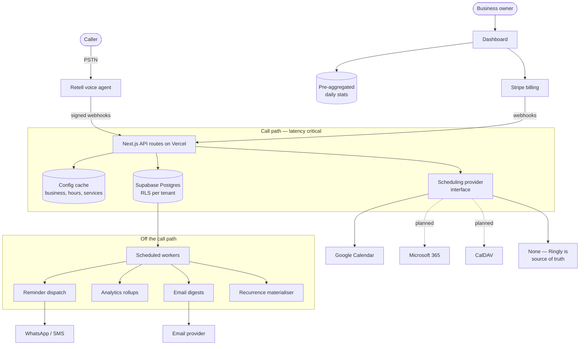

# Ringly — PRD + EDD (v3.0)

_Supersedes `Ringly_PRD_EDD_v2.md` (2026-07-01). Revised 2026-07-30 for
multi-tenant scale, scheduling-provider independence, recurring appointments,
the business analytics dashboard, Stripe billing, and email notifications._

> **Status.** Part 1 (PRD) and Part 2 (EDD) are agreed design. Part 3 is the
> delivery plan; nothing in §2.3 onward is built yet. What ships today is the v2
> product plus the calendar conflict check (PR #2).

---

# Part 1 — Product Requirements (PRD)

## 1.1 Vision

Ringly gives a small business a dedicated AI receptionist that answers calls,
discusses services and pricing, books/reschedules/cancels appointments, keeps the
business's own calendar in sync, and reminds customers before they are due.

v2 made a single business live in under three minutes. **v3 turns that into a
business**: thousands of tenants, each with thousands of customers, each on their
own calendar system and timezone, billed for what they use, and able to see and
manage their own operation without talking to us.

## 1.2 What changed from v2

| Area         | v2                                   | v3                                                                |
| ------------ | ------------------------------------ | ----------------------------------------------------------------- |
| Tenancy      | Implicitly single-tenant assumptions | Explicit multi-tenant model, isolation and scale targets          |
| Scheduling   | Google Calendar only                 | Provider abstraction; Google is one implementation of several     |
| Appointments | One-off only                         | One-off **and** recurring series                                  |
| Reminders    | Deferred (`pg_cron` TODO)            | First-class, durable, batched dispatch at scale                   |
| Services     | Set at onboarding                    | Editable any time; changes reach the agent for the next caller    |
| Analytics    | None                                 | Per-business dashboard, plus an operator cost/revenue dashboard   |
| Money        | None                                 | $100/30 days in advance, usage in arrears, $500 cap, card on file |
| Email        | None                                 | Billing and stats emails to the business                          |
| Latency      | Not a stated requirement             | Explicit per-turn budget on the call path                         |
| Cost         | Not a stated requirement             | Explicit per-tenant serving-cost target                           |

## 1.3 Personas

- **Business owner (primary).** Non-technical. Salon, clinic, tax office. Wants a
  receptionist, not a configuration project. Checks a dashboard occasionally and
  an email monthly. Cares about missed calls and money.
- **Calling customer (secondary).** Wants an appointment at a time that suits
  them, in one call, without being told to hold. Never sees Ringly's UI.
- **Ringly operator (us).** Needs per-tenant cost visibility, safe degradation,
  and no manual work per new tenant.

## 1.4 Scope

**In scope for v3:** everything in §1.5 and §1.6.

**Explicit non-goals for v3:**

- Multi-location businesses (one location per business row).
- Multi-staff / resource-level scheduling (one implicit calendar per business).
- Non-US phone numbers and non-English calls.
- Self-serve plan changes, coupons, refunds, dunning UI beyond Stripe's own.
- Customer-facing web booking. The phone is the only booking channel.

---

## 1.5 Functional requirements

### F1 — Onboarding and identity

_(Carried from v2; renumbered. v2 FR1–FR10 map to F1.1–F1.10.)_

- **F1.1** Intake accepts free-form text; no structured fields required.
- **F1.2** Voice output speaks the prompt; typed input in v1.
- **F1.3** Enrichment resolves name, address, phone, hours, IANA timezone, and
  website from Google Places.
- **F1.4** Services auto-extracted from the website (≤5 items), with upload and
  manual entry as first-class fallbacks.
- **F1.5** All enriched fields are inline-editable before commit.
- **F1.6** Enrichment resolves in a single request.
- **F1.7** A single Google OAuth grants the Ringly session and offline calendar
  access; the account is keyed to the Google identity.
- **F1.8** The user is told their Google login is now their Ringly login.
- **F1.9** Number purchase and agent provisioning run in the background.
- **F1.10** No WhatsApp UI in onboarding.
- **F1.11 (new)** Onboarding collects and verifies a **business contact email**,
  defaulted from the Google identity and editable. It is required before
  activation and is the destination for all billing and stats email (F8).
- **F1.12 (new)** Onboarding ends with a **test call** step. Activation (F7.1) is
  only offered once the business has placed a successful test call to its number.

### F2 — Call handling and booking

- **F2.1** The agent answers on the business's dedicated number, identifies the
  business, and can describe services, prices, and durations.
- **F2.2** The agent books, reschedules, and cancels appointments.
- **F2.3** A requested time is checked against the business's own bookings **and**
  its connected calendar before anything is written; a taken slot is refused and
  the nearest open times either side are offered. _(Shipped in PR #2.)_
- **F2.4** Callers may only reschedule or cancel their own appointments,
  identified by calling number.
- **F2.5** All times spoken to a caller are in the **business's** local timezone,
  never UTC and never the caller's.
- **F2.6 (new)** While the agent is waiting on any backend operation, the caller
  hears natural filler speech rather than silence. No caller-perceptible gap may
  exceed the budget in N3.
- **F2.7 (new)** If a scheduling integration is unavailable, the agent continues
  to take bookings against Ringly's own records rather than failing the call. The
  business is told which bookings were taken without calendar verification.

### F3 — Service catalogue management

- **F3.1** A business can add, edit, deactivate, and reorder services, each with
  a name, description, price, and duration.
- **F3.2** A change takes effect for the **next** caller. Target propagation ≤ 60s
  from save; the caller mid-conversation keeps the catalogue they started with.
- **F3.3** Deactivating a service never alters appointments already booked
  against it.
- **F3.4** Price and duration are versioned: an appointment records the price and
  duration in force **when it was booked**, so later edits never rewrite history.

### F4 — Scheduling integrations

- **F4.1** A business connects **one** scheduling provider. Google Calendar is
  the default and the only one that must exist at v3 launch.
- **F4.2** The system is built so a further provider can be added **without
  changes to booking logic** — provider-specific code lives behind one interface
  (EDD §2.4).
- **F4.3** A business may choose **no external calendar**. Ringly's own records
  are then the source of truth, and every other feature behaves identically.
- **F4.4** Providers targeted after launch, in priority order: Microsoft 365 /
  Outlook, CalDAV (Apple/Fastmail), then vertical booking systems (Square
  Appointments, Acuity, Calendly).
- **F4.5** Losing or revoking provider access degrades to F4.3 behaviour and
  raises a dashboard warning and an email; it never blocks calls.

### F5 — Recurring appointments and reminders

- **F5.1** A caller can set up a **recurring** appointment in one call (e.g.
  "every fourth Tuesday at 2"), described by a standard recurrence rule.
- **F5.2** Occurrences are generated ahead of time so each can be individually
  moved, cancelled, or skipped without affecting the rest of the series.
- **F5.3** Cancelling a series cancels its future occurrences and leaves past
  ones intact.
- **F5.4** Every appointment, one-off or recurring, schedules reminders to the
  customer ahead of the appointment. Default: 24 hours and 4 hours before.
- **F5.5** A customer who set up a series once must keep receiving reminders for
  each occurrence indefinitely, with no further contact.
- **F5.6** Reminders are sent **at most once**, survive process restarts, and are
  cancelled if the appointment moves or is cancelled.
- **F5.7** Reminder delivery is channel-agnostic in design; WhatsApp is the first
  channel and SMS the expected second.

### F6 — Business dashboard and analytics

- **F6.1** Each business sees only its own data, always.
- **F6.2** The dashboard reports, over a selectable period (today / 7d / 30d /
  custom):
  - calls received, and unique callers;
  - call time-of-day distribution;
  - average and median call duration;
  - outcome breakdown as counts and percentages: **booked / rescheduled /
    cancelled / enquiry-only / dropped**;
  - appointments booked, and revenue booked (from versioned service prices).
- **F6.3** "Dropped" means the caller hung up without a resolved outcome; it is
  reported separately from a completed enquiry.
- **F6.4** A business can list, search, and open individual calls, with
  transcript and outcome.
- **F6.5** Dashboard queries return in ≤ 500ms p95 regardless of tenant size,
  and their cost must not grow with total call volume across all tenants.
- **F6.6** All figures are rendered in the business's own timezone, including day
  and week boundaries for grouping.

### F7 — Billing and payments

**Billing period.** A business's period is a **rolling 30 days from activation**,
not a calendar month. Period 1 begins the moment the business activates (F1.12);
period _n+1_ begins 30 days after period _n_.

- **F7.1** A **$100 fixed fee** is charged **in advance** at the start of every
  30-day period, irrespective of usage. The first such charge is the activation
  payment — there is no separate one-off activation fee.
- **F7.2** At activation the business's **card is stored for future off-session
  use**, so later charges need no customer presence.
- **F7.3** Ringly never stores, transmits, or logs raw card details. Card data is
  handled entirely by the payment provider; Ringly stores only provider
  identifiers. _(Hard requirement, not a preference.)_
- **F7.4** **Usage** accrues through the period and is charged **in arrears** at
  period end, once the total is known.
- **F7.5** Two billable usage units:
  - **connected minutes on productive calls** (F7.6), whole call duration (F7.7);
  - **reminders sent**, per message.
- **F7.6** A call is **productive** — and therefore billable — if it resulted in
  any of: a new booking; a reschedule that produced a booked appointment; or a
  cancellation of a real existing appointment. **Not billable:** general enquiry
  calls, wrong numbers, dropped calls, test calls, and any call that changed
  nothing for the business.
- **F7.7** The **whole call** is billable, not only the minutes up to the
  booking.
- **F7.8** Rates are **configuration, not constants in code**: per-connected-
  minute rate and per-reminder rate. Both are **TBD** and must be settable
  without a deploy. Working assumption for the reminder rate: **$0.05**.
- **F7.9** A **$500 cap per period, inclusive of the $100 fixed fee** — so usage
  tops out at $400. On reaching the cap Ringly **continues to serve the business
  and absorbs the cost**, stops accruing further charges for that period, and
  **alerts the operator** (F9.6).
- **F7.10** Billing repeats every 30 days with no action from the business.
- **F7.11** A failed charge notifies the business (F8.2) and enters a retry
  period before any service change.
- **F7.12** On **cancellation mid-period**: refund the unused portion of the $100
  fixed fee, prorated at 1/30 per whole day remaining, and charge usage accrued
  up to the cancellation date.
- **F7.13** The business dashboard shows current-period usage, amount accrued,
  the cap, and the next charge date.
- **F7.14** Every charge, refund, and failure is recorded immutably against the
  business for reconciliation.

> **Deliberately deferred.** Charging for _all_ connected minutes (booked or not)
> is the expected next pricing model. F7.6 is written as a predicate over call
> outcome so widening it later is a configuration change, not a redesign.

### F9 — Operator dashboard (Ringly-internal)

- **F9.1** Visible **only to the operator**. No business owner may reach it by
  any route, with any credential. This is the single screen that reads across all
  tenants and is therefore treated as a walled garden (EDD §2.9a, N1.1).
- **F9.2** Per business, per period: **net revenue** (charges received, less
  payment-processor fees), **cost incurred**, and the margin between them.
- **F9.3** Payment reliability per business — paid on time, late, failed,
  currently past due — so irregular payers are visible at a glance.
- **F9.4** Platform totals: revenue, cost, and margin across all businesses.
- **F9.5** **Cost model (v1): Retell only.** Retell is the sole recurring cost
  attributed per business, covering the telephony number rental and all per-call
  charges including LLM. Deliberately excluded: Supabase and Vercel (fixed
  platform overhead, immaterial per tenant) and Google Places (one-off at
  onboarding, considered covered by the first $100). **WhatsApp messaging cost is
  added to this model when WhatsApp ships.**
- **F9.6** **Operator alerts**: a business reaching its cap (F7.9), and payment
  failures. Delivered by **email** initially. _TBD: move operator alerting to
  Slack; pending implementation._
- **F9.7** Refreshed **daily**, and available at all times. The current period is
  computed live; history is served from pre-aggregated data.

### F8 — Email notifications

- **F8.1** Email is sent to the business contact address (F1.11).
- **F8.2** **Billing email**: activation receipt, upcoming charge notice, invoice
  issued, payment succeeded, payment failed, and approaching/at cap.
- **F8.3** **Stats email**: a periodic digest of the F6.2 headline figures,
  aligned to the business's 30-day billing period.
- **F8.4** A business can unsubscribe from stats email. **Billing email is
  transactional and cannot be unsubscribed.**
- **F8.5** Email sending is idempotent — a retry never sends a duplicate.

---

## 1.6 Non-functional requirements

### N1 — Multi-tenancy and isolation

- **N1.1** Every row of business data belongs to exactly one business, and no
  query path can return another business's rows. Isolation is enforced by the
  database, not only by application code.
- **N1.2** Server-side code paths that bypass row-level security (webhook
  handlers using a service role) must scope every query by business explicitly,
  and that scoping must be covered by tests.
- **N1.3** A tenant's data can be exported and deleted on request, completely.

### N2 — Scale

- **N2.1** Target: **10,000 businesses**, each with up to **10,000 customers** and
  a comparable number of historical appointments and calls — order 10⁸ rows in
  the largest tables.
- **N2.2** No feature may degrade as a function of _total_ platform size; only of
  the requesting tenant's own size.
- **N2.3** Reminder dispatch must sustain the resulting steady-state volume with
  bounded lag (≤ 5 min from due time).

### N3 — Latency on the call path

Caller-perceived silence is the metric that matters. Budget per agent turn that
involves a backend call:

| Segment                                    | Target p95 |
| ------------------------------------------ | ---------- |
| Ringly webhook handler, end to end         | ≤ 400 ms   |
| — of which our own datastore               | ≤ 80 ms    |
| — of which external scheduling provider    | ≤ 250 ms   |
| Hard ceiling before we abandon and degrade | 1500 ms    |
| Caller-perceived silence (filler covers)   | ≈ 0        |

- **N3.1** Any backend operation on the call path has a hard timeout and a
  defined degraded result. Slow is treated as failed.
- **N3.2** Work not needed to answer the caller is done after responding, never
  before.

### N4 — Serving cost

- **N4.1** Per-business fixed monthly infrastructure cost (excluding telephony
  and LLM minutes, which are usage-driven) is the metric to minimise; it must not
  grow faster than linearly with tenants.
- **N4.2** Repeated reads of slow-changing configuration on the call path must
  not hit paid third-party APIs or the primary database every time.
- **N4.3** Dashboard analytics must be served from pre-aggregated data, not from
  scanning raw call history per request.
- **N4.4** Paid third-party calls (Places, LLM, telephony) are attributable per
  business so unit economics are measurable.

### N5 — Timezone correctness

- **N5.1** Every instant is stored in UTC and rendered in the business's IANA
  timezone.
- **N5.2** All day, week, and month boundaries — for availability, reminders,
  analytics grouping, and billing periods — are computed in the business's
  timezone, not the server's and not UTC.
- **N5.3** Behaviour is correct across DST transitions, including the duplicated
  and skipped local hours.

### N6 — Security and compliance

- **N6.1** Provider refresh tokens are encrypted at rest.
- **N6.2** Card data never touches Ringly infrastructure (F7.3), keeping us out
  of PCI-DSS scope beyond SAQ-A.
- **N6.3** All inbound webhooks verify provider signatures before acting.
- **N6.4** Customer PII (name, phone) is per-tenant and deletable (N1.3).

### N7 — Availability and degradation

- **N7.1** No third-party outage may prevent a business from answering calls and
  taking bookings.
- **N7.2** Every degraded path is logged and surfaced to the business; silent
  degradation is a defect. _(See Risk R1 — this is currently violated.)_

---

## 1.7 Success metrics

| Metric                                | Target                 |
| ------------------------------------- | ---------------------- |
| Time-to-live (land → Go Live)         | p50 < 3 min            |
| Activation rate (live → paid)         | > 60%                  |
| Caller-perceived silence per turn     | p95 ≈ 0, no gap > 1.5s |
| Booking conflicts reaching a customer | 0                      |
| Reminder delivery lag                 | p99 ≤ 5 min            |
| Dashboard load                        | p95 ≤ 500 ms           |
| Monthly infra cost per business       | tracked, trending down |

## 1.8 Decisions and open questions

**Settled 2026-07-30:** pricing shape (F7), cap behaviour (F7.9), reminder
metering (F7.5), email provider **Resend** (§2.10), 90-day recurrence horizon
(§2.7), operator cost model (F9.5), net-of-fees revenue (F9.2).

**Still open — each blocks the phase named:**

- **Q1 — Rates (Phase 5).** Per-connected-minute rate is TBD; per-reminder rate
  assumed $0.05. Both are configuration (F7.8), so Phase 5 can be built and
  tested with placeholders, but cannot be switched on for real customers until
  set.
- **Q2 — Is the cap prorated on cancellation (Phase 5)?** A business that
  cancels on day 12 has used 40% of its period. Is its cap still $500, or 12/30
  of it? Affects F7.12.
- **Q3 — Does a failed renewal keep the phone answered (Phase 5)?** F7.11 gives
  a retry period; the behaviour _during_ it is unspecified. Proposed: keep
  serving through the retry window, then suspend.
- **Q4 — Which channel delivers reminders in v3 (Phase 6)?** F5.4–F5.7 require
  reminders, but WhatsApp is explicitly out of v1 (F9.5). Either reminders ship
  over SMS first, or F5 delivers recurrence and reminder _scheduling_ with
  dispatch dark until a channel exists. **This is a scope conflict, not a
  detail** — see Risk R7.
- **Q5 — Double-charging optics (Phase 5).** Under F7.6, a caller who books and
  later cancels produces two billable calls for a net-zero outcome. Accepted, or
  suppress the second?

---

# Part 2 — Engineering Design (EDD)

## 2.1 Architecture overview



The governing split: **the call path touches cache, one database, and at most one
external scheduler, each with a hard timeout.** Everything else — reminders,
rollups, digests, recurrence expansion, billing — runs on scheduled workers and
may be slow.

## 2.2 Multi-tenancy model

**Decision: shared schema, shared database, row-level tenant isolation.**

Rejected alternatives: database-per-tenant (10k databases is unmanageable and
multiplies fixed cost, violating N4.1) and schema-per-tenant (migration cost
scales with tenants). Shared-schema with RLS is the only option that keeps fixed
cost flat per tenant (N4.1) while satisfying N1.1.

Implementation:

- `business_id` is present on every tenant-scoped table and is the **leading
  column of every composite index**, so each tenant's working set is contiguous
  and query cost scales with the tenant, not the platform (N2.2).
- RLS policies stay as today (`owner_user_id = auth.uid()` directly on
  `businesses`, membership subquery elsewhere) but the subquery moves into a
  `security definer` function marked `stable` so the planner caches it per
  statement instead of re-running per row.
- **The service-role path is the real isolation risk** (N1.2). Retell webhooks
  resolve the tenant from the dialled number and then use a service-role client
  that bypasses RLS entirely. Mitigation: a single `tenantScoped(db, businessId)`
  helper that every webhook query goes through, plus tests asserting cross-tenant
  reads return nothing. This is the pattern already used ad hoc in the functions
  route; v3 makes it structural.
- High-volume tables (`calls`, `appointments`, `reminders`) are **range
  partitioned by month** once volume justifies it, so old partitions can be
  detached and archived cheaply. Partitioning is deferred until measured, but the
  primary keys are chosen now so it stays possible without a rewrite.

## 2.3 Data model changes

Migrations `005`–`010`, in dependency order.

**005 — tenancy and integrity hardening**

- Composite indexes leading with `business_id` on `appointments`, `calls`,
  `customers`, `reminders`.
- Replace the ad-hoc `(business_id, starts_at)` unique index with a
  `tstzrange` **exclusion constraint** so overlapping active appointments are
  impossible at the database level, closing the check-then-write race noted in
  PR #2. Requires `btree_gist`.
- `security definer stable` helper for RLS membership.

**006 — service versioning (F3.4)**

- `service_versions(id, service_id, business_id, name, price_cents, duration_minutes, effective_from, effective_to)`.
- `appointments.service_version_id` records the version in force at booking.
- `services` keeps current values for display; edits insert a new version.

**007 — scheduling providers (F4)**

- `businesses.scheduling_provider text not null default 'google'`
  (`google | microsoft | caldav | none`).
- `scheduling_credentials(business_id, provider, encrypted_payload, status, last_error_at)` —
  replaces the single `google_refresh_token` column; provider-shaped payload.
- `businesses.external_calendar_id` generalises `google_calendar_id`.
- `appointments.external_event_id` generalises `google_calendar_event_id`.

**008 — recurring appointments (F5.1–F5.3)**

- `appointment_series(id, business_id, customer_id, service_id, rrule text, timezone, starts_at_local time, dtstart, until, status)`.
- `appointments.series_id`, `appointments.occurrence_date`, unique per
  `(series_id, occurrence_date)` so materialisation is idempotent.
- Occurrence rows are ordinary appointments — every existing conflict, reminder,
  and calendar path works on them unchanged.

**009 — analytics (F6)**

- `calls` gains `started_at`, `ended_at`, `duration_seconds`, and widens
  `outcome` to include `dropped`.
- `daily_business_stats(business_id, local_date, calls, unique_callers, avg_duration_seconds, booked, rescheduled, cancelled, enquiry_only, dropped, revenue_booked_cents)` —
  primary key `(business_id, local_date)`, `local_date` computed in the
  business's timezone (N5.2).

**010 — billing and email (F7, F8)**

- `businesses.contact_email`, `stripe_customer_id`, `stripe_subscription_id`,
  `billing_status` (`unbilled | active | past_due | capped | cancelled`),
  `period_started_at`, `cap_cents` (default 50000).
- `pricing_config(id, key unique, cents, effective_from)` — the per-minute and
  per-reminder rates (F7.8). Rates are data, not constants, so they can be set
  without a deploy while they remain TBD (§1.8 Q1).
- `billing_events(id, business_id, stripe_event_id unique, kind, amount_cents, fee_cents, occurred_at, payload)` —
  immutable ledger (F7.14); `stripe_event_id` unique for webhook idempotency;
  `fee_cents` from the Stripe balance transaction so revenue is net (F9.2).
- `usage_records(id, business_id, period_start, occurred_at, kind, quantity, unit_cents, amount_cents, call_id, reminder_id)` —
  `kind` in (`connected_minutes`, `reminder`). Per-tenant attribution (N4.4) and
  the input to the cap check (F7.9).
- `email_log(id, business_id, kind, idempotency_key unique, sent_at, status)` — F8.5.

**011 — operator dashboard (F9)**

- `cost_records(id, business_id, occurred_at, source, kind, amount_cents, call_id)` —
  `source` = `retell` in v1 (`whatsapp` when it ships). `kind` in
  (`call`, `number_rental`). Populated from the post-call webhook and a monthly
  rental job (F9.5).
- `daily_business_economics(business_id, local_date, revenue_net_cents, cost_cents, calls, billable_calls)` —
  primary key `(business_id, local_date)`; the daily refresh behind F9.7.
- No RLS policy is added for these tables. They are reachable **only** through
  the ops data module under a service role (§2.9a); tenant-facing code has no
  path to them.

## 2.4 Scheduling provider abstraction (F4.2)

One interface, implemented per provider. Booking logic depends only on this:

```ts
type BusyInterval = { starts_at: string; ends_at: string };

interface SchedulingProvider {
  readonly id: "google" | "microsoft" | "caldav" | "none";
  getBusyIntervals(
    ctx: TenantContext,
    window: { from: string; to: string },
    opts: { excludeExternalEventId?: string; signal: AbortSignal },
  ): Promise<BusyInterval[]>;
  createEvent(
    ctx: TenantContext,
    appt: AppointmentView,
  ): Promise<string | null>;
  updateEvent(
    ctx: TenantContext,
    externalEventId: string,
    appt: AppointmentView,
  ): Promise<void>;
  deleteEvent(ctx: TenantContext, externalEventId: string): Promise<void>;
}
```

- The **Google implementation already exists** in all but name — PR #2's
  `getCalendarBusyIntervals` has exactly this shape, including the
  `excludeExternalEventId` and `AbortSignal` parameters. Extracting it is a
  refactor, not a rewrite.
- The **`none` provider** returns `[]` busy and no-ops on writes (F4.3). It is
  also what a failed provider degrades to (F4.5), which makes the degraded path
  the same code as a supported configuration rather than a special case.
- Every implementation must honour the `AbortSignal` and the N3 timeout. A
  provider that cannot answer within budget is treated as absent.
- **Provider capability differences are declared, not discovered**: whether a
  provider can exclude an event by id, expand recurrences, or report
  free/busy without event detail. Booking logic branches on declared capability.

## 2.5 Call path and latency budget (N3, F2.6)

Current measured shape of one `book_appointment` turn: 3–4 Supabase round trips
plus 2 Google round trips (token exchange + API call), all sequential.

Target shape:

1. **Resolve tenant config from cache** by dialled number — business, timezone,
   hours, active services, provider. One cache read replaces three database
   queries. Cache is authoritative for ≤60s (F3.2).
2. **Conflict check**: one database read (own appointments) issued in parallel
   with one provider read, both under the N3 ceiling. Already the shape built in
   PR #2 — `Promise.all` over the two sources, single day-wide window.
3. **Respond**, then do calendar writes, reminder rows, and analytics after the
   response. Already partly true (`syncAfterBooking` is fire-and-forget).

**Filler speech (F2.6).** Retell's `speak_during_execution` is already set on
every booking tool, so the agent talks while we work; v3 adds per-tool filler
phrasing appropriate to the operation ("let me check the diary for you") and
enables backchannelling. Retell's own end-to-end budget is ~600ms, so our 400ms
handler target keeps a turn inside roughly one second.

## 2.6 Caching and config propagation (N4.2, F3.2)

A read-through cache keyed by dialled number, holding the tenant's slow-changing
configuration. TTL 60s, and **explicitly invalidated on write** by the services,
hours, and business settings endpoints — so an edit reaches the next caller
immediately in the normal case, and within 60s even if invalidation is missed.
This single mechanism serves three requirements at once: F3.2 propagation, N3
latency, and N4.2 cost.

The cache never holds appointment or calendar data — only configuration. Busy
intervals are always read live, because a stale conflict check books someone over
a real appointment.

> Note: caching Google **access tokens** was considered and is **deliberately out
> of scope** by owner decision. The per-lookup token exchange is an accepted cost.

## 2.7 Recurrence and reminders (F5)

- **Materialiser** (scheduled, hourly): for every active series, ensure
  occurrences exist for a rolling horizon (proposed 90 days — §1.8 Q4). Idempotent
  via the `(series_id, occurrence_date)` unique key. This is what makes F5.5 work
  — a customer who called once keeps getting occurrences and reminders forever
  without further contact.
- **Reminder scheduling**: creating or moving an appointment writes reminder rows
  transactionally with the appointment and cancels superseded ones. Already the
  pattern in the booking handler.
- **Dispatcher** (scheduled, every minute): claims due reminders with
  `FOR UPDATE SKIP LOCKED` in bounded batches, sends, and marks terminal state.
  `SKIP LOCKED` gives at-most-once delivery under concurrent workers (F5.6) and
  bounded lag (N2.3) without an external queue — the cheapest option that meets
  the requirement (N4.1).
- Channel is behind a `ReminderChannel` interface (F5.7); WhatsApp first.

## 2.8 Analytics (F6)

Raw `calls` rows are never scanned per dashboard request (N4.3, F6.5). A nightly
per-tenant rollup writes `daily_business_stats` keyed by the business's **local**
date (N5.2, F6.6); the dashboard reads a bounded number of pre-aggregated rows.
Today-so-far is computed live from that tenant's own rows only, which is bounded
by tenant size, not platform size (N2.2).

`dropped` (F6.3) is derived at call end: a call that reached no terminal outcome
and was ended by the caller. This requires the post-call webhook to record
`ended_at` and an end reason, which it does not do today.

## 2.9 Billing (F7)

**Stripe, using Customers + Setup Intents + a 30-day recurring price + usage
meters.** Verified capabilities in §2.15.

| Requirement                         | Mechanism                                                                                                                                    |
| ----------------------------------- | -------------------------------------------------------------------------------------------------------------------------------------------- |
| F7.1 $100 in advance, every 30 days | Subscription with `interval: day, interval_count: 30`, billed at period start. **Not** `interval: month` — see the drift note below.         |
| F7.2 card stored                    | `SetupIntent` with `usage: off_session`, attached to the Customer                                                                            |
| F7.3 no card liability              | Card entered into Stripe Elements; never reaches our servers. We store `stripe_customer_id` and `payment_method_id` only. Keeps us at SAQ-A. |
| F7.4 usage in arrears               | Metered price on the same subscription, invoiced at period end                                                                               |
| F7.5 two usage units                | Two Stripe **meters**: `connected_minutes` and `reminders_sent`                                                                              |
| F7.6 productive calls only          | Our own predicate over call outcome, evaluated post-call; only productive calls emit a usage record                                          |
| F7.8 rates configurable             | Rates live in `pricing_config`, not in code                                                                                                  |
| F7.9 cap                            | Enforced **by us** before emitting usage, not by Stripe. On reaching: stop accruing, keep serving, alert operator                            |
| F7.11 failed charge                 | `invoice.payment_failed` webhook → notify (F8.2) → Stripe retry schedule                                                                     |
| F7.12 cancellation                  | Credit note for unused fixed-fee days + final usage invoice                                                                                  |
| F7.14 immutable record              | `billing_events`, keyed by `stripe_event_id` for idempotency                                                                                 |

Usage is written locally to `usage_records` first — the source of truth for our
own reporting and unit economics (N4.4) — and pushed to Stripe's meters
asynchronously, so a Stripe outage never blocks a call.

**Three consequences worth stating plainly:**

1. **The billing date drifts backwards through the calendar.** 30-day periods
   give 12.17 periods a year, not 12, so a business signing up on 1 January is
   billed 31 January, 2 March, 1 April… and pays **$1,216.67** a year rather than
   $1,200. This is what was asked for and Stripe supports it directly; it is
   recorded because it surprises customers, not because it is wrong. Switching to
   `interval: month` anchored on the signup day would give calendar-stable dates
   and exactly 12 charges.
2. **The cap is enforced by Ringly, not Stripe.** Stripe's billing thresholds can
   invoice early at a monetary threshold, but "stop charging and keep serving at
   a loss" is a Ringly-side policy. We check the accrued total before writing
   each usage record and stop at $400 of usage ($500 including the fixed fee).
3. **Timezone position — resolves the N5.2 conflict.** Usage is metered and
   displayed in the **business's** timezone; the invoice period is **Stripe's**.
   The dashboard labels which it is showing. Any other combination produces
   invoices that disagree with the dashboard.

## 2.9a Operator dashboard (F9)

A separate application surface, not a privileged view of the business dashboard:

- **Route namespace `/ops/*`**, excluded from every tenant-facing layout.
- **Its own data access module.** Tenant-facing code never imports it; it never
  imports tenant-scoped helpers. The one place a cross-tenant query is legitimate
  is the one place it is allowed to exist.
- **Authorisation by operator allowlist** (env-configured user ids), checked in
  the proxy _and_ in every `/ops` handler. Not a role column on a tenant table —
  nothing a compromised business account could set.
- **Tests assert** an authenticated business owner gets 404 from every `/ops`
  route, and that no tenant-facing route can reach the ops data module.
- **Cost attribution (F9.5):** per-call Retell cost captured at the post-call
  webhook — preferring a cost field on the call object where Retell supplies one,
  otherwise `duration × configured_rate`. Number rental is a monthly per-business
  line. Both land in `cost_records`.
- **Net revenue (F9.2)** from Stripe balance transactions, which carry the
  processing fee, so margin is net rather than gross.
- **Daily refresh (F9.7)** via the §2.8 rollup worker, writing
  `daily_business_economics`.

## 2.10 Email (F8)

**Provider: Resend** (decided 2026-07-30). Chosen for React Email — templates
live in this repo and are reviewed like any other code — a small API surface that
keeps the abstraction thin, and price parity with the alternatives at this
volume. Postmark was the runner-up on transactional deliverability; SES was
rejected as 10–20× cheaper but materially more operational work (warmup, bounce
and complaint handling) at a scale where the saving is noise.

Operator alerting (F9.6) uses the same path initially. _TBD: move operator alerts
to Slack; pending implementation._

Design: one `sendEmail(kind, businessId, payload)` entry point writing an
`email_log` row keyed by an idempotency key derived from `(kind, business, period)`
**before** sending, so a retried worker cannot double-send (F8.5). Billing email is
transactional and always sent; stats email honours an unsubscribe flag (F8.4).

## 2.11 Cost model (N4)

| Lever                       | Mechanism                                                               |
| --------------------------- | ----------------------------------------------------------------------- |
| Fixed cost per tenant       | Shared schema, shared database, no per-tenant infrastructure            |
| Call-path third-party spend | Config cache (§2.6); one provider call per turn (already done in PR #2) |
| Dashboard cost              | Pre-aggregated rollups (§2.8)                                           |
| Reminder cost               | Batched dispatch, `SKIP LOCKED`, no external queue                      |
| Enrichment spend            | Cache Places lookups by `place_id`; single call on submit               |
| Attribution                 | `usage_records` per business (N4.4)                                     |

## 2.12 Security (N6)

Unchanged foundations: signature verification on every webhook (Retell today,
Stripe added), encrypted provider tokens, RLS. New: the `tenantScoped` helper
(§2.2) as the single service-role query path, and Stripe webhook signature
verification using the Stripe SDK's own verifier — per project rule, the vendor's
implementation, never hand-rolled.

## 2.13 Risks

- **R1 — Silent degradation (violates N7.2).** Today a calendar failure, timeout,
  or expired token is caught, logged, and treated as a free calendar. Conflict
  checking can therefore stop working platform-wide with no signal. This is the
  highest-severity open issue in the current codebase and should be fixed in
  Phase 1, not deferred: surface it per-tenant on the dashboard and alert.
- **R2 — Refresh-token expiry.** While the Google app is in _Testing_, refresh
  tokens are revoked after 7 days, which triggers R1 for every tenant. Production
  publishing and verification are prerequisites for launch, and verification for
  a sensitive scope takes weeks.
- **R3 — Cross-tenant leakage via service role.** Mitigated by §2.2; must be
  test-enforced (N1.2).
- **R4 — Migration risk.** 005's exclusion constraint fails to apply if any
  overlapping appointments already exist; needs a data audit first.
- **R5 — Provider capability mismatch.** Not every provider can exclude an event
  by id or expand recurrences; §2.4 declares capabilities rather than assuming
  parity.
- **R6 — Cost of correctness.** Live busy-checks on every turn are a real
  third-party spend. Accepted: a stale conflict check is worse than its cost.
- **R7 — Reminders have no delivery channel in v3 (scope conflict).** F5.4–F5.7
  require reminders, but WhatsApp is explicitly excluded from v1 (F9.5). Phase 6
  can build recurrence, scheduling, and the dispatcher, but nothing will actually
  send until a channel exists. Either SMS ships as the first channel or F5
  delivers dark. **Unresolved — §1.8 Q4.**
- **R8 — Unbooked calls are pure cost.** Only productive calls are billable
  (F7.6) while every call costs Retell minutes. At Retell's $0.13–0.31/min
  all-in, the $100 fixed fee covers roughly 320–770 minutes of unbilled calling
  before a business is loss-making. Accepted for now; F9 exists partly to measure
  exactly this, and the stated next pricing model (all connected minutes) is the
  remedy.

## 2.14 Delivery plan

Each phase is independently shippable. **Phase 1 is a prerequisite for
everything and contains the one active defect (R1); phases 2–7 are independent of
each other after it**, except where noted.

| Phase                          | Scope                                                                                                                                              | Depends on      | Flag    |
| ------------------------------ | -------------------------------------------------------------------------------------------------------------------------------------------------- | --------------- | ------- |
| **1 — Foundations**            | Migration 005; `tenantScoped` helper + isolation tests; fix R1 (surface degradation); capture call duration, end reason, outcome and per-call cost | —               | no      |
| **2 — Catalogue + cache**      | 006; config cache (§2.6); F3 end to end                                                                                                            | 1               | no      |
| **3 — Provider abstraction**   | 007; extract `SchedulingProvider`; port Google; add `none`                                                                                         | 1               | no      |
| **4 — Business dashboard**     | 009; rollups; F6 UI                                                                                                                                | 1               | no      |
| **5 — Billing + email**        | 010; Stripe 30-day subscription, card on file, meters, cap; Resend; F7/F8                                                                          | 1, 4            | **yes** |
| **6 — Recurrence + reminders** | 008; materialiser; dispatcher; reminder metering; F5                                                                                               | 1, 5 (metering) | **yes** |
| **7 — Operator dashboard**     | 011; `/ops` walled garden; economics rollup; F9                                                                                                    | 1, 4, 5         | **yes** |

### How the work is split across branches and PRs

The rule: **one PR is one reviewable idea that leaves `main` deployable.** A
phase is not a PR. Phases split by _layer_, in this order, because each layer is
independently reviewable and the earlier ones are safe to merge before the later
ones exist:

1. **Migration + types** — schema, generated types, no behaviour change. Merges
   green and inert.
2. **Backend** — services, repositories, jobs, webhooks, with unit and
   integration tests.
3. **UI** — the screens that consume it.
4. **Enablement** — flip the feature flag on, once 1–3 are proven.

Phase 1 is small enough to be a single PR. Phases 4, 5 and 7 are each three or
four PRs on that pattern. Phase 5 additionally splits _by concern_ — Stripe
subscription, usage metering and cap, then email — because "billing" as one PR
would be unreviewable.

### Feature flags

Flags exist so incomplete work can live on `main` instead of a long-lived branch:

- **Phase 5 `billing`** — the highest-stakes flag. Until it flips, no customer is
  charged; the whole path can be exercised against Stripe test mode on `main`.
- **Phase 6 `recurring_appointments`** — recurrence changes what the agent offers
  callers, so it stays dark until the dispatcher is proven (and R7 is resolved).
- **Phase 7 `ops_dashboard`** — additionally gated by the operator allowlist, so
  the flag is defence in depth rather than the control.

Phases 1–4 need no flags: each is either invisible to users or a strict
improvement to an existing screen, and each is complete when merged.

## 2.15 Verified vendor capabilities (confirmed 2026-07-30)

- **Stripe** — `SetupIntent` saves a card without charging and optimises later
  off-session charges; off-session means future charges happen without the
  customer present. Usage-based billing uses the **Meters** API (real-time,
  idempotent via `identifier`); **billing thresholds** can invoice when accrued
  usage reaches a monetary threshold. Stripe now positions **Metronome** as its
  primary usage-based billing platform for new complex integrations — worth
  evaluating at Phase 5 if metering outgrows Billing Meters.
  Sources: [Setup Intents API](https://docs.stripe.com/payments/setup-intents),
  [Save a payment method without charging](https://docs.stripe.com/payments/save-and-reuse),
  [Usage-based pricing plans](https://docs.stripe.com/billing/subscriptions/usage-based/pricing-plans),
  [Billing thresholds](https://docs.stripe.com/billing/subscriptions/usage-based/thresholds).
- **Retell** — end-to-end response budget ≈600ms with streaming between STT, LLM
  and TTS; **backchannelling** is configurable (enable, frequency, words);
  `speak_during_execution` covers tool-call latency, though community reports
  note fillers sometimes landing after completion rather than during — verify
  behaviour when tuning F2.6.
  Sources: [How real-time voice AI works](https://www.retellai.com/blog/how-real-time-voice-ai-works-stt-llm-tts),
  [Backchanneling changelog](https://www.retellai.com/changelog/latest-features-call-analysis-backchanneling-and-python-custom-llm-update),
  [Building a great voice agent](https://docs.retellai.com/blog/build-voice-agent).
- **Google Calendar `calendar.events`** — a **sensitive** scope; production use
  requires verification, and refresh tokens are revoked after 7 days while the app
  is in _Testing_ (R2).
  Sources: [Sensitive scope verification](https://developers.google.com/identity/protocols/oauth2/production-readiness/sensitive-scope-verification),
  [Manage App Audience](https://support.google.com/cloud/answer/15549945?hl=en).
